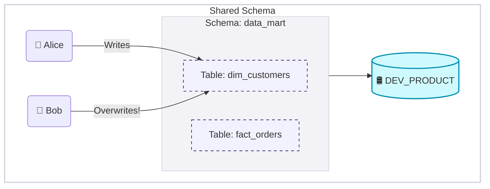
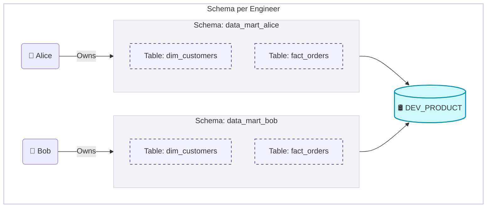

## Development

The development environment is where data engineers perform their
day-to-day work: building ingestion pipelines, applying transformations,
designing orchestration flows, and updating infrastructure using <Term>IaC</Term>.

**The \"Cloud Local\" Paradox** - In typical software engineering,
engineers run the application and database on their local laptop
(localhost). In data engineering, the scale of production data volumes makes this impractical. Development, therefore, operates as a hybrid:

-   **Code** resides locally (Git, IDE, Python scripts)
-   **Compute & Storage** resides in the cloud data warehouse or lakehouse

This means engineers need cloud environments even for development work.

> **Core Principle:** Engineers must have write access to their own
sandboxes, but strict Read-Only access to the shared \"Source/Raw\" data
to prevent accidental corruption of the ingestion layer.

### Shared vs. Isolated

#### Shared Environment <LevelBadge level="Standard" />

A single DEV database shared by all engineers.

-  *Best for:* Very small teams (1-3 engineers) with zero or less overlap in deliverables.
-  *Risks:* High likelihood of \"overwrite conflicts\" (Engineer A drops a table that Engineer B is currently querying).
-  *Coordination:* Constant communication required

#### Environment per Engineer <LevelBadge level="Advanced" />

This approach assigns each data engineer an isolated sandbox.

-  *Best for:* Medium teams (4+ engineers) with overlap in deliverables.
-  *Risks:* Low - complete isolation between engineers
-  *Coordination:* None required, it promotes deep work by removing the need for constant status checks

**Implementation**

-   **Namespace:** Use **Private Schemas** within a shared DEV database
    (e.g., `DEV_PRODUCT.DATA_MART_JOE`).

> **Why Schemas?** Creating a full *database* per engineer (`DEV_PRODUCT_JOE`) creates catalog clutter. A schema-per-engineer approach inherits time-travel and access policies from the parent database, while giving engineers read-access to each other's schemas. This makes it easier for peers to review code by simply querying a colleague's sandbox schema.

**Cost Management**

-   **Storage:** Leverage <Term>Zero-Copy Cloning</Term>. By cloning production
    tables to the sandbox, you avoid duplicating physical storage.
    Storage costs remain negligible.
-   **Compute:** Engineers pay only for the queries they run. By cloning
    the *output* tables from Production, engineers can incrementally
    build logic without re-computing the entire history from scratch.

**Lifecycle Management (Preventing \"Zombie Schemas\"):**

-   **Provisioning:** Codify the creation of the sandbox and role
    assignment during the onboarding process (IaC).
-   **Cleanup:** Implement a scheduled \"Reaper Script\" (weekly) that
    detects schemas with no query activity for \'X\' weeks and
    automatically drops them to maintain hygiene.

### Security

-   **Least Privilege:** Engineers have OWNERSHIP of their Sandbox
    Schema, READ on Raw Data, and NO ACCESS to Production Write roles.
-   **PII Protection:** Even in Development, engineers should not have
    unrestricted access to raw Sensitive PII (Personally Identifiable
    Information)
-   *Standard:* Development should run against **Masked Clones** of
    production data, or usage of PII columns should be audit-logged
    and restricted via policy.

**Which approach should I choose?** Use a shared schema for very small teams (1–3 engineers) with little overlap. Switch to schema-per-engineer once the team reaches 4+ engineers or multiple people work on the same models — the isolation eliminates overwrite conflicts and coordination overhead.