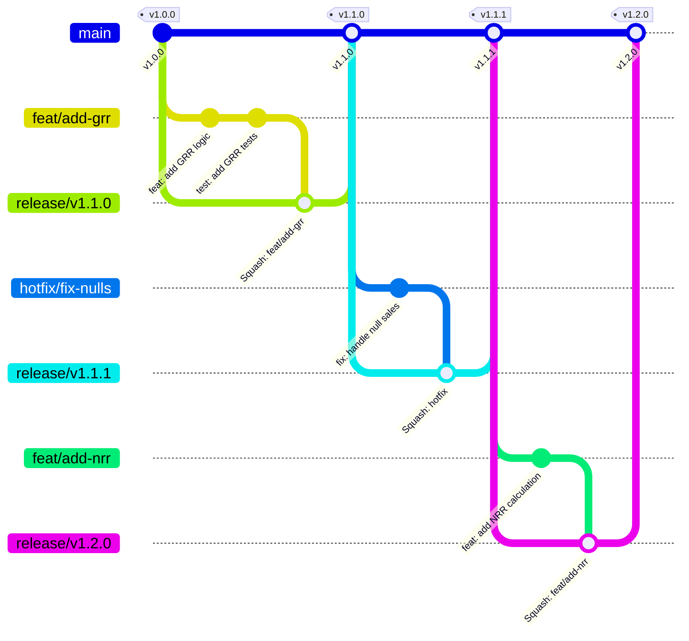
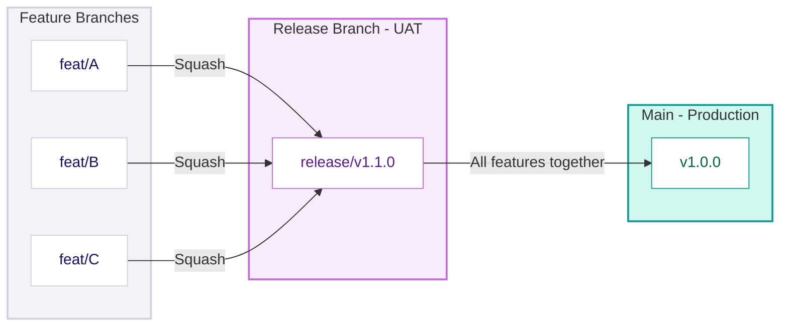
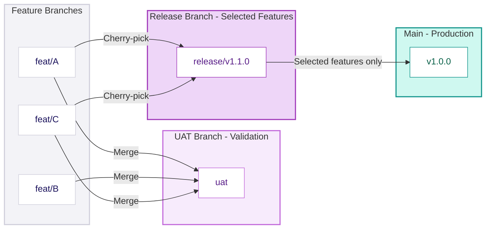
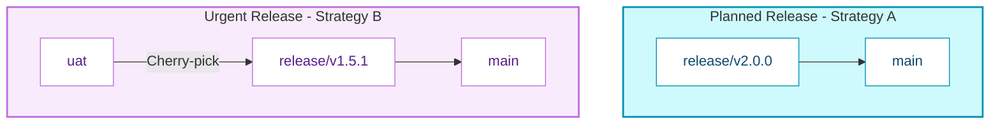

## Branching Strategy

<div className="not-prose my-6 grid grid-cols-1 md:grid-cols-2 gap-4">
  <div className="rounded-lg border border-amber-200 dark:border-amber-800 bg-amber-50 dark:bg-amber-950/20 p-4">
    <p className="text-xs font-semibold uppercase tracking-wide text-amber-700 dark:text-amber-400 mb-3">Why data engineering is different</p>
    <ul className="space-y-2.5">
      {[
        ["Data has state", "Bad merges can corrupt historical data that's expensive to rebuild"],
        ["Pipeline dependencies", "Models depend on each other — merging one feature may break another"],
        ["Business validation", "Finance must approve revenue calculations before they go live"],
        ["Audit requirements", "Regulators need to trace exactly what changed, when, and why"],
      ].map(([title, detail], i) => (
        <li key={i} className="text-sm text-slate-700 dark:text-slate-300">
          <span className="font-medium text-slate-900 dark:text-slate-100">{title}</span>
          <span className="text-slate-500 dark:text-slate-400"> — {detail}</span>
        </li>
      ))}
    </ul>
  </div>
  <div className="rounded-lg border border-rose-200 dark:border-rose-800 bg-rose-50 dark:bg-rose-950/20 p-4">
    <p className="text-xs font-semibold uppercase tracking-wide text-rose-700 dark:text-rose-400 mb-3">Common failures without a strategy</p>
    <ul className="space-y-2">
      {[
        "Features merged directly to production break pipelines",
        "\"WIP\" commits pollute history, making debugging impossible",
        "Hotfixes bypass validation and cause bigger outages",
        "Multiple features entangled in one release — can't ship the good without the bad",
      ].map((item, i) => (
        <li key={i} className="flex items-start gap-2 text-sm text-slate-700 dark:text-slate-300">
          <span className="text-rose-500 mt-0.5 flex-shrink-0">✗</span>{item}
        </li>
      ))}
    </ul>
  </div>
</div>

#### Solution

<div className="not-prose my-4 rounded-lg border border-emerald-200 dark:border-emerald-800 bg-emerald-50 dark:bg-emerald-950/20 p-4">
  <p className="text-xs font-semibold uppercase tracking-wide text-emerald-700 dark:text-emerald-400 mb-3">A modified Trunk-Based Development strategy</p>
  <div className="grid grid-cols-1 sm:grid-cols-2 gap-2">
    {[
      ["Short-lived release branches", "Stabilisation buffers between features and production"],
      ["Squash merges", "Clean, auditable history — one commit per feature"],
      ["Mandatory rebase", "Linear history with no merge bubbles"],
      ["Flexible UAT strategy", "Adapts to the client's release culture"],
    ].map(([title, detail], i) => (
      <div key={i} className="flex items-start gap-2 text-sm">
        <span className="text-emerald-500 mt-0.5 flex-shrink-0">✓</span>
        <span className="text-slate-700 dark:text-slate-300"><span className="font-medium text-slate-900 dark:text-slate-100">{title}</span> — {detail}</span>
      </div>
    ))}
  </div>
</div>

### Core Philosophy

#### Main is Sacred

The `main` branch always represents Production. Every commit on main:
- Has passed automated CI checks
- Has passed Pre-Prod regression testing
- Has been approved by business stakeholders
- Is immediately deployable

**Developers never merge directly to main.** The only path to main is through a release branch.

#### Linear History

We enforce a "No Merge Commit" policy:

| Action | Method | Why |
|--------|--------|-----|
| Features → Release | Squash & Merge | Compresses WIP commits into one clean commit |
| Release → Main | Rebase & Merge | Maintains linear history for debugging |
| Staying current | Rebase (not merge) | Avoids "merge bubbles" in history |

#### Short-Lived Release Branches

We don't use persistent `dev` or `uat` branches. Instead:
- Create ephemeral `release/vX.X.X` branches for each release
- Stabilise in the release branch
- Merge to main when ready
- Delete the release branch

This prevents "long-lived branch drift" where dev and main diverge over months.

### Visual Workflow



### Branch Types

| Branch | Purpose | Naming | Branch From | Merge Into | Merge Method |
|--------|---------|--------|-------------|------------|--------------|
| `main` | Production truth | `main` | - | - | - |
| `release/*` | Stabilisation for UAT | `release/v1.2.0` | `main` | `main` | Rebase & Merge |
| `feat/*` | New development | `feat/123-add-nrr` | `main` or `release` | `release/*` | Squash & Merge |
| `hotfix/*` | Emergency fixes | `hotfix/456-fix-null` | `main` | `release/*` | Squash & Merge |

<div className="not-prose my-6 grid grid-cols-1 md:grid-cols-2 gap-4">
  <div className="rounded-lg border-2 border-emerald-200 dark:border-emerald-800 bg-white dark:bg-slate-900 overflow-hidden">
    <div className="bg-emerald-50 dark:bg-emerald-950/30 px-4 py-3 flex items-center gap-2 border-b border-emerald-200 dark:border-emerald-800">
      <span className="w-2.5 h-2.5 rounded-full bg-emerald-500 flex-shrink-0" />
      <code className="text-sm font-semibold text-emerald-800 dark:text-emerald-300">main</code>
      <span className="ml-auto text-xs text-emerald-600 dark:text-emerald-500 font-medium">Production truth</span>
    </div>
    <div className="p-4 space-y-3">
      <p className="text-sm text-slate-600 dark:text-slate-400">The source of truth. Contains production-ready, business-approved code.</p>
      <ul className="space-y-1.5">
        {["Never commit directly", "Only accepts merges from release branches", "Protected branch with all safeguards enabled"].map((r, i) => (
          <li key={i} className="flex items-start gap-2 text-sm text-slate-700 dark:text-slate-300">
            <span className="mt-1 w-1.5 h-1.5 rounded-full bg-emerald-400 flex-shrink-0" />{r}
          </li>
        ))}
      </ul>
    </div>
  </div>

  <div className="rounded-lg border-2 border-purple-200 dark:border-purple-800 bg-white dark:bg-slate-900 overflow-hidden">
    <div className="bg-purple-50 dark:bg-purple-950/30 px-4 py-3 flex items-center gap-2 border-b border-purple-200 dark:border-purple-800">
      <span className="w-2.5 h-2.5 rounded-full bg-purple-500 flex-shrink-0" />
      <code className="text-sm font-semibold text-purple-800 dark:text-purple-300">release/*</code>
      <span className="ml-auto text-xs text-purple-600 dark:text-purple-500 font-medium">Stabilisation / UAT</span>
    </div>
    <div className="p-4 space-y-3">
      <p className="text-sm text-slate-600 dark:text-slate-400">Stabilisation buffer before production. Deployed to UAT for business validation.</p>
      <ul className="space-y-1.5">
        {["Created from main at the start of a release cycle", "Accepts features and hotfixes via PR", "Bug fixes only after feature freeze", "Short-lived — days to weeks, not months", "Deleted after merging to main"].map((r, i) => (
          <li key={i} className="flex items-start gap-2 text-sm text-slate-700 dark:text-slate-300">
            <span className="mt-1 w-1.5 h-1.5 rounded-full bg-purple-400 flex-shrink-0" />{r}
          </li>
        ))}
      </ul>
    </div>
  </div>

  <div className="rounded-lg border-2 border-blue-200 dark:border-blue-800 bg-white dark:bg-slate-900 overflow-hidden">
    <div className="bg-blue-50 dark:bg-blue-950/30 px-4 py-3 flex items-center gap-2 border-b border-blue-200 dark:border-blue-800">
      <span className="w-2.5 h-2.5 rounded-full bg-blue-500 flex-shrink-0" />
      <code className="text-sm font-semibold text-blue-800 dark:text-blue-300">feat/*</code>
      <span className="ml-auto text-xs text-blue-600 dark:text-blue-500 font-medium">New development</span>
    </div>
    <div className="p-4 space-y-3">
      <p className="text-sm text-slate-600 dark:text-slate-400">Isolated development for a specific feature or task.</p>
      <ul className="space-y-1.5">
        {["Created from main (or release if building on unreleased work)", "Must pass CI and peer review before merge", "Squash merged to keep WIP commits out of history", "Deleted after merge"].map((r, i) => (
          <li key={i} className="flex items-start gap-2 text-sm text-slate-700 dark:text-slate-300">
            <span className="mt-1 w-1.5 h-1.5 rounded-full bg-blue-400 flex-shrink-0" />{r}
          </li>
        ))}
      </ul>
    </div>
  </div>

  <div className="rounded-lg border-2 border-rose-200 dark:border-rose-800 bg-white dark:bg-slate-900 overflow-hidden">
    <div className="bg-rose-50 dark:bg-rose-950/30 px-4 py-3 flex items-center gap-2 border-b border-rose-200 dark:border-rose-800">
      <span className="w-2.5 h-2.5 rounded-full bg-rose-500 flex-shrink-0" />
      <code className="text-sm font-semibold text-rose-800 dark:text-rose-300">hotfix/*</code>
      <span className="ml-auto text-xs text-rose-600 dark:text-rose-500 font-medium">Emergency fixes</span>
    </div>
    <div className="p-4 space-y-3">
      <p className="text-sm text-slate-600 dark:text-slate-400">Emergency fixes for production issues that cannot wait for the next release cycle.</p>
      <ul className="space-y-1.5">
        {["Created from main (current production state)", "Prioritised over all feature work", "Still goes through release branch for UAT validation", "Never merged directly to main"].map((r, i) => (
          <li key={i} className="flex items-start gap-2 text-sm text-slate-700 dark:text-slate-300">
            <span className="mt-1 w-1.5 h-1.5 rounded-full bg-rose-400 flex-shrink-0" />{r}
          </li>
        ))}
      </ul>
    </div>
  </div>
</div>

### UAT Environment Strategy

Different clients have different release cultures. The branching strategy must adapt.

#### The Challenge

Consider this scenario:
- 5 features have been developed and merged to a release branch
- Business has validated all 5 in UAT
- Business decides they only want to release 3 features now
- The other 2 need more time or have external dependencies

**With a single release branch, you can't easily separate them.** You'd have to revert 2 features from the release, which is messy and error-prone.

#### Two Strategies

| Strategy | Release Branch as UAT | Dedicated UAT Branch |
|----------|----------------------|---------------------|
| **How it works** | Each release branch deploys to UAT | Persistent `uat` branch receives features; cherry-pick to release |
| **Best for** | Planned releases, predictable scope | Agile/continuous, scope changes frequently |
| **Flexibility** | Low-release is all-or-nothing | High-pick which features go to prod |
| **Complexity** | Low | Medium |
| **Typical client** | Quarterly releases, formal change control | Continuous deployment, startup culture |

#### Strategy A: Release Branch as UAT (Planned Releases)



<div className="not-prose my-6 space-y-4">
  <div className="rounded-lg border border-slate-200 dark:border-slate-800 bg-white dark:bg-slate-900 p-4">
    <p className="text-xs font-semibold uppercase tracking-wide text-slate-400 dark:text-slate-500 mb-3">How it works</p>
    <ol className="flex flex-col gap-2">
      {[
        "Create release/v1.1.0 from main",
        "Merge features A, B, C into the release branch",
        "Deploy release branch to UAT environment",
        "Business validates all features together",
        "Merge entire release to main → Production"
      ].map((step, i) => (
        <li key={i} className="flex items-start gap-3">
          <span className="flex-shrink-0 w-6 h-6 rounded-full bg-jman-trypan text-white text-xs font-bold flex items-center justify-center mt-0.5">{i + 1}</span>
          <span className="text-sm text-slate-700 dark:text-slate-300">{step}</span>
        </li>
      ))}
    </ol>
  </div>

  <div className="grid grid-cols-1 md:grid-cols-2 gap-4">
    <div className="rounded-lg border border-emerald-200 dark:border-emerald-800 bg-emerald-50 dark:bg-emerald-950/20 p-4">
      <p className="text-xs font-semibold uppercase tracking-wide text-emerald-700 dark:text-emerald-400 mb-3">Pros</p>
      <ul className="space-y-2">
        {["Simple mental model", "Clean, linear history", "Release is a coherent unit"].map((item, i) => (
          <li key={i} className="flex items-start gap-2 text-sm text-slate-700 dark:text-slate-300">
            <span className="text-emerald-500 mt-0.5 flex-shrink-0">✓</span>{item}
          </li>
        ))}
      </ul>
    </div>
    <div className="rounded-lg border border-rose-200 dark:border-rose-800 bg-rose-50 dark:bg-rose-950/20 p-4">
      <p className="text-xs font-semibold uppercase tracking-wide text-rose-700 dark:text-rose-400 mb-3">Cons</p>
      <ul className="space-y-2">
        {["All-or-nothing release", "One failing feature blocks the entire release", "Can't release some features early"].map((item, i) => (
          <li key={i} className="flex items-start gap-2 text-sm text-slate-700 dark:text-slate-300">
            <span className="text-rose-500 mt-0.5 flex-shrink-0">✗</span>{item}
          </li>
        ))}
      </ul>
    </div>
  </div>

  <div className="rounded-lg border border-slate-200 dark:border-slate-800 bg-slate-50 dark:bg-slate-900/50 p-4">
    <p className="text-xs font-semibold uppercase tracking-wide text-slate-400 dark:text-slate-500 mb-3">When to use</p>
    <div className="flex flex-wrap gap-2">
      {["Formal release schedule (monthly / quarterly)", "Features planned as a cohesive unit", "Change Advisory Board sign-off required", "Regulatory release documentation needed"].map((tag, i) => (
        <span key={i} className="rounded-full bg-white dark:bg-slate-800 border border-slate-200 dark:border-slate-700 px-3 py-1 text-xs text-slate-600 dark:text-slate-400">{tag}</span>
      ))}
    </div>
  </div>
</div>

#### Strategy B: Dedicated UAT Branch (Agile Releases)



<div className="not-prose my-6 space-y-4">
  <div className="rounded-lg border border-slate-200 dark:border-slate-800 bg-white dark:bg-slate-900 p-4">
    <p className="text-xs font-semibold uppercase tracking-wide text-slate-400 dark:text-slate-500 mb-3">How it works</p>
    <ol className="flex flex-col gap-2">
      {[
        "Maintain a persistent uat branch alongside main",
        "Merge all completed features to uat for validation",
        "Deploy uat branch to UAT environment",
        "Business validates features independently",
        "When ready to release, create release/v1.1.0 from main",
        "Cherry-pick only the approved features into the release branch",
        "Merge release to main → Production"
      ].map((step, i) => (
        <li key={i} className="flex items-start gap-3">
          <span className="flex-shrink-0 w-6 h-6 rounded-full bg-jman-trypan text-white text-xs font-bold flex items-center justify-center mt-0.5">{i + 1}</span>
          <span className="text-sm text-slate-700 dark:text-slate-300">{step}</span>
        </li>
      ))}
    </ol>
  </div>

  <div className="grid grid-cols-1 md:grid-cols-2 gap-4">
    <div className="rounded-lg border border-emerald-200 dark:border-emerald-800 bg-emerald-50 dark:bg-emerald-950/20 p-4">
      <p className="text-xs font-semibold uppercase tracking-wide text-emerald-700 dark:text-emerald-400 mb-3">Pros</p>
      <ul className="space-y-2">
        {["Release any combination of features", "Features validated independently", "One bad feature never blocks others"].map((item, i) => (
          <li key={i} className="flex items-start gap-2 text-sm text-slate-700 dark:text-slate-300">
            <span className="text-emerald-500 mt-0.5 flex-shrink-0">✓</span>{item}
          </li>
        ))}
      </ul>
    </div>
    <div className="rounded-lg border border-rose-200 dark:border-rose-800 bg-rose-50 dark:bg-rose-950/20 p-4">
      <p className="text-xs font-semibold uppercase tracking-wide text-rose-700 dark:text-rose-400 mb-3">Cons</p>
      <ul className="space-y-2">
        {["More complex workflow", "UAT branch drifts from main over time", "Cherry-picking requires care with dependencies", "UAT must be periodically reset to main"].map((item, i) => (
          <li key={i} className="flex items-start gap-2 text-sm text-slate-700 dark:text-slate-300">
            <span className="text-rose-500 mt-0.5 flex-shrink-0">✗</span>{item}
          </li>
        ))}
      </ul>
    </div>
  </div>

  <div className="rounded-lg border border-slate-200 dark:border-slate-800 bg-slate-50 dark:bg-slate-900/50 p-4">
    <p className="text-xs font-semibold uppercase tracking-wide text-slate-400 dark:text-slate-500 mb-3">When to use</p>
    <div className="flex flex-wrap gap-2">
      {["Continuous delivery mindset", "Business frequently changes release scope", "Features have independent value", "Agile-first culture"].map((tag, i) => (
        <span key={i} className="rounded-full bg-white dark:bg-slate-800 border border-slate-200 dark:border-slate-700 px-3 py-1 text-xs text-slate-600 dark:text-slate-400">{tag}</span>
      ))}
    </div>
  </div>
</div>

<Callout type="warning">
  **UAT Branch Reset** - Coordinate with the team before resetting UAT. Any in-progress validation will need to restart.
</Callout>

#### Decision Framework: Which Strategy?

| Question | If Yes → | If No → |
|----------|----------|---------|
| Does client have formal release schedule? | Strategy A | Consider B |
| Are features tightly coupled? | Strategy A | Consider B |
| Does business frequently change scope? | Strategy B | Consider A |
| Is there a Change Advisory Board? | Strategy A | Consider B |
| Does client want continuous deployment? | Strategy B | Consider A |
| Is the team comfortable with cherry-picking? | Either | Strategy A |

**Default recommendation:** Start with Strategy A (simpler). Move to Strategy B only if the client demonstrates need for selective releases.

#### Hybrid Approach

Some clients use a hybrid:
- **Strategy A for planned releases** (quarterly major releases)
- **Strategy B for hotfixes and urgent features** (can be released independently)



### Checklist

<div className="not-prose my-6 grid grid-cols-1 md:grid-cols-2 gap-4">
  <div className="rounded-lg border border-slate-200 dark:border-slate-800 bg-white dark:bg-slate-900 overflow-hidden">
    <div className="bg-slate-50 dark:bg-slate-800/50 px-4 py-3 border-b border-slate-200 dark:border-slate-800">
      <p className="text-sm font-semibold text-slate-700 dark:text-slate-300">Starting a Release</p>
    </div>
    <ul className="p-4 space-y-2">
      {[
        ["Create release branch from main", "git checkout -b release/vX.X.X main"],
        ["Push release branch", "git push -u origin release/vX.X.X"],
        ["Configure CI/CD to deploy release branch to UAT", null],
        ["Communicate to team: features should target this release branch", null],
        ["Set feature freeze date", null],
        ["Document release scope in tracking system", null],
      ].map(([label, cmd], i) => (
        <li key={i} className="flex items-start gap-3">
          <span className="mt-0.5 flex-shrink-0 w-4 h-4 rounded border-2 border-slate-300 dark:border-slate-600" />
          <span className="text-sm text-slate-700 dark:text-slate-300 space-y-0.5">
            <span className="block">{label}</span>
            {cmd && <code className="text-xs text-slate-500 dark:text-slate-400 font-mono">{cmd}</code>}
          </span>
        </li>
      ))}
    </ul>
  </div>

  <div className="rounded-lg border border-slate-200 dark:border-slate-800 bg-white dark:bg-slate-900 overflow-hidden">
    <div className="bg-slate-50 dark:bg-slate-800/50 px-4 py-3 border-b border-slate-200 dark:border-slate-800">
      <p className="text-sm font-semibold text-slate-700 dark:text-slate-300">Completing a Release</p>
    </div>
    <ul className="p-4 space-y-2">
      {[
        ["All planned features merged to release branch", null],
        ["All CI checks passing", null],
        ["UAT sign-off received", null],
        ["Create PR: release branch → main", null],
        ["Pre-Prod regression tests pass", null],
        ["Merge to main", null],
        ["Verify production deployment", null],
        ["Tag release", "git tag vX.X.X"],
        ["Delete release branch", null],
        ["Communicate release completion", null],
      ].map(([label, cmd], i) => (
        <li key={i} className="flex items-start gap-3">
          <span className="mt-0.5 flex-shrink-0 w-4 h-4 rounded border-2 border-slate-300 dark:border-slate-600" />
          <span className="text-sm text-slate-700 dark:text-slate-300 space-y-0.5">
            <span className="block">{label}</span>
            {cmd && <code className="text-xs text-slate-500 dark:text-slate-400 font-mono">{cmd}</code>}
          </span>
        </li>
      ))}
    </ul>
  </div>
</div>

### Golden Rules

#### 1. Main Sanctity

> Developers never merge feature branches directly into main.

The only path to main is through a release branch that has passed:
- CI validation
- Pre-Prod regression testing
- Business sign-off (for Strategy A) or feature approval (for Strategy B)

#### 2. The Destination Rule

> When merging, always check out the target branch first.

```bash
# Correct
git checkout release/v1.0
git merge feat/my-feature

# Incorrect (merges release INTO feature)
git checkout feat/my-feature
git merge release/v1.0
```

#### 3. Freshness (Rebase Rule)

> Before merging a feature into release, ensure your feature is up to date.

If the release branch has moved ahead, rebase your feature:

```bash
git checkout feat/my-feature
git fetch origin
git rebase origin/release/v1.0
git push --force-with-lease  # Safe force push
```

#### 4. No Cowboy Coding

> Even for hotfixes, we never patch Production directly.

The path is always: `hotfix` → `release` → `main`

This ensures every change is validated in Pre-Prod before touching Production.

### Worst Case Scenarios

<div className="not-prose my-6 space-y-4">
  {[
    {
      label: "Scenario A",
      title: "The \"Bad Apple\"",
      context: "Three features (A, B, C) merged into a release branch. Feature B has a logic error that passes CI but fails UAT.",
      without: "B was merged directly to main — Production is broken. Rolling back B also rolls back A and C.",
      with: "Production is safe. Either revert B and proceed with A and C, or reject the release, fix B, and re-release.",
      badColor: "rose",
      goodColor: "emerald",
    },
    {
      label: "Scenario B",
      title: "The \"Hotfix Collision\"",
      context: "P1 bug in Production. Developer merges hotfix directly to main to \"deploy fast\". The fix included a schema change that breaks existing pipelines.",
      without: "The \"fix\" causes a P0 outage. Production is now worse than before.",
      with: "Hotfix goes to release/v1.0.1 first. Pre-Prod regression catches the schema break before it touches Production.",
      badColor: "rose",
      goodColor: "emerald",
    },
    {
      label: "Scenario C",
      title: "The \"Spaghetti History\"",
      context: "Developer commits 50 times with messages like \"wip\", \"typo\", \"fixing error\", then merges to main without squashing.",
      without: "Three months later, debugging requires reading hundreds of meaningless commits. Nobody can trace what broke the system.",
      with: "Squash merge collapses 50 commits into one: feat: add revenue calculation. History is readable, auditable, and debuggable.",
      badColor: "rose",
      goodColor: "emerald",
    },
  ].map(({ label, title, context, without: wo, with: wi }, i) => (
    <div key={i} className="rounded-lg border border-slate-200 dark:border-slate-800 bg-white dark:bg-slate-900 overflow-hidden">
      <div className="px-4 py-3 border-b border-slate-200 dark:border-slate-800 bg-slate-50 dark:bg-slate-800/50 flex items-center gap-3">
        <span className="text-xs font-semibold uppercase tracking-wide text-slate-400 dark:text-slate-500">{label}</span>
        <span className="font-semibold text-slate-800 dark:text-slate-200 text-sm">{title}</span>
      </div>
      <div className="p-4 space-y-3">
        <p className="text-sm text-slate-600 dark:text-slate-400 italic">{context}</p>
        <div className="grid grid-cols-1 md:grid-cols-2 gap-3">
          <div className="rounded-md border border-rose-200 dark:border-rose-800 bg-rose-50 dark:bg-rose-950/20 p-3">
            <p className="text-xs font-semibold uppercase tracking-wide text-rose-700 dark:text-rose-400 mb-1.5">Without release branch</p>
            <p className="text-sm text-slate-700 dark:text-slate-300">{wo}</p>
          </div>
          <div className="rounded-md border border-emerald-200 dark:border-emerald-800 bg-emerald-50 dark:bg-emerald-950/20 p-3">
            <p className="text-xs font-semibold uppercase tracking-wide text-emerald-700 dark:text-emerald-400 mb-1.5">With release branch</p>
            <p className="text-sm text-slate-700 dark:text-slate-300">{wi}</p>
          </div>
        </div>
      </div>
    </div>
  ))}
</div>

### Branch Protection Rules

#### Protected Branches

| Branch | Protected | Direct Commits | Force Push | Delete |
|--------|-----------|----------------|------------|--------|
| `main` | ✓ | Blocked | Blocked | Blocked |
| `release/*` | ✓ | Blocked | Blocked | Blocked |
| `uat` (if using Strategy B) | ✓ | Blocked | Allowed (for reset) | Blocked |
| `feat/*` | ✗ | Allowed | Allowed | Allowed |
| `hotfix/*` | ✗ | Allowed | Allowed | Allowed |

#### Merge Requirements

Before a PR can be merged to a protected branch:

<div className="not-prose my-4 rounded-lg border border-slate-200 dark:border-slate-800 bg-white dark:bg-slate-900 p-4">
  <ul className="space-y-2">
    {[
      "All CI pipelines pass",
      "All status checks pass",
      "No unresolved review comments",
      "Source branch is up to date with target",
      "All merge conflicts resolved",
      "Minimum 1 approval (2 for critical paths)",
    ].map((item, i) => (
      <li key={i} className="flex items-center gap-3">
        <span className="flex-shrink-0 w-4 h-4 rounded border-2 border-slate-300 dark:border-slate-600" />
        <span className="text-sm text-slate-700 dark:text-slate-300">{item}</span>
      </li>
    ))}
  </ul>
</div>

### Anti-Patterns

<AntiPatterns
  patterns={[
    {
      title: "The Long-Lived Release Branch",
      problem: "Release branch stays open for months, accumulating features. It drifts far from main.",
      example: "When finally merged, massive conflicts. Pre-Prod regression fails spectacularly. Team spends days resolving issues.",
      prevention: "Release branches are short-lived (1-2 weeks max). If a release takes longer, consider breaking it into smaller releases."
    },
    {
      title: "The Direct-to-Main Hotfix",
      problem: "\"It's urgent, we'll skip the release branch just this once.\"",
      example: "Hotfix introduces regression. Production breaks. Now you have two problems.",
      prevention: "Hotfix → Release → Main. Always. The extra 30 minutes of validation is worth it."
    },
    {
      title: "The Merge Commit Tangle",
      problem: "Developer merges main into feature branch (instead of rebasing). Creates complex merge graph.",
      example: "Git history becomes unreadable. git bisect doesn't work properly. Debugging is painful.",
      prevention: "Enforce rebase workflow. Block merge commits via CI check or branch rules."
    }
  ]}
/>

### Git commands

#### Strategy B: Detailed Workflow

##### Setup

```bash
# Create persistent UAT branch (one-time)
git checkout main
git checkout -b uat
git push -u origin uat
```

##### Feature Development

```bash
# Develop feature as normal
git checkout -b feat/add-nrr main
# ... develop ...
git push origin feat/add-nrr

# Merge to UAT for validation
git checkout uat
git merge feat/add-nrr  # Regular merge (not squash) to preserve commits
git push origin uat
# UAT deployment triggers automatically
```

##### Selective Release

```bash
# Business approves feat/A and feat/C, but not feat/B
# Create release from main (clean slate)
git checkout main
git checkout -b release/v1.1.0

# Cherry-pick approved features
git cherry-pick <feat/A-squash-commit>
git cherry-pick <feat/C-squash-commit>

# Push release for Pre-Prod regression
git push origin release/v1.1.0
```

##### UAT Branch Maintenance

The UAT branch will accumulate unreleased features over time. Periodically reset it:

```bash
# After a release, reset UAT to match main
git checkout uat
git reset --hard main

# Re-apply any features still pending validation
git merge feat/B  # Feature B still in progress
git push --force origin uat  # Force push required after reset
```
