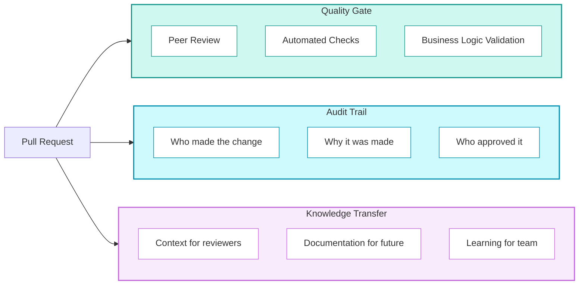

## Pull Requests

<Callout type="info">
  **The Only Way In** - Pull Requests are the single controlled mechanism for introducing changes to protected branches. No exceptions, no shortcuts, no "just this once."
</Callout>


<div className="not-prose my-6 grid grid-cols-1 md:grid-cols-2 gap-4">
  <div className="rounded-lg border border-rose-200 dark:border-rose-800 bg-rose-50 dark:bg-rose-950/20 p-4">
    <p className="text-xs font-semibold uppercase tracking-wide text-rose-700 dark:text-rose-400 mb-3">Without PRs — predictable failures</p>
    <ul className="space-y-3">
      {[
        ["Uncaught errors reach production", "A subtle bug in a join condition goes unreviewed. Finance reports incorrect revenue for a week."],
        ["No audit trail", "Six months later: \"Who changed this? When? Why?\" The commit message says \"fix.\" Context is lost forever."],
        ["Knowledge silos form", "One developer builds a complex transformation. Nobody reviews it. They leave. The code becomes unmaintainable."],
        ["Quality degrades over time", "Bad patterns propagate unchallenged. Technical debt accumulates sprint after sprint."],
      ].map(([title, detail], i) => (
        <li key={i} className="flex items-start gap-2 text-sm text-slate-700 dark:text-slate-300">
          <span className="text-rose-500 mt-0.5 flex-shrink-0">✗</span>
          <span><span className="font-medium text-slate-900 dark:text-slate-100">{title}</span> — {detail}</span>
        </li>
      ))}
    </ul>
  </div>

  <div className="rounded-lg border border-emerald-200 dark:border-emerald-800 bg-emerald-50 dark:bg-emerald-950/20 p-4">
    <p className="text-xs font-semibold uppercase tracking-wide text-emerald-700 dark:text-emerald-400 mb-3">With PRs — mandatory checkpoint</p>
    <ul className="space-y-3">
      {[
        ["Peers review", "Logic, quality, and downstream impact are verified before merge"],
        ["Automation validates", "Syntax, tests, and security checks run on every change"],
        ["Context is documented", "Descriptions create a permanent record for future maintainers"],
        ["Approval creates accountability", "Every change to production has a named reviewer who signed off"],
      ].map(([title, detail], i) => (
        <li key={i} className="flex items-start gap-2 text-sm text-slate-700 dark:text-slate-300">
          <span className="text-emerald-500 mt-0.5 flex-shrink-0">✓</span>
          <span><span className="font-medium text-slate-900 dark:text-slate-100">{title}</span> — {detail}</span>
        </li>
      ))}
    </ul>
  </div>
</div>

Every change — features, fixes, config, documentation — flows through this gate.

#### Impact on Delivery

| Without PRs | With PRs |
|-------------|----------|
| Bugs discovered in production | Bugs caught in review |
| "Who changed this?" → Unknown | Full audit trail |
| Tribal knowledge | Documented decisions |
| Inconsistent quality | Enforced standards |
| Risky deployments | Confidence in releases |

### Why Pull Requests Matter

#### The Three Functions of a Pull Request

A Pull Request isn't just a merge mechanism. It serves three critical functions:



<div className="not-prose my-6 grid grid-cols-1 md:grid-cols-3 gap-4">
  <div className="rounded-lg border-2 border-emerald-200 dark:border-emerald-800 bg-white dark:bg-slate-900 overflow-hidden">
    <div className="bg-emerald-50 dark:bg-emerald-950/30 px-4 py-3 border-b border-emerald-200 dark:border-emerald-800">
      <p className="text-xs font-semibold uppercase tracking-wide text-emerald-700 dark:text-emerald-400">1. Quality Gate</p>
      <p className="text-sm font-semibold text-slate-800 dark:text-slate-200 mt-0.5">Where quality is enforced</p>
    </div>
    <div className="p-4 space-y-2">
      {[
        ["Peer review", "Catches logic errors, edge cases, and bad patterns"],
        ["CI automation", "Validates syntax, tests, and security on every push"],
        ["Discussion", "Surfaces concerns before they become production issues"],
      ].map(([title, detail], i) => (
        <div key={i} className="flex items-start gap-2 text-sm">
          <span className="text-emerald-500 mt-0.5 flex-shrink-0">✓</span>
          <span className="text-slate-700 dark:text-slate-300"><span className="font-medium">{title}</span> — {detail}</span>
        </div>
      ))}
      <p className="text-xs text-slate-400 dark:text-slate-500 pt-2 border-t border-slate-100 dark:border-slate-800">Without this gate, quality depends entirely on individual discipline.</p>
    </div>
  </div>

  <div className="rounded-lg border-2 border-blue-200 dark:border-blue-800 bg-white dark:bg-slate-900 overflow-hidden">
    <div className="bg-blue-50 dark:bg-blue-950/30 px-4 py-3 border-b border-blue-200 dark:border-blue-800">
      <p className="text-xs font-semibold uppercase tracking-wide text-blue-700 dark:text-blue-400">2. Audit Trail</p>
      <p className="text-sm font-semibold text-slate-800 dark:text-slate-200 mt-0.5">Permanent record of every change</p>
    </div>
    <div className="p-4 space-y-2">
      {[
        ["What", "Changed — captured in the diff"],
        ["Why", "It changed — in the description"],
        ["Who", "Made it — the author"],
        ["Who", "Approved it — the reviewer"],
        ["When", "It was merged — the timestamp"],
      ].map(([title, detail], i) => (
        <div key={i} className="flex items-start gap-2 text-sm">
          <span className="text-blue-500 mt-0.5 flex-shrink-0 font-bold w-8">{title}</span>
          <span className="text-slate-700 dark:text-slate-300">{detail}</span>
        </div>
      ))}
      <p className="text-xs text-slate-400 dark:text-slate-500 pt-2 border-t border-slate-100 dark:border-slate-800">Invaluable for debugging, compliance, and due diligence.</p>
    </div>
  </div>

  <div className="rounded-lg border-2 border-purple-200 dark:border-purple-800 bg-white dark:bg-slate-900 overflow-hidden">
    <div className="bg-purple-50 dark:bg-purple-950/30 px-4 py-3 border-b border-purple-200 dark:border-purple-800">
      <p className="text-xs font-semibold uppercase tracking-wide text-purple-700 dark:text-purple-400">3. Knowledge Transfer</p>
      <p className="text-sm font-semibold text-slate-800 dark:text-slate-200 mt-0.5">Every PR is a teaching moment</p>
    </div>
    <div className="p-4 space-y-2">
      {[
        ["Reviewers learn", "What's changing in the codebase and why"],
        ["Authors explain", "Their reasoning — creating living documentation"],
        ["Future maintainers", "Can read the PR to understand decisions made"],
      ].map(([title, detail], i) => (
        <div key={i} className="flex items-start gap-2 text-sm">
          <span className="text-purple-500 mt-0.5 flex-shrink-0">✓</span>
          <span className="text-slate-700 dark:text-slate-300"><span className="font-medium">{title}</span> — {detail}</span>
        </div>
      ))}
      <p className="text-xs text-slate-400 dark:text-slate-500 pt-2 border-t border-slate-100 dark:border-slate-800">Code without context is a liability. PRs provide the context.</p>
    </div>
  </div>
</div>

### When a Pull Request is Required

**Always.** For protected branches (`main`, `release/*`), there are no exceptions.

- New features
- Bug fixes
- Refactoring
- Infrastructure changes
- Configuration changes
- Documentation changes

#### The "Urgent" Trap

<div className="not-prose my-4 rounded-lg border border-amber-200 dark:border-amber-800 bg-amber-50 dark:bg-amber-950/20 p-4 space-y-3">
  <p className="text-sm font-semibold text-amber-800 dark:text-amber-300">When something is urgent, the temptation is to skip the PR. This is backwards.</p>
  <div className="space-y-2">
    {[
      ["Urgency increases risk", "Under pressure, people make mistakes. The more urgent the change, the more important a second pair of eyes becomes."],
      ["Hotfix PRs can be fast", "A focused, well-described hotfix PR can be reviewed in 10 minutes. A small price to avoid a bigger outage."],
      ["The process exists because of urgency", "The PR requirement wasn't invented for calm, planned work. It exists precisely for the moments when you're tempted to skip it."],
    ].map(([title, detail], i) => (
      <div key={i} className="flex items-start gap-2 text-sm text-slate-700 dark:text-slate-300">
        <span className="text-amber-500 mt-0.5 flex-shrink-0 font-bold">→</span>
        <span><span className="font-medium text-slate-900 dark:text-slate-100">{title}</span> — {detail}</span>
      </div>
    ))}
  </div>
</div>

### Scope and Size

#### The Small PR Principle

> Pull Requests must be small, focused, and scoped to a single logical change.

| PR Size | Lines Changed | Review Time | Risk |
|---------|---------------|-------------|------|
| Small | < 200 lines | 15-30 mins | Low |
| Medium | 200-500 lines | 30-60 mins | Medium |
| Large | 500+ lines | 1+ hours | High |

**Why small PRs are better:**

| Aspect | Small PR | Large PR |
|--------|----------|----------|
| Review quality | High (reviewer can focus) | Low (reviewer fatigued) |
| Review speed | Fast (easy to understand) | Slow (takes multiple sessions) |
| Bug detection | Higher (attention to detail) | Lower (things get missed) |
| Merge conflicts | Rare | Common |
| Rollback ease | Simple (isolated change) | Complex (entangled changes) |

#### What "Single Logical Change" Means

A PR should answer one question: "What does this PR do?"

| Good (Single Change) | Bad (Multiple Changes) |
|---------------------|----------------------|
| "Add NRR calculation to revenue model" | "Add NRR calculation and fix customer churn bug and update documentation" |
| "Fix null handling in sales fact" | "Fix various bugs across multiple models" |
| "Add customer cohort dimension" | "Add cohort dimension and refactor date logic and update tests" |

If you need "and" to describe the PR, it's probably too big.

### Description Requirements

A PR description is not optional decoration-it's essential documentation.

#### What Every PR Must Include

| Section | Purpose | Questions Answered |
|---------|---------|-------------------|
| **Motivation** | Why this change exists | What problem does it solve? Why now? |
| **Changes** | What was modified | Which files? What logic? What approach? |
| **Impact** | What could be affected | Which pipelines? Which reports? Which teams? |
| **Validation** | How it was tested | What queries? What test cases? What evidence? |

#### Why Descriptions Matter

**For the reviewer:** A good description lets the reviewer understand context before reading code. They can assess whether the approach makes sense before diving into implementation details.

**For the future:** Six months from now, someone will ask "why does this code do X?" The PR description is the answer. Without it, the context is lost forever.

**For the author:** Writing a description forces you to articulate your reasoning. Often, explaining the change reveals issues you hadn't considered.

#### Description Anti-Patterns

| Bad Description | Problem | Better Version |
|-----------------|---------|----------------|
| "Fix bug" | What bug? Why did it happen? | "Fix: Revenue double-counted when customer has multiple subscriptions. Root cause was missing DISTINCT in aggregation." |
| "Update model" | Which model? What update? | "Update: Add customer_cohort column to dim_customer for retention analysis. Requested by Finance for Q2 board deck." |
| "WIP" | Not ready for review | Don't open PR until ready, or mark as Draft |
| "See ticket" | Context not in PR | Include summary in PR; link ticket for details |

### PR Template

Every PR must use this template. It's not bureaucracy-it's a thinking tool.

```markdown
## Motivation

Why is this change needed? What problem does it solve?

<!-- 
- Link to ticket/issue if applicable
- Explain the business context
- Describe what's broken or missing
-->

## Changes

What exactly was changed? Mention code, infra, config, or doc updates.

<!--
- List the files/models modified
- Describe the approach taken
- Note any alternatives considered
-->

## Impact

What systems, pipelines, or reports could be affected?

<!--
- Downstream models that depend on this
- Dashboards or reports that consume this data
- Other teams who should be notified
-->

## Validation

How was this change tested? What evidence do you have that it works?

<!--
- Queries run and their results
- Test cases executed
- Screenshots if visual changes
- Comparison to expected values
-->

## Other Notes

Any context, caveats, or dependencies reviewers should know about?

<!--
- Known limitations
- Follow-up work planned
- Deployment considerations
-->
```

#### Filling Out the Template

**Motivation example:**
> Finance team reported that NRR calculation doesn't match their spreadsheet. Investigation revealed we were including churned customers in the denominator. This PR fixes the calculation to match the standard NRR formula: (Starting ARR + Expansion - Contraction - Churn) / Starting ARR.

**Changes example:**
> - Modified `models/marts/finance/fct_revenue_retention.sql`
> - Updated NRR calculation to exclude churned customers from starting ARR
> - Added `is_churned` filter to base CTE
> - Updated dbt test thresholds to reflect corrected values

**Impact example:**
> - `rpt_executive_dashboard` consumes this model (will show different NRR)
> - Finance team has been notified and expects the change
> - Historical values will change-documented in JIRA-1234

**Validation example:**
> - Compared output to Finance spreadsheet for Jan-Dec 2024: all months within 0.1%
> - Ran full dbt test suite: all passing
> - Spot-checked edge cases: customer with churn + re-activation correctly handled

### Review and Feedback

#### What Reviewers Assess

| Area | Questions |
|------|-----------|
| **Correctness** | Does the logic actually do what it claims? Are edge cases handled? |
| **Data quality** | Could this introduce nulls, duplicates, or incorrect values? |
| **Dependencies** | What downstream models/reports are affected? Are they considered? |
| **Backward compatibility** | Does this break existing consumers? Schema changes? |
| **Security** | Any sensitive data exposed? Access controls correct? |
| **Maintainability** | Will someone else understand this in 6 months? |
| **Performance** | Will this scale with production data volumes? |

<div className="not-prose my-6 grid grid-cols-1 md:grid-cols-2 gap-4">
  <div className="rounded-lg border border-blue-200 dark:border-blue-800 bg-white dark:bg-slate-900 overflow-hidden">
    <div className="bg-blue-50 dark:bg-blue-950/30 px-4 py-3 border-b border-blue-200 dark:border-blue-800">
      <p className="text-xs font-semibold uppercase tracking-wide text-blue-700 dark:text-blue-400 mb-0.5">Reviewer's Responsibility</p>
      <p className="text-xs text-slate-500 dark:text-slate-400">Approving means: "I believe this is safe to deploy." Your name is on it.</p>
    </div>
    <div className="p-4 space-y-2">
      {[
        "Actually read the code — don't skim",
        "Run the code mentally with edge cases",
        "Check the description matches the implementation",
        "Ask questions if anything is unclear",
        "Request changes if something is wrong",
      ].map((item, i) => (
        <div key={i} className="flex items-start gap-2 text-sm text-slate-700 dark:text-slate-300">
          <span className="text-blue-500 mt-0.5 flex-shrink-0">→</span>{item}
        </div>
      ))}
    </div>
  </div>

  <div className="rounded-lg border border-purple-200 dark:border-purple-800 bg-white dark:bg-slate-900 overflow-hidden">
    <div className="bg-purple-50 dark:bg-purple-950/30 px-4 py-3 border-b border-purple-200 dark:border-purple-800">
      <p className="text-xs font-semibold uppercase tracking-wide text-purple-700 dark:text-purple-400 mb-0.5">Author's Responsibility</p>
      <p className="text-xs text-slate-500 dark:text-slate-400">Unresolved comments block the merge — by design.</p>
    </div>
    <div className="p-4 space-y-2">
      {[
        ["Address every comment", "Don't ignore or dismiss feedback"],
        ["Explain your reasoning", "If you disagree, explain why — don't just ignore"],
        ["Make requested changes", "Or open a discussion about why not"],
        ["Re-request review", "After making changes, don't leave it in limbo"],
      ].map(([title, detail], i) => (
        <div key={i} className="flex items-start gap-2 text-sm text-slate-700 dark:text-slate-300">
          <span className="text-purple-500 mt-0.5 flex-shrink-0">→</span>
          <span><span className="font-medium text-slate-900 dark:text-slate-100">{title}</span> — {detail}</span>
        </div>
      ))}
    </div>
  </div>
</div>

#### Review Turnaround

<div className="not-prose my-4 grid grid-cols-1 sm:grid-cols-3 gap-3">
  {[
    { priority: "Hotfix (P1)", sla: "Within 2 hours", border: "border-rose-200 dark:border-rose-800", bg: "bg-rose-50 dark:bg-rose-950/20", label: "bg-rose-100 text-rose-800 dark:bg-rose-900/40 dark:text-rose-200" },
    { priority: "Standard feature", sla: "Within 1 business day", border: "border-amber-200 dark:border-amber-800", bg: "bg-amber-50 dark:bg-amber-950/20", label: "bg-amber-100 text-amber-800 dark:bg-amber-900/40 dark:text-amber-200" },
    { priority: "Large / complex change", sla: "Within 2 business days", border: "border-slate-200 dark:border-slate-700", bg: "bg-slate-50 dark:bg-slate-800/50", label: "bg-slate-100 text-slate-700 dark:bg-slate-800 dark:text-slate-300" },
  ].map(({ priority, sla, border, bg, label }, i) => (
    <div key={i} className={`rounded-lg border p-4 ${border} ${bg}`}>
      <span className={`text-xs font-semibold px-2 py-0.5 rounded-full ${label}`}>{priority}</span>
      <p className="mt-2 text-sm font-medium text-slate-800 dark:text-slate-200">{sla}</p>
    </div>
  ))}
</div>

If you're blocked waiting for review, escalate. Don't bypass the process.

### CI/CD and Validation

#### Automated Checks

Every PR triggers CI pipeline. The following must pass before merge:

| Check | Purpose | Failure = |
|-------|---------|-----------|
| Linting | Code style and syntax | Block merge |
| Unit tests | Logic correctness | Block merge |
| Integration tests | Component interaction | Block merge |
| Security scan | Vulnerability detection | Block merge |
| Build validation | Code compiles/parses | Block merge |

#### No Bypassing CI

| Scenario | Temptation | Reality |
|----------|------------|---------|
| "CI is slow, I'll merge anyway" | Bypass | Broken code reaches release branch |
| "It's just a typo fix" | Bypass | Typo fix has unintended side effect |
| "CI is flaky, this failure is unrelated" | Bypass | Flaky test was actually catching a real bug |

**Rule:** If CI fails, the PR cannot be merged. Fix the failure. No exceptions.

#### Re-Running CI

Before merge, CI must reflect the current state:
- If you push new commits, CI must re-run
- If the target branch has moved, CI must re-run
- Stale CI results are not valid

### Merge Strategy

#### Squash and Merge

For feature and hotfix branches merging to release:

```bash
Before (10 commits):
- "wip"
- "fix typo"  
- "actually fix it"
- "add test"
- "fix test"
- "refactor"
- "more wip"
- "done?"
- "now really done"
- "final fix"

After (1 commit):
- "feat(revenue): add NRR calculation (#123)"
```

**Why squash?**
- Clean history for debugging
- Meaningful commit messages
- Easy to revert (one commit = one feature)
- Hides messy development process

#### Rebase and Merge

For release branches merging to main:
- Maintains linear history
- Each release is a clear point in history
- Tags align with commits

### No Merge Commits

Standard merge commits create "bubbles" in history:

```bash
# Bad: Merge commit creates non-linear history
*   Merge branch 'feat/x' into release
|\
| * feat: add x
| * wip
|/
* previous commit

# Good: Squash creates linear history
* feat: add x (#123)
* previous commit
```

Linear history makes `git bisect` work properly and keeps the log readable.

### Anti-Patterns

<AntiPatterns
  patterns={[
    {
      title: "The Mega PR",
      problem: "Developer works for two weeks, then opens a PR with 2,000 lines of changes across 40 files.",
      example: "A 1,500-line PR was 'reviewed' in 20 minutes - the reviewer admitted they skimmed it because it was overwhelming. The PR contained a subtle bug in line 847 that nobody caught. The bug caused incorrect margin calculations for three weeks before discovery.",
      prevention: "Break large work into incremental PRs. Set soft limit: 400 lines per PR. If over 500 lines, require explicit justification. Reviewers should push back on mega PRs.",
    },
    {
      title: "The Rubber Stamp",
      problem: "Reviewer approves immediately without actually reviewing. 'I trust you' or 'I'm too busy.'",
      example: "Two developers had a pattern of approving each other's PRs within seconds. A change with an obvious bug (wrong table name in a join) made it to production. When investigated, reviewer admitted they 'didn't really look.'",
      prevention: "Require meaningful review comment before approval. Track approval times (instant approvals are suspicious). Rotate reviewers to avoid buddy-system rubber stamping. Make clear: approval = accountability.",
    },
    {
      title: "The Abandoned PR",
      problem: "PR opened, feedback given, author never responds. PR sits for weeks, accumulating merge conflicts.",
      example: "A PR with an important security fix was opened, reviewer requested minor changes, author went on holiday. PR sat for 3 weeks. By the time author returned, the target branch had diverged significantly. Resolving conflicts took longer than the original work.",
      prevention: "Set SLA: address feedback within 2 business days. Auto-close PRs with no activity after 14 days. If blocked, communicate - don't go silent. Hand off PRs if author unavailable.",
    },
    {
      title: "The Description Desert",
      problem: "PR description is empty or says only 'Fix' or 'Update.'",
      example: "A PR titled 'Update revenue model' was merged. Six months later, during PE due diligence, auditors asked why revenue calculation changed on that date. Nobody remembered. The PR description said 'Update revenue model' - no context, no rationale, no audit trail.",
      prevention: "Require template completion (automated check). Reject PRs with insufficient description. Reviewers should request context before reviewing code.",
    },
    {
      title: "The CI Bypass",
      problem: "CI is red, but developer merges anyway because 'it's a flaky test' or 'we need to ship.'",
      example: "A developer force-merged over a failing test, claiming it was unrelated. The test was actually catching a null pointer exception that manifested in production that night, causing pipeline failure and stale dashboards.",
      prevention: "Technically block merge when CI fails. No admin overrides without documented justification. If test is truly flaky, fix the test - don't bypass it.",
    },
  ]}
/>