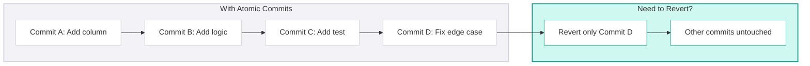

## Commit Discipline

<Callout type="info">
  **Commits are Documentation** - Every commit message is a note to your future self and your teammates. Write commits as if you'll need to debug this code at 2 AM six months from now-because you might.
</Callout>

<div className="not-prose my-6 grid grid-cols-1 md:grid-cols-2 gap-4">
  <div className="rounded-lg border border-rose-200 dark:border-rose-800 bg-rose-50 dark:bg-rose-950/20 p-4">
    <p className="text-xs font-semibold uppercase tracking-wide text-rose-700 dark:text-rose-400 mb-3">Poor commit discipline — compounding problems</p>
    <ul className="space-y-3">
      {[
        ["Debugging becomes archaeology", "History shows 47 commits labelled \"fix\", \"wip\", \"final\". Finding the problem takes hours instead of minutes."],
        ["Reverts become surgery", "A feature committed in pieces mixed with other work. Rolling it back means untangling a dozen commits."],
        ["Reviews become guesswork", "30 commits with no logical progression. Reviewer must decipher the final diff as a monolith."],
        ["Secrets leak permanently", "A .env file is committed and pushed. Even after deletion, the secret lives in git history forever."],
      ].map(([title, detail], i) => (
        <li key={i} className="flex items-start gap-2 text-sm text-slate-700 dark:text-slate-300">
          <span className="text-rose-500 mt-0.5 flex-shrink-0">✗</span>
          <span><span className="font-medium text-slate-900 dark:text-slate-100">{title}</span> — {detail}</span>
        </li>
      ))}
    </ul>
  </div>

  <div className="rounded-lg border border-emerald-200 dark:border-emerald-800 bg-emerald-50 dark:bg-emerald-950/20 p-4">
    <p className="text-xs font-semibold uppercase tracking-wide text-emerald-700 dark:text-emerald-400 mb-3">Solution — three practices working together</p>
    <ul className="space-y-3">
      {[
        ["Atomic commits", "Each commit is one complete, logical unit of work"],
        ["Conventional commits", "Commit messages follow a standard, machine-readable format"],
        ["Gitignore hygiene", "Sensitive and generated files never enter the repository"],
      ].map(([title, detail], i) => (
        <li key={i} className="flex items-start gap-2 text-sm text-slate-700 dark:text-slate-300">
          <span className="text-emerald-500 mt-0.5 flex-shrink-0">✓</span>
          <span><span className="font-medium text-slate-900 dark:text-slate-100">{title}</span> — {detail}</span>
        </li>
      ))}
    </ul>
  </div>
</div>

### Atomic Commits

#### The Problem with "End of Day" Commits

How frequently should you commit? Most developers commit "at the end of the day" or "Friday evening"-bundling hours of work into one massive commit.

This creates problems:

| End-of-Day Commits | Atomic Commits |
|--------------------|----------------|
| One commit = 8 hours of mixed work | One commit = one logical change |
| Can't revert part of it | Can revert precisely |
| Message: "Friday work" | Message: "feat: add NRR calculation" |
| Reviewer sees chaos | Reviewer sees progression |

#### What Makes a Commit Atomic?

> **Atomic commit = Small as possible + Complete work**

Each commit should express a single unit of work that:
- **Does one thing** - Explainable in a single sentence
- **Is complete** - Doesn't leave the codebase in a broken state
- **Is reversible** - Can be reverted independently

#### Examples

| Atomic (Good) | Non-Atomic (Bad) |
|---------------|------------------|
| "Add customer_cohort column to dim_customer" | "Add cohort and fix bug and update tests" |
| "Fix null handling in revenue calculation" | "Various fixes" |
| "Add dbt test for unique customer_key" | "Add tests" |
| "Refactor date logic into macro" | "Refactor and add new feature" |

#### How Atomic Commits Help



<div className="not-prose my-4 grid grid-cols-1 sm:grid-cols-2 gap-3">
  {[
    ["Reversible changes", "Need to undo one thing? Revert one commit. The rest of your work is untouched."],
    ["Clean git history", "Each commit is meaningful and complete. History becomes living documentation."],
    ["Easy PR review", "Reviewers follow your thought process commit by commit — not a monolithic diff."],
    ["Precise debugging", "git bisect pinpoints exactly which commit introduced the bug."],
  ].map(([title, detail], i) => (
    <div key={i} className="rounded-lg border border-slate-200 dark:border-slate-800 bg-white dark:bg-slate-900 p-3 flex items-start gap-3">
      <span className="mt-0.5 flex-shrink-0 w-5 h-5 rounded-full bg-emerald-100 dark:bg-emerald-900/40 text-emerald-700 dark:text-emerald-300 text-xs font-bold flex items-center justify-center">{i + 1}</span>
      <span className="text-sm text-slate-700 dark:text-slate-300"><span className="font-medium text-slate-900 dark:text-slate-100">{title}</span> — {detail}</span>
    </div>
  ))}
</div>


#### The "One Sentence" Test

If you can't describe your commit in one short sentence, it's too big.

| Can Describe | Can't Describe (Too Big) |
|--------------|-------------------------|
| "Add NRR calculation" | "Work on revenue stuff" |
| "Fix null check in join" | "Fix various issues" |
| "Update dbt test threshold" | "Updates" |

When writing the commit message, if you find yourself using "and"-stop. That's two commits.


### Conventional Commits

#### The Problem with Free-Form Messages

We've all seen commit histories like this (good and bad):


Bad commit messages are useless. They don't tell you:
- What was changed
- Why it was changed
- What area of the codebase was affected
- Whether it was a feature, fix, or refactor

#### The Conventional Commits Specification

Conventional Commits is a standard format for commit messages:

```bash
<type>(<scope>): <description>

[optional body]

[optional footer]
```

**Structure:**

| Element | Required | Purpose | Example |
|---------|----------|---------|---------|
| **type** | Yes | Category of change | `feat`, `fix`, `refactor` |
| **scope** | Optional | Area affected | `revenue`, `customer`, `infra` |
| **description** | Yes | Short summary | "add NRR calculation" |
| **body** | Optional | Detailed explanation | Why, context, approach |
| **footer** | Optional | Metadata | Breaking changes, ticket refs |

#### Commit Types

| Type | When to Use | Example |
|------|-------------|---------|
| `feat` | New functionality | `feat(revenue): add NRR calculation` |
| `fix` | Bug fix | `fix(customer): correct churn date logic` |
| `refactor` | Code restructure, no behaviour change | `refactor(models): simplify join logic` |
| `docs` | Documentation only | `docs(readme): update setup instructions` |
| `test` | Adding or updating tests | `test(revenue): add edge case coverage` |
| `chore` | Maintenance tasks | `chore(deps): update dbt to 1.7` |
| `style` | Formatting, no logic change | `style(sql): apply SQLFluff formatting` |
| `perf` | Performance improvement | `perf(facts): add clustering key` |
| `ci` | CI/CD changes | `ci(github): add SQLFluff check` |

#### Examples

**Simple commit:**
```bash
feat(revenue): add gross revenue retention metric
```

**Commit with body:**
```bash
fix(customer): correct churn calculation for reactivated customers

Previously, customers who churned and reactivated were still marked as churned
in their original cohort. This fix updates the churn flag to FALSE when a
customer reactivates.

Closes #234
```

**Breaking change:**
```bash
feat(schema)!: rename customer_id to customer_key

BREAKING CHANGE: All downstream models referencing customer_id must be updated
to use customer_key. This aligns with our surrogate key naming convention.
```

#### Why Conventional Commits Matter

<div className="not-prose my-4 grid grid-cols-1 md:grid-cols-3 gap-4">
  <div className="rounded-lg border border-blue-200 dark:border-blue-800 bg-white dark:bg-slate-900 overflow-hidden">
    <div className="bg-blue-50 dark:bg-blue-950/30 px-4 py-3 border-b border-blue-200 dark:border-blue-800">
      <p className="text-xs font-semibold uppercase tracking-wide text-blue-700 dark:text-blue-400">Automated release notes</p>
    </div>
    <div className="p-4 space-y-1.5">
      {[["feat:", "Features section"], ["fix:", "Bug Fixes section"], ["BREAKING CHANGE:", "Breaking Changes section"]].map(([type, section], i) => (
        <div key={i} className="flex items-center gap-2 text-sm">
          <code className="text-xs bg-slate-100 dark:bg-slate-800 px-1.5 py-0.5 rounded text-slate-700 dark:text-slate-300 flex-shrink-0">{type}</code>
          <span className="text-slate-500 dark:text-slate-400">→ {section}</span>
        </div>
      ))}
    </div>
  </div>

  <div className="rounded-lg border border-purple-200 dark:border-purple-800 bg-white dark:bg-slate-900 overflow-hidden">
    <div className="bg-purple-50 dark:bg-purple-950/30 px-4 py-3 border-b border-purple-200 dark:border-purple-800">
      <p className="text-xs font-semibold uppercase tracking-wide text-purple-700 dark:text-purple-400">Semantic versioning</p>
    </div>
    <div className="p-4 space-y-1.5">
      {[["feat:", "Minor bump", "1.1.0 → 1.2.0"], ["fix:", "Patch bump", "1.1.0 → 1.1.1"], ["BREAKING CHANGE:", "Major bump", "1.1.0 → 2.0.0"]].map(([type, bump, example], i) => (
        <div key={i} className="flex items-center gap-2 text-sm">
          <code className="text-xs bg-slate-100 dark:bg-slate-800 px-1.5 py-0.5 rounded text-slate-700 dark:text-slate-300 flex-shrink-0">{type}</code>
          <span className="text-slate-500 dark:text-slate-400">{bump} <span className="text-xs text-slate-400">({example})</span></span>
        </div>
      ))}
    </div>
  </div>

  <div className="rounded-lg border border-emerald-200 dark:border-emerald-800 bg-white dark:bg-slate-900 overflow-hidden">
    <div className="bg-emerald-50 dark:bg-emerald-950/30 px-4 py-3 border-b border-emerald-200 dark:border-emerald-800">
      <p className="text-xs font-semibold uppercase tracking-wide text-emerald-700 dark:text-emerald-400">Searchable history & audit</p>
    </div>
    <div className="p-4 space-y-3">
      <code className="block text-xs bg-slate-100 dark:bg-slate-800 rounded p-2 text-slate-700 dark:text-slate-300">git log --oneline --grep="revenue"</code>
      <p className="text-sm text-slate-600 dark:text-slate-400">Find every revenue-related change across all commits. Clear audit trail of what changed, when, and why.</p>
    </div>
  </div>
</div>

---

#### Enforcing Conventional Commits

<div className="not-prose my-4 grid grid-cols-1 md:grid-cols-2 gap-4">
  <div className="rounded-lg border border-amber-200 dark:border-amber-800 bg-white dark:bg-slate-900 overflow-hidden">
    <div className="bg-amber-50 dark:bg-amber-950/30 px-4 py-3 border-b border-amber-200 dark:border-amber-800 flex items-center justify-between">
      <p className="text-xs font-semibold uppercase tracking-wide text-amber-700 dark:text-amber-400">Local — Pre-Commit Hook</p>
      <span className="text-xs text-amber-600 dark:text-amber-500 font-medium">Helpful, not sufficient</span>
    </div>
    <div className="p-4 space-y-3">
      <pre className="text-xs bg-slate-50 dark:bg-slate-800 rounded p-3 overflow-x-auto text-slate-700 dark:text-slate-300 leading-relaxed">{`# .pre-commit-config.yaml
repos:
  - repo: https://github.com/compilerla/
      conventional-pre-commit
    rev: v2.1.1
    hooks:
      - id: conventional-pre-commit
        stages: [commit-msg]`}</pre>
      <p className="text-xs text-amber-700 dark:text-amber-400">Can be bypassed with <code className="bg-amber-100 dark:bg-amber-900/40 px-1 rounded">--no-verify</code>. Use as a developer aid only.</p>
    </div>
  </div>

  <div className="rounded-lg border-2 border-emerald-200 dark:border-emerald-800 bg-white dark:bg-slate-900 overflow-hidden">
    <div className="bg-emerald-50 dark:bg-emerald-950/30 px-4 py-3 border-b border-emerald-200 dark:border-emerald-800 flex items-center justify-between">
      <p className="text-xs font-semibold uppercase tracking-wide text-emerald-700 dark:text-emerald-400">CI — Mandatory Gate</p>
      <span className="text-xs text-emerald-600 dark:text-emerald-500 font-medium">The enforcement point</span>
    </div>
    <div className="p-4 space-y-3">
      <pre className="text-xs bg-slate-50 dark:bg-slate-800 rounded p-3 overflow-x-auto text-slate-700 dark:text-slate-300 leading-relaxed">{`# GitHub Actions
- name: Validate commit messages
  uses: wagoid/commitlint-github-action@v5
  with:
    configFile: .commitlintrc.json`}</pre>
      <p className="text-xs text-emerald-700 dark:text-emerald-400">PRs with non-conventional commits cannot be merged. No exceptions.</p>
    </div>
  </div>
</div>

---

#### Commit Message Anti-Patterns

| Anti-Pattern | Example | Problem |
|--------------|---------|---------|
| **The Meaningless** | "fix", "update", "changes" | No information about what or why |
| **The Novel** | 500-word commit message | Too long; should be in PR description |
| **The Ticket Only** | "JIRA-123" | Context requires looking up external system |
| **The Emoji Soup** | "🚀✨🔥 awesome stuff" | Not searchable, not professional |
| **The Passive** | "Revenue was updated" | Who did what? Be direct |
| **The Future Tense** | "This will add NRR" | Commits describe what is, not what will be |

### Gitignore

#### Why Gitignore Matters

Git tracks everything by default. Without proper `.gitignore`, repositories accumulate:
- Build artifacts that differ between machines
- IDE settings that cause merge conflicts
- Secrets that create security incidents
- Large files that bloat clone times

#### Mandatory Rules

Every repository must:
- Include a `.gitignore` file at the root level
- Maintain and update `.gitignore` as the project evolves
- Never commit files that should be ignored

#### Files That Must NEVER Be Committed

##### Secrets and Credentials

| File Type | Examples | Risk |
|-----------|----------|------|
| Environment files | `.env`, `.env.local`, `.env.production` | Credentials exposed |
| Key files | `*.pem`, `*.key`, `id_rsa` | Private keys leaked |
| Credential files | `credentials.json`, `service-account.json` | API access compromised |
| Config with secrets | `profiles.yml` with passwords | Database access exposed |

<Callout type="warning">
  **Any Pull Request containing secrets will be rejected immediately.** The author must rotate all exposed credentials before the PR can be reconsidered.
</Callout>

**Why this is serious:**
- Secrets in git history persist even after deletion
- Removing secrets requires history rewriting (complex, disruptive)
- Leaked credentials can lead to data breaches
- Compliance frameworks (SOC2, ISO27001) require secret management controls

#### Handling Secrets Properly

If you need secrets for local development:

```bash
# 1. Create .env.example (committed) with placeholder values
DATABASE_HOST=your-host-here
DATABASE_PASSWORD=your-password-here

# 2. Create .env (ignored) with real values
DATABASE_HOST=prod.database.com
DATABASE_PASSWORD=actual-secret-password

# 3. Document in README
"Copy .env.example to .env and fill in your credentials"
```

For production, use proper secret management:

<div className="not-prose my-3 flex flex-wrap gap-2">
  {["AWS Secrets Manager", "Azure Key Vault", "HashiCorp Vault", "CI/CD environment variables"].map((tool, i) => (
    <span key={i} className="rounded-full border border-slate-200 dark:border-slate-700 bg-white dark:bg-slate-800 px-3 py-1 text-xs font-medium text-slate-600 dark:text-slate-400">{tool}</span>
  ))}
</div>

### Putting It Together

#### Example: Building a Feature with Atomic Commits

**Task:** Add customer cohort analysis to the data model

<div className="not-prose my-4 grid grid-cols-1 md:grid-cols-2 gap-4">
  <div className="rounded-lg border border-rose-200 dark:border-rose-800 bg-white dark:bg-slate-900 overflow-hidden">
    <div className="bg-rose-50 dark:bg-rose-950/30 px-4 py-3 border-b border-rose-200 dark:border-rose-800">
      <p className="text-xs font-semibold uppercase tracking-wide text-rose-700 dark:text-rose-400">Bad — one commit</p>
    </div>
    <div className="p-4">
      <code className="block text-xs bg-slate-50 dark:bg-slate-800 rounded p-3 text-slate-700 dark:text-slate-300">* Add cohort stuff and fix some bugs and update tests — 847 lines changed</code>
      <ul className="mt-3 space-y-1">
        {["Can't revert just one part", "No logical progression", "Reviewer sees a monolith"].map((item, i) => (
          <li key={i} className="flex items-start gap-2 text-sm text-slate-600 dark:text-slate-400">
            <span className="text-rose-500 mt-0.5 flex-shrink-0">✗</span>{item}
          </li>
        ))}
      </ul>
    </div>
  </div>

  <div className="rounded-lg border border-emerald-200 dark:border-emerald-800 bg-white dark:bg-slate-900 overflow-hidden">
    <div className="bg-emerald-50 dark:bg-emerald-950/30 px-4 py-3 border-b border-emerald-200 dark:border-emerald-800">
      <p className="text-xs font-semibold uppercase tracking-wide text-emerald-700 dark:text-emerald-400">Good — atomic commits</p>
    </div>
    <div className="p-4">
      <pre className="text-xs bg-slate-50 dark:bg-slate-800 rounded p-3 text-slate-700 dark:text-slate-300 leading-relaxed">{`* feat(customer): add acquisition_date
* feat(customer): add cohort_month column
* test(customer): uniqueness test for cohort
* docs(customer): document cohort logic
* fix(customer): handle null acquisition_date`}</pre>
      <ul className="mt-3 space-y-1">
        {["Each commit does one thing", "Can revert independently", "Tells a story when read in sequence"].map((item, i) => (
          <li key={i} className="flex items-start gap-2 text-sm text-slate-600 dark:text-slate-400">
            <span className="text-emerald-500 mt-0.5 flex-shrink-0">✓</span>{item}
          </li>
        ))}
      </ul>
    </div>
  </div>
</div>

### Anti-Patterns

<AntiPatterns
  patterns={[
    {
      title: "The Friday Dump",
      problem: "Developer works all week, commits everything Friday afternoon with message \"weekly work.\"",
      example: "A Friday commit introduced a bug. On Monday, the team needed to revert \"just the revenue fix\" but couldn't  it was bundled with 15 other changes. They had to manually unpick the code, introducing new bugs in the process.",
      prevention: "Commit early, commit often. Each logical change is a commit. End of day should have multiple small commits, not one large one."
    },
    {
      title: "The Secret Slip",
      problem: "Developer commits .env file with production database password. Pushes to remote. Realises mistake. Deletes file and commits again.",
      example: "The secret was \"deleted\" but remained in git history. Three months later, a security scan flagged it. The database password had been exposed for 90 days. Full credential rotation required, incident report filed, audit finding recorded.",
      prevention: "Proper .gitignore from day one. Pre-commit hooks to scan for secrets. Never commit credentials  use secret management. If secrets are committed, rotate immediately (deletion is not enough)."
    },
    {
      title: "The Merge Commit Message",
      problem: "Developer merges main into feature branch. Commit message is auto-generated: \"Merge branch 'main' into feat/my-feature.\"",
      example: "The repository history became a maze of merge commits. Running git log --oneline showed more merge commits than actual work. git bisect was unusable. Finding when a bug was introduced required manual archaeology.",
      prevention: "Rebase instead of merge to stay current. Keep history linear. Use git rebase main instead of git merge main."
    },
    {
      title: "The Commit Squash Regret",
      problem: "Developer makes 30 atomic commits during development. When merging PR, all 30 are squashed into one \"feat: add feature\" commit. This is actually correct  squashing gives clean history.",
      example: "The real anti-pattern is the opposite: not making atomic commits because \"they'll be squashed anyway.\" The value of atomic commits is during development and review, not just in final history.",
      prevention: "Make atomic commits during development for easy review and debugging. Squash when merging to release branch. The detailed commits are preserved in the PR for reference."
    }
  ]}
/>

### References

- [Conventional Commits Specification](https://www.conventionalcommits.org/en/v1.0.0/)
- [GitHub's gitignore templates](https://github.com/github/gitignore)
- [git bisect documentation](https://git-scm.com/docs/git-bisect)

### Commit Message Humour

For a laugh (and cautionary tales), see what happens without commit discipline:
- [What the Commit](https://whatthecommit.com/) - Random real commit messages
- [50 Hilarious Git Commit Messages](https://medium.com/@coders.stop/50-hilarious-git-commit-messages-that-made-the-entire-dev-team-lose-it-72a9840d6f49)

Don't let your commits end up on these lists.
