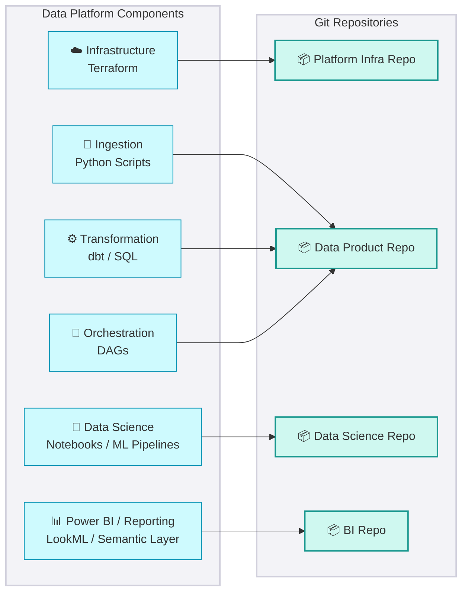
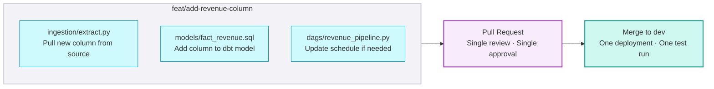

## Git For Everything

<Callout type="info">
**If it isn't in Git, it doesn't exist.** Version control transforms data engineering from scripting into software engineering — enabling collaboration, rollback, and automated releases across every layer of the platform.
</Callout>

Every artifact that defines how the platform behaves must be committed: infrastructure, data logic, pipelines, and configuration. The only exception is secrets — those go in a vault, never in a repo.

### What requires Git

The diagram below shows how every layer of the data platform maps to a Git repository. Ingestion, Transformation, and Orchestration share a single repo by design — this is what enables Atomic PRs.

### Repository structure

<UniversalTable
  headers={["Repository", "What lives here", "Owner", "Change frequency"]}
  rows={[
    {
      "Repository": "**Platform Infra Repo**",
      "What lives here": ["Terraform for core resources", "VPC, Storage Accounts, Clusters", "Databricks / Snowflake / Fabric account-level setup"],
      "Owner": "Platform Engineers",
      "Change frequency": "Rarely — stable foundation"
    },
    {
      "Repository": "**Data Product Repo**",
      "What lives here": ["Python ingestion scripts", "dbt models and SQL transformations", "Orchestration DAGs for this pipeline", "CI/CD config for this product"],
      "Owner": "Data & Analytical Engineers",
      "Change frequency": "Frequently — per feature/sprint"
    },
    {
      "Repository": "**Data Science Repo**",
      "What lives here": ["Jupyter notebooks and training scripts", "ML pipeline definitions", "Model experiment tracking config"],
      "Owner": "Data Scientists",
      "Change frequency": "Frequently — experimentation cadence"
    },
    {
      "Repository": "**BI / Reporting Repo**",
      "What lives here": ["LookML or semantic layer definitions", "Dataset SQL (split from visual layer)", "BI-as-code configs"],
      "Owner": "Analysts",
      "Change frequency": "Frequently — per reporting cycle"
    }
  ]}
/>

<Callout type="info">
**Why are Ingestion, Transformation, and Orchestration in the same repo?** This enables **Atomic PRs** — a developer can add a new column, update the dbt model, and adjust the DAG schedule in a single Pull Request. One review, one merge, one deployment.
</Callout>

### Atomic Pull Request

A single feature or fix touches multiple layers simultaneously. Splitting them across PRs creates review gaps and deployment ordering problems.

### What belongs in Git

<DosAndDonts
  dosLabel="Commit to Git"
  dontsLabel="Never commit"
  dos={[
    { text: "Infrastructure as Code — Terraform" },
    { text: "Transformation logic — dbt models, SQL, Python" },
    { text: "Orchestration definitions — DAGs, workflow YAMLs" },
    { text: "CI/CD pipeline config — GitHub Actions, Azure Pipelines" },
    { text: "Environment variable *names* (not values) — .env.example" },
    { text: "BI / semantic layer definitions — LookML, metrics YAML" },
    { text: "ML training scripts and pipeline definitions" }
  ]}
  donts={[
    { text: "Secrets or credentials — use Azure Key Vault / environment secrets" },
    { text: ".env files with real values — commit .env.example only" },
    { text: "Binary BI files — Power BI .pbix files cannot be diffed or merged" },
    { text: "Large model artefacts — use a model registry (MLflow, Azure ML)" },
    { text: "Generated files — .next/, __pycache__/, node_modules/ go in .gitignore" },
    { text: "Unreviewed notebooks — clean and strip outputs before committing" }
  ]}
/>

<SectionIndex
  items={[
    {
      title: "Repo Management",
      description: "Standards for repository structure, naming conventions, and access control.",
      href: "repo-management"
    },
    {
      title: "Branching Strategy",
      description: "Our strict Git flow: Main, Release, Hotfix, and Feature branches.",
      href: "branching-strategy"
    },
    {
      title: "Pull Request",
      description: "Guidelines for code reviews, merging rules, and automated checks.",
      href: "pull-request"
    },
    {
      title: "Commit Discipline",
      description: "Atomic commits, conventional commit messages, and .gitignore standards.",
      href: "commit-discipline"
    }
  ]}
/>
