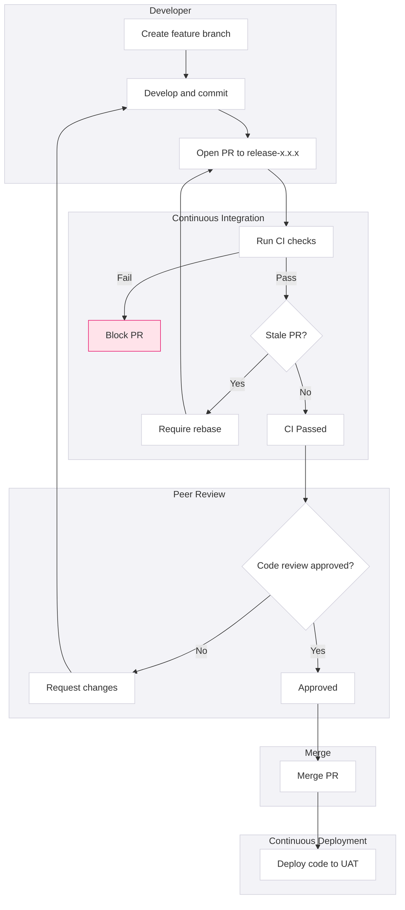
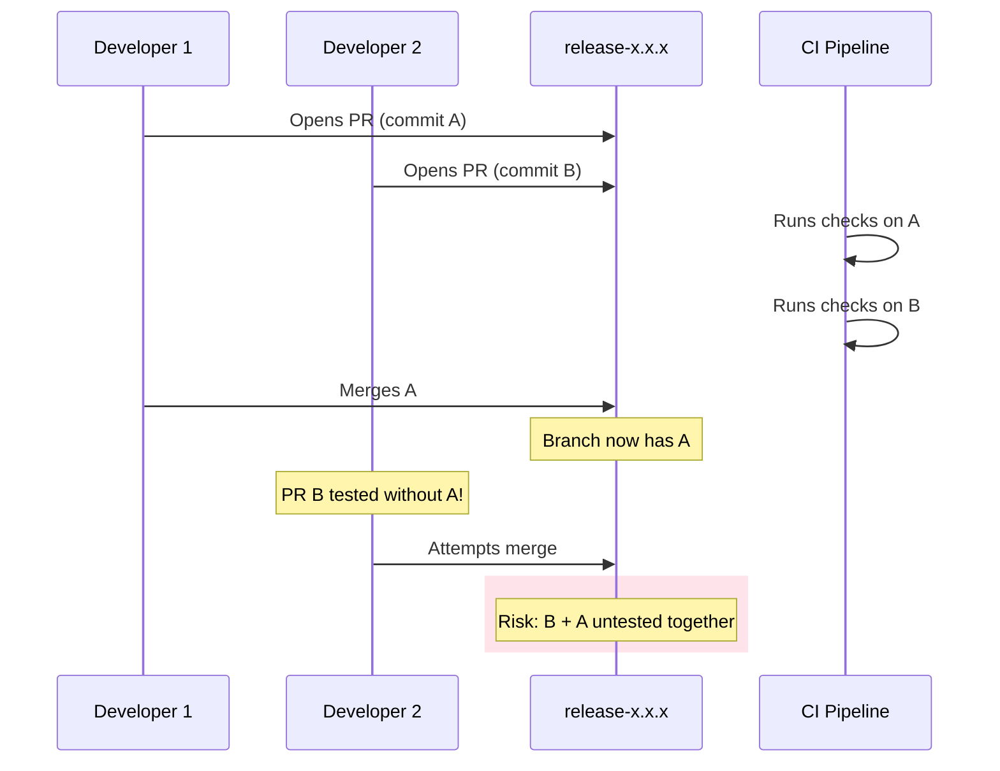
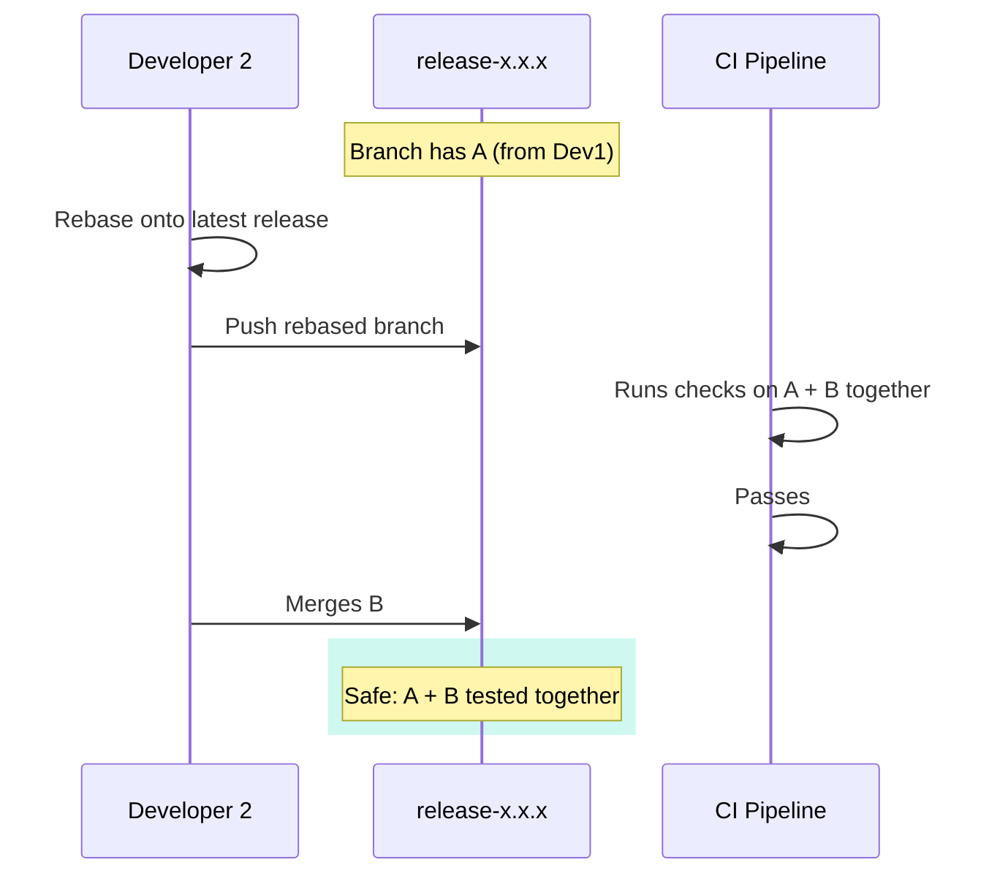

## Development to UAT

This stage ensures code meets standards before business users see it. Automated checks catch technical issues; peer review catches logic issues; manual validation catches data issues.

Developers merge feature or hotfix branches into the `release-x.x.x` branch via Pull Request. CI validates code quality; CD deploys to UAT; manual pipeline execution validates data logic.

<div className="not-prose my-4 rounded-lg border border-blue-200 dark:border-blue-800 bg-blue-50 dark:bg-blue-950/20 p-4">
  <p className="text-xs font-semibold uppercase tracking-wide text-blue-700 dark:text-blue-400 mb-2">Key Principle</p>
  <div className="space-y-1.5">
    {[
      "Code that reaches UAT has passed automated standards checks and peer review",
      "Business stakeholders review validated code — not work-in-progress",
    ].map((item, i) => (
      <div key={i} className="flex items-start gap-2 text-sm text-slate-700 dark:text-slate-300">
        <span className="text-blue-500 mt-0.5 flex-shrink-0">→</span>{item}
      </div>
    ))}
  </div>
</div>

### Engineer Checklist

<div className="not-prose my-4 rounded-lg border border-slate-200 dark:border-slate-800 bg-white dark:bg-slate-900 p-4">
  <ul className="space-y-2">
    {[
      ["Branch follows naming convention", "feat/*, hotfix/*"],
      ["Commits follow conventional commit format", null],
      ["Code passes local linting", "sqlfluff lint, ruff check"],
      ["Unit tests pass locally", null],
      ["PR description explains the change and links to ticket", null],
      ["CI passes before requesting review", null],
      ["Review feedback addressed", null],
      ["Re-ran CI before merge — critical!", null],
      ["Triggered UAT pipeline for modified models", null],
      ["Data quality validated in UAT", null],
      ["Business stakeholder notified for sign-off", null],
      ["Sign-off received and documented", null],
    ].map(([label, cmd], i) => (
      <li key={i} className="flex items-start gap-3">
        <span className="mt-0.5 flex-shrink-0 w-4 h-4 rounded border-2 border-slate-300 dark:border-slate-600" />
        <span className="text-sm text-slate-700 dark:text-slate-300 space-y-0.5">
          <span className="block">{label}</span>
          {cmd && <code className="text-xs text-slate-500 dark:text-slate-400 font-mono">{cmd}</code>}
        </span>
      </li>
    ))}
  </ul>
</div>



### CI: Continuous Integration

**Trigger:** PR opened against `release-x.x.x` branch

#### Automated Checks

| Check | What It Does | Failure Action |
|-------|--------------|----------------|
| **Branch Naming** | Validates source branch matches `feat/*` or `hotfix/*` | Block PR |
| **Conventional Commits** | Ensures commit messages follow standard pattern | Block PR |
| **Linting & Style** | Runs SQLFluff, Black, Ruff for code standards | Block PR |
| **Vulnerability Scan** | Scans dependencies for known CVEs | Block PR (or warn for low severity) |
| **Build & Compile** | Validates code compiles, dbt parses | Block PR |
| **Unit Tests** | Runs dbt tests, Python unit tests | Block PR |
| **Integration Tests** | Tests component interactions | Block PR |
| **Stale PR Check** | Detects if target branch moved since CI started | Require rebase |

#### Branch Naming Validation

| Valid Pattern | Example | Use Case |
|---------------|---------|----------|
| `feat/*` | `feat/add-customer-cohort` | New functionality |
| `hotfix/*` | `hotfix/fix-revenue-calc` | Bug fixes |

Branches that don't match these patterns are blocked from merging to release branches.

#### Conventional Commits

Commit messages must follow the pattern:

``` bash
<type>(<scope>): <description>

[optional body]
[optional footer]
```

| Type | When to Use | Example |
|------|-------------|---------|
| `feat` | New functionality | `feat(revenue): add NRR calculation` |
| `fix` | Bug fix | `fix(customer): correct churn date logic` |
| `refactor` | Code restructure, no behaviour change | `refactor(models): simplify join logic` |
| `docs` | Documentation only | `docs(readme): update setup instructions` |
| `test` | Adding or updating tests | `test(revenue): add edge case coverage` |
| `chore` | Maintenance tasks | `chore(deps): update dbt to 1.7` |

**Why enforce this?** Automated release notes are generated from commit messages. `feat:` becomes "Features", `fix:` becomes "Bug Fixes".


#### Stale PR Check

**Problem:** Two developers work on different features. Both open PRs to the release branch. Developer A merges first. Developer B's PR was tested *without* Developer A's changesthe combination is untested.



**Solution:** If the target branch has moved since CI started, the PR is marked stale. Developer must rebase and re-run CI.



### Peer Review

Automated checks validate syntax and standards. Peer review validates:

| Review Focus | Questions to Ask |
|--------------|------------------|
| **Business logic** | Does this correctly implement the requirement? |
| **Edge cases** | What happens with nulls, empty sets, duplicates? |
| **Performance** | Will this scale with production data volumes? |
| **Maintainability** | Can someone else understand this in 6 months? |
| **Testing** | Are the right scenarios covered? |
| **Documentation** | Are complex sections explained? |

**Minimum reviewers:** 1 (2 for critical paths like revenue calculations)

#### Reviewer Checklist

<div className="not-prose my-4 grid grid-cols-1 md:grid-cols-2 gap-4">
  <div className="rounded-lg border border-slate-200 dark:border-slate-800 bg-white dark:bg-slate-900 p-4">
    <p className="text-xs font-semibold uppercase tracking-wide text-slate-500 dark:text-slate-400 mb-3">Logic & Quality</p>
    <ul className="space-y-2">
      {[
        "Business requirement correctly implemented",
        "Edge cases handled (nulls, empties, duplicates)",
        "Grain is appropriate and documented",
        "Code is readable and maintainable",
        "No hardcoded values that should be configurable",
        "Appropriate error handling",
      ].map((item, i) => (
        <li key={i} className="flex items-center gap-3">
          <span className="flex-shrink-0 w-4 h-4 rounded border-2 border-slate-300 dark:border-slate-600" />
          <span className="text-sm text-slate-700 dark:text-slate-300">{item}</span>
        </li>
      ))}
    </ul>
  </div>
  <div className="rounded-lg border border-slate-200 dark:border-slate-800 bg-white dark:bg-slate-900 p-4">
    <p className="text-xs font-semibold uppercase tracking-wide text-slate-500 dark:text-slate-400 mb-3">Testing & Documentation</p>
    <ul className="space-y-2">
      {[
        "Unit tests cover the change",
        "Test data covers edge cases",
        "dbt tests added for data quality",
        "Model/column descriptions updated",
        "Complex logic has inline comments",
        "README updated if needed",
      ].map((item, i) => (
        <li key={i} className="flex items-center gap-3">
          <span className="flex-shrink-0 w-4 h-4 rounded border-2 border-slate-300 dark:border-slate-600" />
          <span className="text-sm text-slate-700 dark:text-slate-300">{item}</span>
        </li>
      ))}
    </ul>
  </div>
</div>

### CD: Continuous Deployment to UAT

**Trigger:** Immediately after PR merge to `release-x.x.x`

#### Automated Steps

1. **Deploy SQL/Python code** to UAT environment
2. **Deploy dbt models** (compile and deploy)
3. **Apply IaC changes** (Terraform/Pulumi if applicable)
4. **Create pipeline in orchestrator**  **PAUSED state**

#### Why Paused?

Full pipeline execution is expensive (compute, time). Running the entire pipeline for every merge would:
- Consume significant compute resources
- Slow down the development cycle
- Often be unnecessary (changes may only affect specific models)

Instead, developers manually trigger runs for:
- Specific models they modified
- Upstream/downstream dependencies of their changes
- Targeted validation, not full refresh

### Manual Validation

#### Developer Responsibilities

| Step | Action | Validation |
|------|--------|------------|
| 1 | Trigger pipeline run for modified models | Pipeline completes successfully |
| 2 | Check row counts | Within expected range |
| 3 | Check for nulls in required fields | No unexpected nulls |
| 4 | Sample data inspection | Data looks correct |
| 5 | Run dbt tests | All tests pass |
| 6 | Notify business stakeholders | Ready for review |

#### Pipeline Trigger Options

**Option A: Run specific models**

dbt example

```bash
dbt run --select model_name+  # Model and downstream
dbt run --select +model_name  # Model and upstream
dbt run --select tag:release-1.2.0  # Tagged models
```

**Option B: Run via orchestrator UI**
- Navigate to paused DAG
- Trigger manual run
- Select specific tasks/models

### UAT Sign-Off

#### Business Stakeholder Responsibilities

| Step | Action | Evidence |
|------|--------|----------|
| 1 | Review dashboard/report changes | Visual inspection |
| 2 | Validate metrics match expectations | Compare to known values |
| 3 | Check for regressions | Existing reports unchanged |
| 4 | Provide sign-off or feedback | Written approval |

### Gate: Exit Criteria

| Requirement | Who | Evidence |
|-------------|-----|----------|
| CI checks pass | Automated | Pipeline status |
| Peer review approved | Engineer | PR approval |
| Data quality checks pass | Engineer | Test results, pipeline logs |
| Business logic validated | Business stakeholder | Written sign-off |
| No regressions | Analyst | Comparison to production |

**All criteria must be met** before creating the release PR to main.

### Anti-Patterns

<AntiPatterns
  patterns={[
    {
      title: 'The "CI Will Catch It" Mindset',
      problem: "Developer doesn't run linting or tests locally. Pushes code, CI fails, fixes one issue, pushes again, CI fails on something else. Repeat 5 times.",
      example: "A developer pushed 12 commits in one afternoon, each fixing a different CI failure. The PR history was cluttered, review was difficult, and CI runners were tied up. Other team members' PRs were delayed waiting for CI capacity.",
      prevention: "Run checks locally before pushing. Set up pre-commit hooks. If it fails in CI, it should have failed on your machine first."
    },
    {
      title: "The Stale PR Merge",
      problem: "PR passes CI on Monday. Developer goes on leave. On Friday, another developer merges without noticing the PR is stale. Release branch now has untested combination of changes.",
      example: "Two developers both modified the same staging modelone added a column, one changed a join. Each worked independently. When both merged, the combination produced duplicate rows. The issue wasn't caught until business users reported \"impossible\" numbers in UAT.",
      prevention: "Stale PR check blocks merge automatically. Re-run CI immediately before merge (not optional). Set PR auto-close after X days of inactivity. Never merge a PR without green CI from today."
    },
    {
      title: "The Skipped UAT Validation",
      problem: "Developer merges to release, code deploys to UAT, but nobody actually runs the pipeline or checks the data. \"CI passed, it must be fine.\"",
      example: "A change to date timezone handling passed all unit tests (which used mock data). In UAT with real data, the change shifted all historical dates by 8 hours. Nobody ran the UAT pipeline because \"it was a small change.\" The issue was discovered in Pre-Prod regression testing, requiring emergency fixes and delaying the release by a week.",
      prevention: "Pipeline run is mandatory, not optional. Create a \"UAT Validation\" checklist in the PR template. Require evidence (screenshots, test output) attached to PR. \"Deployed to UAT\" does not mean \"Validated in UAT\"  both must happen."
    },
    {
      title: "The Rubber Stamp Review",
      problem: "Reviewer approves PR without actually reviewing. \"I trust the developer\" or \"I'm too busy to look closely.\"",
      example: "A senior developer's PR was approved in 3 minutesthe reviewer admitted they \"just skimmed it.\" The code had a subtle bug where customer churn was calculated using <= instead of <, causing customers to appear churned one day early. The bug affected retention metrics shown to investors.",
      prevention: "Require meaningful review comments (not just \"LGTM\"). Set minimum review time. Use review checklist that requires explicit checkboxes. Rotate reviewers to prevent rubber-stamping between \"buddies\". If you approve it, you own it."
    },
    {
      title: 'The "Works on My Data" Assumption',
      problem: "Developer tests with a subset of data that doesn't include edge cases present in production. Logic works perfectly on test data, fails on real data.",
      example: "A developer built a revenue allocation model tested against 100 sample transactions. All tests passed. In UAT (with 50,000 transactions), the model hit a division-by-zero error on a product line with zero-cost itemsa scenario that didn't exist in the sample data.",
      prevention: "UAT environment should have production-representative data. Include known edge cases in test data (nulls, zeros, duplicates). Run against full UAT data, not just modified models. Document \"data assumptions\" in model descriptions."
    }
  ]}
/>