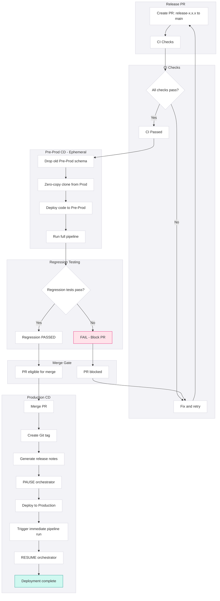
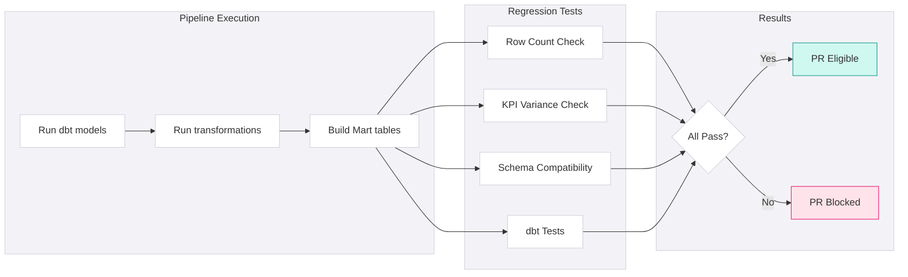
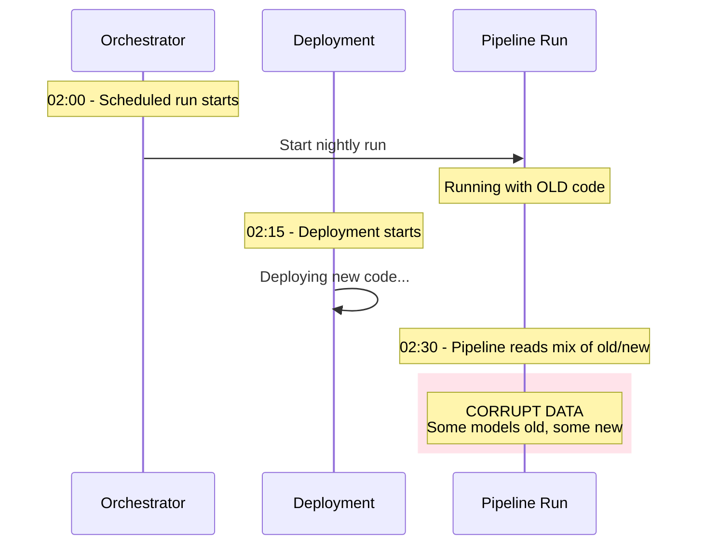
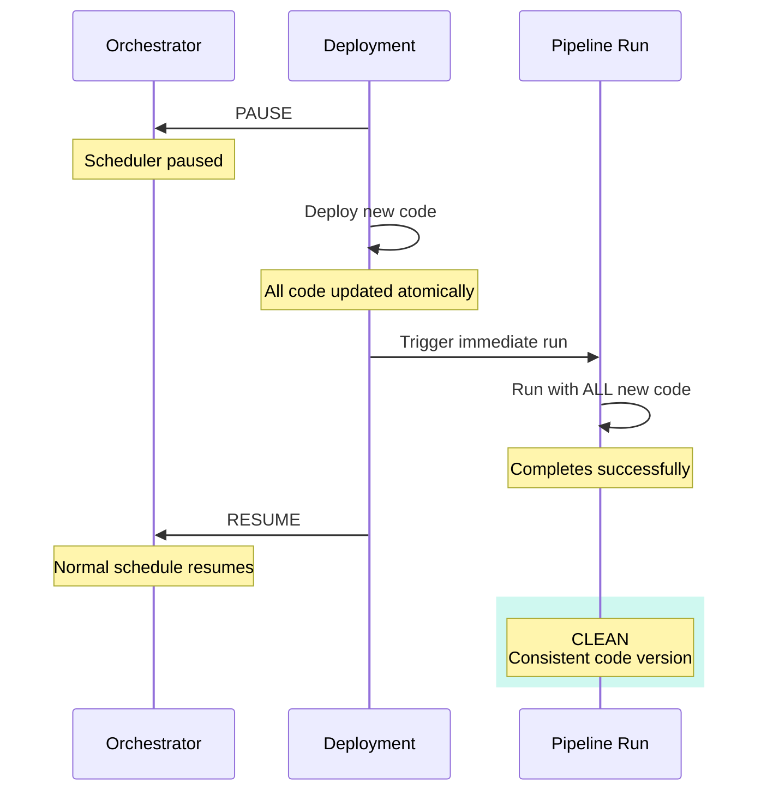

### UAT to Production (via Pre-Prod)

This stage proves that changes won't break production. Automated tests against production-clone data catch metric drift before it reaches users. No human approval needed-if tests pass, code is safe.

Once business stakeholders sign off on UAT, developers create a release PR to merge `release-x.x.x` into `main`. This triggers:

1. **CI checks** - Re-validate code quality
2. **Pre-Prod provisioning** - Zero-copy clone from Production
3. **Regression testing** - Automated validation against real data
4. **Production deployment** - Safe deployment with scheduler management

<div className="not-prose my-4 rounded-lg border border-blue-200 dark:border-blue-800 bg-blue-50 dark:bg-blue-950/20 p-4">
  <p className="text-xs font-semibold uppercase tracking-wide text-blue-700 dark:text-blue-400 mb-2">Key Principle</p>
  <div className="space-y-1.5">
    {[
      "The Pre-Prod regression gate is fully automated",
      "Human judgement happened at UAT sign-off — if regression tests pass, the code is proven safe",
    ].map((item, i) => (
      <div key={i} className="flex items-start gap-2 text-sm text-slate-700 dark:text-slate-300">
        <span className="text-blue-500 mt-0.5 flex-shrink-0">→</span>{item}
      </div>
    ))}
  </div>
</div>



### Continuous Integration

**Trigger:** Release PR opened against `main`

Same checks as Dev → UAT, run again to ensure:
- No drift since UAT sign-off
- Release branch incorporates any hotfixes merged to main
- Code still meets all standards

| Check | Purpose |
|-------|---------|
| Branch naming | Validates `release-*` pattern |
| Conventional commits | Enables automated release notes |
| Linting & style | Code standards maintained |
| Vulnerability scan | No new security issues |
| Build & compile | Code is valid |
| Unit & integration tests | Logic still correct |
| Stale PR check | Catches concurrent changes |

### Ephemeral Pre-Prod CD

This is the critical validation step. It runs **automatically after CI passes** but **before the PR can be merged**.

#### Step 1: Environment Provisioning

<PlatformTabs>

<PlatformTabsFabric>

Fabric Lakehouses use Delta Lake shortcuts and the Copy activity for environment cloning. Full zero-copy clone is not natively supported at the Lakehouse level — use shortcuts for read-only references or Copy activity for writable clones.

```python
# Option 1: Shortcut (read-only reference to Prod tables)
# Create via Fabric UI or REST API — no data duplication
# Best for: regression testing where Pre-Prod only reads Prod data

# Option 2: Copy activity (writable clone)
# Use a Fabric Data Factory pipeline to copy tables
for table in production_tables:
    spark.sql(f"""
        CREATE OR REPLACE TABLE preprod_lakehouse.{table}
        AS SELECT * FROM prod_lakehouse.{table}
    """)
```

> **Note:** Shortcuts are preferred when Pre-Prod only needs read access — they incur zero storage cost. Use Copy activity when Pre-Prod must write to cloned tables during pipeline execution.

</PlatformTabsFabric>

<PlatformTabsDatabricks>

Clone tables

```python
spark.sql("""
    CREATE SCHEMA IF NOT EXISTS preprod.analytics
""")

for table in production_tables:
    spark.sql(f"""
        CREATE OR REPLACE TABLE preprod.analytics.{table}
        SHALLOW CLONE prod.analytics.{table}
    """)
```

</PlatformTabsDatabricks>

<PlatformTabsSnowflake>

Zero-copy clone

```sql
DROP SCHEMA IF EXISTS PREPROD.ANALYTICS;
CREATE SCHEMA PREPROD.ANALYTICS CLONE PROD.ANALYTICS;

-- Clone includes all tables, views, and data
-- No storage cost - shares underlying data blocks
```

</PlatformTabsSnowflake>

</PlatformTabs>

**Why zero-copy clone?**

| Benefit | Explanation |
|---------|-------------|
| **Production-identical data** | Tests run against real volumes, not synthetic |
| **No storage cost** | Clone shares underlying data (Snowflake/Databricks) |
| **Fast provisioning** | Seconds, not hours |
| **Catches scale issues** | Problems that only appear at production volume |

#### Step 2: Deploy Code

- Deploy dbt models to Pre-Prod
- Apply any schema migrations
- Deploy Python/orchestration changes
- **Same deployment process as Production** (validates deployment itself)

#### Step 3: Automated Regression Testing

Run the full pipeline (excluding external ingestion) and validate:



| Threshold | Typical Value | When to Adjust |
|-----------|---------------|----------------|
| Default | 5% | Most tables |
| Strict | 1% | Critical facts (revenue, orders) |
| Lenient | 10% | Tables with known variability |

#### KPI Variance

| KPI | Threshold | Rationale |
|-----|-----------|-----------|
| Total Revenue | 1% | Financial accuracy critical |
| Customer Count | 2% | Entity resolution may vary slightly |
| Churn Rate | 0.5pp | Sensitive metric, small changes matter |
| ARR/MRR | 1% | Investor-facing metric |

### Regression Test Results

| Outcome | Action |
|---------|--------|
| **All tests pass** | PR automatically marked "Ready to Merge" |
| **Any test fails** | PR blocked; developer must fix and restart |

**No human approval required.** The tests are deterministic. If they pass, the code is safe.

### Gate: Merge Eligibility

The PR **cannot be merged** until:

| Requirement | Type | Validation |
|-------------|------|------------|
| CI checks pass | Automated | All green |
| Row count variance < threshold | Automated | Regression test |
| KPI variance < threshold | Automated | Regression test |
| Schema compatibility | Automated | Regression test |
| dbt tests pass | Automated | Regression test |

<div className="not-prose my-4 rounded-lg border border-slate-200 dark:border-slate-800 bg-slate-50 dark:bg-slate-800/50 p-4">
  <p className="text-xs font-semibold uppercase tracking-wide text-slate-500 dark:text-slate-400 mb-1.5">Why no human approval?</p>
  <p className="text-sm text-slate-700 dark:text-slate-300">Human judgement was exercised at UAT sign-off. The regression gate validates that the <em>approved</em> code doesn't break production. This is a technical validation, not a business decision.</p>
</div>

### Continuous Deployment

**Trigger:** Immediately after release PR is merged to `main`

#### Step 1: Tagging

```bash
# Automated by CI/CD pipeline
git tag -a v1.2.0 -m "Release 1.2.0"
git push origin v1.2.0
```

**Release notes generated automatically:**

```markdown
## Release 1.2.0

### Features
- feat(revenue): Add NRR calculation (#123)
- feat(customer): Add cohort dimension (#124)

#### Bug Fixes  
- fix(churn): Correct date boundary logic (#125)

#### Breaking Changes
- None
```

#### Step 2: Orchestrator Pause (Safety Lock)

**Why pause?**

Without pause, a race condition can occur:



**With pause:**



#### Step 3: Deploy Code

- Deploy tagged release (`v1.2.0`) to Production
- Apply schema migrations (dbt run, Terraform apply)
- Validate deployment completed successfully

#### Step 4: Immediate Execution (Catch-up)

**Why run immediately?**

Without immediate execution:
- Dashboards show stale data until next scheduled run
- Business users see outdated metrics for hours (or until next morning)
- Changes aren't validated against production until overnight

**Execution options:**

| Option | When to Use | Command |
|--------|-------------|---------|
| Full pipeline | Major changes, schema migrations | `dbt run --target prod` |
| Changed models + downstream | Most releases | `dbt run --select tag:v1.2.0+` |
| Specific models | Targeted fixes | `dbt run --select model_name` |

**Pre-run check:** Ensure run will complete before next scheduled run.

#### Step 5: Resume Schedulers

Normal daily/hourly schedules resume.

### Post-Deployment Validation

Even after successful deployment, monitor for issues:

| Check | When | Action if Failed |
|-------|------|------------------|
| Pipeline completes | Immediate | Investigate, consider rollback |
| dbt tests pass | After pipeline | Fix or rollback |
| KPI spot-check | Next morning | Investigate variance |
| BI dashboards load | Next morning | Check for breaking changes |
| User reports | 24-48 hours | Triage and respond |

<div className="not-prose my-6 grid grid-cols-1 md:grid-cols-3 gap-4">
  <div className="rounded-lg border border-slate-200 dark:border-slate-800 bg-white dark:bg-slate-900 overflow-hidden">
    <div className="bg-slate-50 dark:bg-slate-800/50 px-4 py-3 border-b border-slate-200 dark:border-slate-800">
      <p className="text-sm font-semibold text-slate-700 dark:text-slate-300">Pre-Merge</p>
    </div>
    <ul className="p-4 space-y-2">
      {[
        ["UAT sign-off received and documented", null],
        ["Release PR created", "release-x.x.x → main"],
        ["CI checks passed", null],
        ["Pre-Prod regression tests passed", null],
        ["All blocking issues resolved", null],
      ].map(([label, cmd], i) => (
        <li key={i} className="flex items-start gap-3">
          <span className="mt-0.5 flex-shrink-0 w-4 h-4 rounded border-2 border-slate-300 dark:border-slate-600" />
          <span className="text-sm text-slate-700 dark:text-slate-300 space-y-0.5">
            <span className="block">{label}</span>
            {cmd && <code className="text-xs text-slate-500 dark:text-slate-400 font-mono">{cmd}</code>}
          </span>
        </li>
      ))}
    </ul>
  </div>

  <div className="rounded-lg border border-slate-200 dark:border-slate-800 bg-white dark:bg-slate-900 overflow-hidden">
    <div className="bg-slate-50 dark:bg-slate-800/50 px-4 py-3 border-b border-slate-200 dark:border-slate-800">
      <p className="text-sm font-semibold text-slate-700 dark:text-slate-300">Deployment</p>
    </div>
    <ul className="p-4 space-y-2">
      {[
        ["Deployment window confirmed", "avoid peak hours"],
        ["Stakeholders notified of release", null],
        ["Orchestrator paused", null],
        ["Code deployed successfully", null],
        ["Immediate pipeline run triggered", null],
        ["Pipeline completed successfully", null],
        ["Orchestrator resumed", null],
      ].map(([label, cmd], i) => (
        <li key={i} className="flex items-start gap-3">
          <span className="mt-0.5 flex-shrink-0 w-4 h-4 rounded border-2 border-slate-300 dark:border-slate-600" />
          <span className="text-sm text-slate-700 dark:text-slate-300 space-y-0.5">
            <span className="block">{label}</span>
            {cmd && <code className="text-xs text-slate-500 dark:text-slate-400 font-mono">{cmd}</code>}
          </span>
        </li>
      ))}
    </ul>
  </div>

  <div className="rounded-lg border border-slate-200 dark:border-slate-800 bg-white dark:bg-slate-900 overflow-hidden">
    <div className="bg-slate-50 dark:bg-slate-800/50 px-4 py-3 border-b border-slate-200 dark:border-slate-800">
      <p className="text-sm font-semibold text-slate-700 dark:text-slate-300">Post-Deployment</p>
    </div>
    <ul className="p-4 space-y-2">
      {[
        ["Spot-check critical KPIs", null],
        ["Verify dashboards load correctly", null],
        ["Monitor alerts for 24 hours", null],
        ["Update release tracking", "Jira / ADO"],
        ["Communicate completion to stakeholders", null],
      ].map(([label, cmd], i) => (
        <li key={i} className="flex items-start gap-3">
          <span className="mt-0.5 flex-shrink-0 w-4 h-4 rounded border-2 border-slate-300 dark:border-slate-600" />
          <span className="text-sm text-slate-700 dark:text-slate-300 space-y-0.5">
            <span className="block">{label}</span>
            {cmd && <code className="text-xs text-slate-500 dark:text-slate-400 font-mono">{cmd}</code>}
          </span>
        </li>
      ))}
    </ul>
  </div>
</div>

### Anti-Patterns

<AntiPatterns
  patterns={[
    {
      title: "The Friday Deployment",
      problem: "Team deploys on Friday afternoon. Production pipeline runs overnight. Issues discovered Monday morning  weekend data is corrupt, dashboards show wrong numbers for two days.",
      example: "A Friday 4 PM deployment introduced a subtle timezone bug. The Saturday and Sunday pipeline runs shifted all transaction dates by one day. Monday morning, the finance team reported that weekend revenue was \"missing.\" It wasn't missing  it was attributed to the wrong dates. Fixing required manual data correction and explanations to stakeholders.",
      prevention: "No production deployments after Thursday EOD. Exception: critical hotfixes with on-call engineer support. If Friday deployment is unavoidable, have someone monitor Saturday pipeline. Deploy early in the week."
    },
    {
      title: "The Skipped Regression",
      problem: "\"The change is small, let's skip Pre-Prod.\" Team merges directly to main. Production metrics drift. Finance reports don't match. Issue discovered weeks later during month-end close.",
      example: "A \"simple\" fix to a join condition was merged without regression testing because \"it's just one line.\" The fix was correct for new data but changed historical calculations. Total revenue shifted by 2.3%  within normal month-to-month variance, so nobody noticed until Q1 close when the board asked why YTD was different from the sum of monthly reports.",
      prevention: "Regression gate is automated and mandatory. No manual override possible without changing pipeline config (which is code-reviewed). \"Small change\" is not a valid reason to skip  small changes cause big problems. Every change runs through regression, no exceptions."
    },
    {
      title: "The Missing Pause",
      problem: "Deployment starts while scheduled pipeline is running. Some models execute with old code, others with new code. Data is internally inconsistent.",
      example: "A deployment started at 2:15 AM, not realising the nightly pipeline (scheduled for 2:00 AM) was still running. The pipeline was 40% complete when new code was deployed. Upstream models used old logic, downstream models used new logic. The fct_revenue table had correct totals but incorrect breakdowns  the sum of parts didn't equal the whole.",
      prevention: "Orchestrator pause is the first step, not optional. Automated deployment script enforces pause before any code changes. If pause fails (orchestrator unreachable), deployment aborts. Pause is the difference between clean deployment and data corruption."
    },
    {
      title: "The Forgotten Resume",
      problem: "Deployment completes. Team forgets to resume orchestrator. Next morning, no data has refreshed. Dashboards are stale. Users panic.",
      example: "A developer deployed at 3 AM, triggered the immediate run, verified it completed, and went to bed  forgetting to resume the scheduler. The 6 AM scheduled run didn't happen. At 9 AM, the CEO opened the dashboard for a board meeting and saw yesterday's data. The data team scrambled to run the pipeline manually while the board waited.",
      prevention: "Resume is automated as part of deployment script. Alert if scheduler remains paused for >2 hours. Deployment checklist explicitly includes \"Resume orchestrator.\" The deployment isn't done until the scheduler is running."
    },
    {
      title: "The Partial Deployment",
      problem: "dbt models deployed but Python scripts not deployed. Or Terraform changes applied but orchestration not updated. Components are out of sync.",
      example: "A release included both dbt model changes and an Airflow DAG update (new task dependencies). The dbt deployment succeeded, but the Airflow deployment failed silently (permission issue). The pipeline ran with new models but old task dependencies  skipping a critical staging step. Data appeared complete but was missing transformations.",
      prevention: "Deployment is atomic  all components or none. Deployment script validates all components deployed successfully. Rollback if any component fails. Single deployment manifest lists all components. If one piece fails, roll back all pieces."
    },
    {
      title: 'The "Regression Passed, Ship It" Rush',
      problem: "Regression tests pass. Team merges immediately without checking why a suspicious test passed. Turns out the test was broken, not the code.",
      example: "A KPI variance test showed 0% variance  perfect match. The team celebrated and merged. Later investigation revealed the Pre-Prod clone had failed silently, so the test was comparing Prod to Prod (of course it matched). The actual code change had a bug that wasn't caught.",
      prevention: "Sanity-check regression results (some variance is expected for active tables). Verify Pre-Prod clone completed successfully before trusting tests. Include a \"clone validation\" test: Pre-Prod should have today's data marker. 0% variance on all metrics is suspicious  investigate. Trust but verify."
    }
  ]}
/>