## Release Management

Deployment in data platforms is uniquely risky. Unlike application deployments where you can roll back a bad release, data deployments can corrupt historical records, break downstream reports, and erode business trust in ways that take weeks to repair.

<div className="not-prose my-6 grid grid-cols-1 md:grid-cols-2 gap-4">
  <div className="rounded-lg border border-rose-200 dark:border-rose-800 bg-rose-50 dark:bg-rose-950/20 p-4">
    <p className="text-xs font-semibold uppercase tracking-wide text-rose-700 dark:text-rose-400 mb-3">Common failure modes</p>
    <ul className="space-y-2">
      {[
        ["It worked in dev", "Code passes local tests but fails against production data volumes"],
        ["Dashboard breaks on Monday", "Schema change deployed Friday, BI tool refresh fails over the weekend"],
        ["Metric drift", "Revenue shifts by 3% after deployment — nobody notices for two weeks"],
        ["Race conditions", "Scheduled pipeline starts mid-deployment, produces corrupt data"],
        ["No rollback path", "Team realises the deployment was bad but can't undo data changes"],
      ].map(([title, detail], i) => (
        <li key={i} className="flex items-start gap-2 text-sm text-slate-700 dark:text-slate-300">
          <span className="text-rose-500 mt-0.5 flex-shrink-0">✗</span>
          <span><span className="font-medium text-slate-900 dark:text-slate-100">{title}</span> — {detail}</span>
        </li>
      ))}
    </ul>
  </div>

  <div className="rounded-lg border border-emerald-200 dark:border-emerald-800 bg-emerald-50 dark:bg-emerald-950/20 p-4">
    <p className="text-xs font-semibold uppercase tracking-wide text-emerald-700 dark:text-emerald-400 mb-3">Structured promotion process</p>
    <ul className="space-y-3">
      {[
        ["Dev → UAT", "CI validates code quality; manual pipeline run validates logic"],
        ["UAT → Pre-Prod", "Regression tests against production-clone data validate no metric drift"],
        ["Pre-Prod → Prod", "Automated deployment with scheduler pause, immediate execution, and resume"],
        ["Explicit gates", "Automated checks that must pass, plus human approvals where judgement is needed"],
      ].map(([title, detail], i) => (
        <li key={i} className="flex items-start gap-2 text-sm text-slate-700 dark:text-slate-300">
          <span className="text-emerald-500 mt-0.5 flex-shrink-0">✓</span>
          <span><span className="font-medium text-slate-900 dark:text-slate-100">{title}</span> — {detail}</span>
        </li>
      ))}
    </ul>
  </div>
</div>

### Risks

| Risk | Mitigation |
|------|------------|
| Pipeline execution is expensive | Manual trigger in UAT; automated only in Pre-Prod regression |
| Pre-Prod data differs from Prod | Zero-copy clone ensures identical data |
| Deployment during scheduled run | Orchestrator pause before deployment |
| Rollback complexity | Git tags enable code rollback; data rollback requires separate strategy |

### Dependencies

- Git branching strategy (feature branches, release branches, main)
- CI/CD platform (GitHub Actions, Azure DevOps, GitLab CI)
- Zero-copy cloning capability (Snowflake, Databricks)
- Orchestrator with pause/resume API (Airflow, Dagster, Prefect)

### Environment Overview

```mermaid
flowchart LR
    subgraph DEV[Development]
        D1[Feature Branch]
        D2[Developer Workspace]
    end
    
    subgraph UAT[UAT]
        U1[Release Branch]
        U2[UAT Environment]
    end
    
    subgraph PREPROD[Pre-Production]
        P1[Release PR]
        P2[Prod Clone]
    end
    
    subgraph PROD[Production]
        PR1[Main Branch]
        PR2[Prod Environment]
    end
    
    DEV -->|PR + CI| UAT
    UAT -->|Business Sign-off| PREPROD
    PREPROD -->|Regression Pass| PROD
    
    style DEV fill:#CEFAFE,stroke:#0391B3,stroke-width:2px
    style UAT fill:#F7EBFC,stroke:#C36BDB,stroke-width:2px
    style PREPROD fill:#EED6F8,stroke:#A23DBB,stroke-width:2px
    style PROD fill:#CFF8F0,stroke:#18978E,stroke-width:2px
    style D1 fill:#fff,stroke:#0391B3
    style D2 fill:#fff,stroke:#0391B3
    style U1 fill:#fff,stroke:#C36BDB
    style U2 fill:#fff,stroke:#C36BDB
    style P1 fill:#fff,stroke:#A23DBB
    style P2 fill:#fff,stroke:#A23DBB
    style PR1 fill:#fff,stroke:#18978E
    style PR2 fill:#fff,stroke:#18978E
```



| Environment | Purpose | Who Accesses |
|-------------|---------|--------------|
| **Development** | Build and unit test | Developers |
| **UAT** | Business validation | Developers, Analysts, Business |
| **Pre-Production** | Regression testing | Automated tests only |
| **Production** | Live system | End users, BI tools |

### The Two Transitions

<div className="not-prose my-6 grid grid-cols-1 md:grid-cols-2 gap-4">
  <div className="rounded-lg border border-purple-200 dark:border-purple-800 bg-white dark:bg-slate-900 overflow-hidden">
    <div className="bg-purple-50 dark:bg-purple-950/30 px-4 py-3 border-b border-purple-200 dark:border-purple-800">
      <p className="text-xs font-semibold uppercase tracking-wide text-purple-700 dark:text-purple-400">Dev → UAT</p>
      <p className="text-sm text-slate-600 dark:text-slate-400 mt-0.5">Code quality & logic validation</p>
    </div>
    <div className="p-4 space-y-2">
      {[
        ["CI", "Automated", "Validate code standards, security, tests"],
        ["Peer Review", "Manual", "Validate business logic and maintainability"],
        ["CD", "Automated", "Deploy code to UAT environment"],
        ["Pipeline Run", "Manual", "Developer validates data logic"],
        ["UAT Sign-off", "Manual", "Business validates results"],
      ].map(([stage, type, purpose], i) => (
        <div key={i} className="flex items-start gap-3 text-sm">
          <span className={`flex-shrink-0 text-xs font-medium px-2 py-0.5 rounded-full ${type === "Automated" ? "bg-blue-100 text-blue-700 dark:bg-blue-900/40 dark:text-blue-300" : "bg-amber-100 text-amber-700 dark:bg-amber-900/40 dark:text-amber-300"}`}>{type}</span>
          <span className="text-slate-700 dark:text-slate-300"><span className="font-medium">{stage}</span> — {purpose}</span>
        </div>
      ))}
      <div className="pt-2 border-t border-slate-100 dark:border-slate-800 text-xs text-purple-700 dark:text-purple-400 font-medium">Gate: Business stakeholder sign-off required to proceed</div>
    </div>
  </div>

  <div className="rounded-lg border border-emerald-200 dark:border-emerald-800 bg-white dark:bg-slate-900 overflow-hidden">
    <div className="bg-emerald-50 dark:bg-emerald-950/30 px-4 py-3 border-b border-emerald-200 dark:border-emerald-800">
      <p className="text-xs font-semibold uppercase tracking-wide text-emerald-700 dark:text-emerald-400">UAT → Production (via Pre-Prod)</p>
      <p className="text-sm text-slate-600 dark:text-slate-400 mt-0.5">Regression prevention & safe deployment</p>
    </div>
    <div className="p-4 space-y-2">
      {[
        ["CI", "Automated", "Re-validate code before production"],
        ["Pre-Prod Clone", "Automated", "Create production-identical environment"],
        ["Regression Tests", "Automated", "Validate no metric drift"],
        ["Production Deploy", "Automated", "Safe deployment with scheduler management"],
      ].map(([stage, type, purpose], i) => (
        <div key={i} className="flex items-start gap-3 text-sm">
          <span className="flex-shrink-0 text-xs font-medium px-2 py-0.5 rounded-full bg-blue-100 text-blue-700 dark:bg-blue-900/40 dark:text-blue-300">{type}</span>
          <span className="text-slate-700 dark:text-slate-300"><span className="font-medium">{stage}</span> — {purpose}</span>
        </div>
      ))}
      <div className="pt-2 border-t border-slate-100 dark:border-slate-800 text-xs text-emerald-700 dark:text-emerald-400 font-medium">Gate: Automated regression tests must pass — no human approval needed</div>
    </div>
  </div>
</div>

### Rollback Strategy

#### Code Rollback

If a production deployment causes issues:

```bash
-- Deploy previous tag
git checkout v1.1.0
-- Re-run deployment pipeline with previous version
```

**Automated rollback triggers:**
- Production data quality checks fail post-deployment
- Alert fires on KPI drift
- Manual trigger by on-call engineer

#### Data Rollback

Data rollback is harder than code rollback. Strategies:

| Strategy | When to Use | Complexity |
|----------|-------------|------------|
| **Re-run with old code** | Logic error, data is fixable | Low |
| **Time travel** | Recent corruption, within retention | Medium |
| **Restore from backup** | Severe corruption | High |
| **Rebuild from Raw** | Transformation logic error | Medium-High |

**Prevention is better than rollback.** The Pre-Prod regression testing catches most issues before they reach Production.