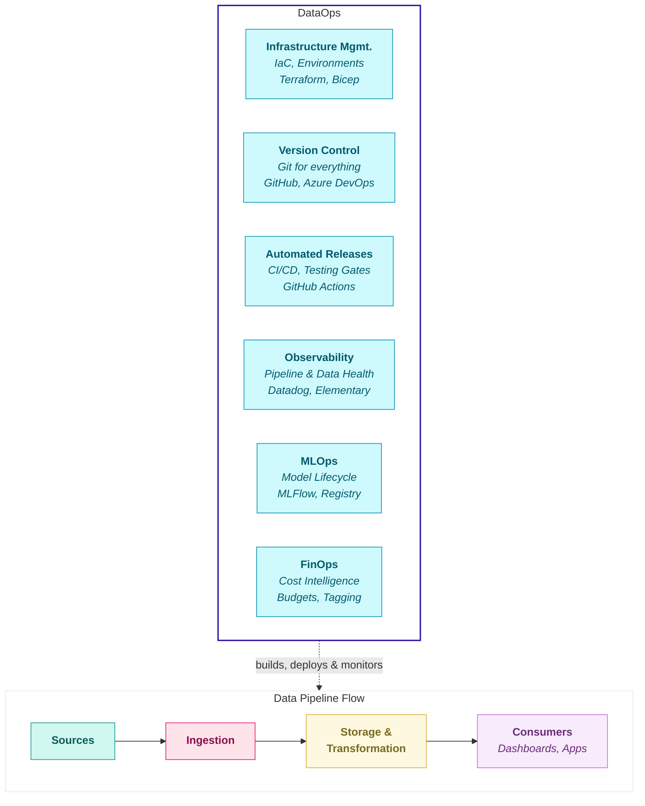

## DataOps

### What is DataOps?

**DataOps** is the application of software engineering best practices - version control, automated testing, continuous deployment, and monitoring - to the world of data. Just as DevOps transformed how software teams build and ship code, DataOps ensures that data platforms are built, deployed, and operated with the same discipline and reliability.

In simple terms: **DataOps answers the question, "How do we build, deploy, and operate our data platform like a professional software product?"**

### The Problem (The "Pain")
> What is the specific pain point or inefficiency we face today?
> (e.g., "Currently, every team builds this from scratch...")

Modern data engineering has evolved beyond writing SQL and Python scripts. Like software engineering, it now requires infrastructure across multiple environments, version control, automated testing, continuous deployment, and observability. Data powers business decisions, so the platforms that deliver it must be built with the same rigour as any business-critical application.

At JMAN, software engineering is in our DNA. The principles that make software reliable - version control, automated testing, environment parity, and continuous deployment - apply equally to data engineering, data science, and AI. As we scale, we must reinforce these principles rather than let them erode.

Today, we see six recurring problems across our projects:

**1. Environment Instability** - Dev environments are used for client deliverables for production purpose, leading to broken dashboards when other engineers modify shared tables. Misconfigurations and schema conflicts are common when multiple engineers working in a shared schema and overwriting each other's work

**2. Inconsistent Version Control** - Stored procedures, pipelines, and GUI transformations often go unversioned. Branching strategies and commit discipline vary wildly between projects; one project mandates feature branches, another works directly on the dev branch. 

**3. Manual Deployments** - Releases require manual steps, enabling direct Production changes without audit trails or rollback capability. Infrastructure-as-Code is typically used once at project start, then abandoned. Subsequent changes happen through the console ("ClickOps")

**4. Reactive Observability** - Pipeline failures often go unnoticed until a client reports that their dashboard shows stale data. Inefficient queries run for hours without alerts, delaying the data to business users, consuming compute resources and inflating costs.

**5. Disconnected Platform Engineering** - Not all projects have Platform Engineering expertise. DataOps-like DevOps-is a shared responsibility between those who build data pipelines and those who operate infrastructure. When this collaboration breaks down, teams reinvent solutions that already exist or operate platforms they don't fully understand.

**6. Uncontrolled Costs** - Platform costs are often underestimated during the Strategy phase, ignoring multiple environments, data growth. Overruns trigger infrastructure upgrades rather than optimisation.

### The Solution (The Purpose)
> What are we building, and what does "good" look like?

This framework establishes the "JMAN Way" for DataOps. The goal is not to restrict creativity but to eliminate low-value decisions, freeing engineers to focus on solving complex problems rather than debating branching strategies or manually configuring environments.

We are standardising five capabilities:

| Capability | What It Means |
|------------|---------------|
| **Environment Management** | Clear Dev, UAT, Pre-Prod, and Production environments with defined purposes, access controls, and refresh strategies-scaled to each client's needs |
| **Developer Experience** | Consistent tooling and workflows regardless of whether the project uses Databricks, Fabric, or Snowflake. Engineers should feel at home on any JMAN project |
| **Automated Releases** | Code moves from development to production through automated pipelines with testing gates. No manual deployments, no ClickOps |
| **Proactive Observability** | Monitoring for both platform health (compute usage, job durations) and data health (freshness, row counts, schema changes). Alerts before clients notice problems |
| **Cost Governance** | FinOps practices embedded from project start; tagging, budgets, alerts, and regular optimisation reviews |

### Impact on JMAN Delivery (The Value)
| Benefit | How It Helps |
|---------|--------------|
| **Consistency** | Any engineer can join any project and recognise the patterns. This is the JMAN Way |
| **Resilience** | Automated pipelines with rollback capability mean fewer outages and faster recovery |
| **Scalability** | Standardised approaches allow us grow the team without proportionally growing delivery risk |
| **Client Trust** | Reliable platforms build long-term partnerships. Clients remember who kept their dashboards running |

### Why Now? (The Risk)
> What happens if we do nothing or delay this?

By 2026, JMAN will have approximately 700 people. More than 60% will have joined in the past two years, many with limited industry experience. As the team grows and projects multiply, delivery quality becomes harder to maintain through informal knowledge transfer.
Data must be treated with same care as product. Modern data platforms and tools realises the importance of Software engineering principles in data engineering to built reliable data systems to serve the data to the business.

### Open Questions (The Unknowns)
- **DevContainers**: Should we mandate containerised development environments? Early results with dbt and Infrastructure-as-Code are promising, but we need broader testing.
- **Technology Partnerships**: For large-scale projects, should Platform Engineering engage during the Strategy phase rather than after Build begins?
- **CI Environment Strategy**: Can UAT serve as the CI target, or do we need dedicated CI environments for teams with high deployment frequency?

### Risks & Dependencies (The Blockers)
| Type | Description |
|------|-------------|
| **Risk** | Skill mismatch at scale, legacy tool environments, partial adoption |
| **Risk** | Adoption resistance - teams under delivery pressure may deprioritise following new standards |
| **Risk** | Tooling gaps - some client environments may not support all recommended practices |