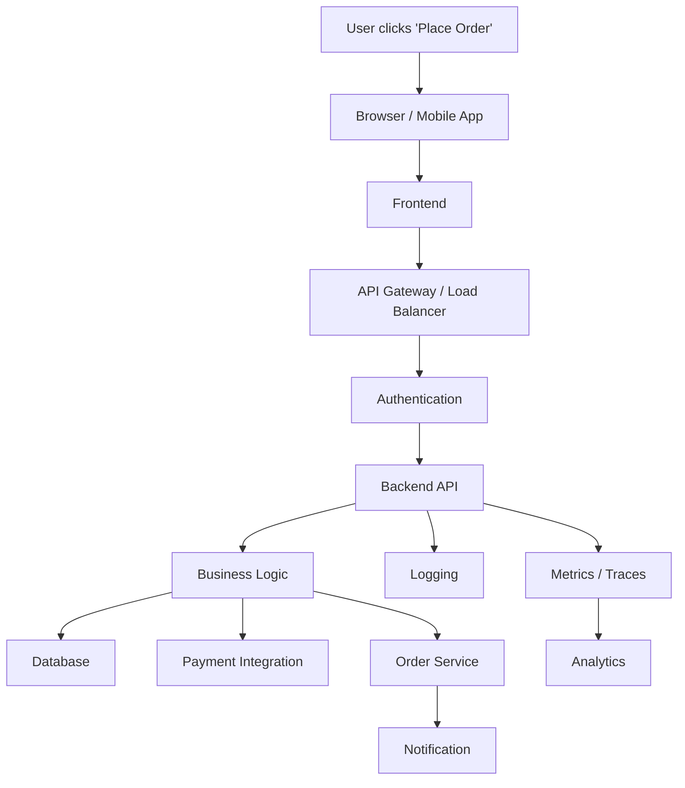

# How Software Works in Real Life

**Level:** 🟢 Beginner - readable with no technical background

This page follows **one real action** - a customer clicking "Place Order" - through every layer of a system. Read the plain-language row first; the technical row underneath is for anyone who wants the engineering detail. This is the clearest way to understand what "full stack" actually means in practice, and it is referenced throughout this playbook as the reference transaction.

## The flow

## Step by step

### 1. User clicks "Place Order"
**Plain language:** A person, on their phone or laptop, decides to buy something and presses a button.
**Technical detail:** A click/tap event fires in the UI layer, bound to a handler that will submit the order.

### 2. Browser / Mobile App
**Plain language:** The device the customer is holding packages up everything about the order - what's in the cart, quantities, shipping address - to send it off.
**Technical detail:** The client assembles a request payload (JSON) representing the order.

### 3. Frontend
**Plain language:** The screen the customer was looking at is the "storefront" - it now hands the request over to be processed.
**Technical detail:** The frontend application (e.g. React/Next.js) sends an HTTP `POST` request to the backend API.

### 4. API Gateway / Load Balancer
**Plain language:** Like a receptionist directing incoming calls, this decides which server should handle the request, especially when many customers are ordering at once.
**Technical detail:** Routes the request to a healthy backend instance; may apply rate limiting.

### 5. Authentication
**Plain language:** The system checks "is this really who they say they are, and are they allowed to do this?" before doing anything else.
**Technical detail:** Verifies a session token/JWT, resolves the user identity, checks authorization scopes. See [APIs & HTTP](/basics/apis-http/overview) and [Security Guardrails](/security/security-guardrails).

### 6. Backend API
**Plain language:** This is the "kitchen" - where the actual order gets prepared according to the business's rules.
**Technical detail:** The API controller receives the validated request and hands it to the service layer.

### 7. Business Logic
**Plain language:** Rules are applied: is the item in stock? Is the price still valid? Is the customer eligible for this discount?
**Technical detail:** The service layer executes domain rules, validation, and orchestrates calls to other layers.

### 8. Database
**Plain language:** The order gets written down somewhere permanent, so it isn't lost even if the power goes out a second later.
**Technical detail:** A transactional write persists the order record (and decrements inventory) in the database. See [Databases](/basics/databases/overview).

### 9. Payment Integration
**Plain language:** Money actually needs to move, so the system talks to a separate, specialized payment provider to charge the customer.
**Technical detail:** A call to an external payment gateway (e.g. Stripe) authorizes and captures the charge; this is a system **integration**, not a locally owned process.

### 10. Order Service
**Plain language:** Once payment succeeds, the order is confirmed and handed off to fulfillment (warehouse, shipping, etc.).
**Technical detail:** Emits an internal event or makes a call to downstream services responsible for fulfillment.

### 11. Notification
**Plain language:** The customer gets an email or text confirming the order, so they know it worked.
**Technical detail:** A notification service sends a templated email/SMS, usually asynchronously.

### 12. Logging
**Plain language:** A record is kept of exactly what happened, in case something needs to be investigated later.
**Technical detail:** Structured logs are written with a correlation ID tying every step of this request together. See [Logging Standards](/operations/logging-standards).

### 13. Metrics / Traces
**Plain language:** The system keeps a running scoreboard of how fast and how often this happens, so problems can be caught early.
**Technical detail:** Latency, error rate, and a distributed trace are emitted for observability. See [Observability](/operations/observability).

### 14. Analytics
**Plain language:** The business uses this order, along with every other order, to understand sales trends, popular products, and revenue.
**Technical detail:** Order events feed downstream reporting/analytics - this is where [Application vs Data Platform](/business-foundations/application-vs-data-platform) considerations begin, separate from the transactional path above.

## Why this matters, regardless of your role

::: tip Why this matters, regardless of your role
- **Clients / non-technical readers:** a "simple button click" is actually ~14 coordinated steps across multiple systems, each of which can fail or be attacked, which is why requirements, architecture, testing, and monitoring all exist.
- **Engineers:** this is the mental map for where your component sits, and what's upstream/downstream of it.
- **QA:** each step is a place a test could target - see [Testing Strategy](/security/testing/overview).
- **DevOps/Platform:** steps 4, 6, 12, and 13 are largely your responsibility in production.
- **Data roles:** step 14 is where your work begins - and it is deliberately *separate* from the transactional steps 1-11. Mixing the two is a common design mistake; see [Application vs Data Platform](/business-foundations/application-vs-data-platform).
:::

## Where this leads

- [What is Full Stack?](/business-foundations/what-is-full-stack) - the four-layer summary this page expands on
- [Full-Stack Architecture](/basics/full-stack-architecture) - deeper technical reference
- [Application vs Integration](/business-foundations/application-vs-integration) - the payment gateway step above is a real-world integration example
