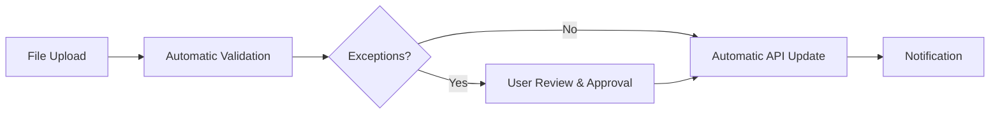

# Application vs Automation

**Level:** 🟡 Intermediate - assumes basic familiarity with how software/business processes work

## Simple explanation

An **application** is something people use - it has a user interface, and people make decisions through it. **Automation** is something that runs itself according to fixed rules, with no user interface, and ideally no person in the loop except to handle exceptions.

## Real-world analogy

An application is like a bank teller window: a person shows up, makes a request, and a human (or system) responds to that specific request. Automation is like a direct debit: once set up, it runs on its own schedule without anyone showing up to ask for it.

## The decision

| Ask | Leans toward Application | Leans toward Automation |
|---|---|---|
| Does a person need to view, enter, or approve data regularly? | Yes | No |
| Is the task the same every time, with clear rules? | No | Yes |
| Does the outcome depend on human judgment? | Yes | No (or only for exceptions) |
| Is there a need for a persistent, browsable interface? | Yes | No |
| Is the trigger a schedule or an event, not a person? | No | Yes |

Many real solutions are **both**: an automation handles the routine 90%, and a small application (or even just an inbox/queue) handles the 10% of exceptions that need a human. This is called **human-in-the-loop automation** - see [From Manual to Digital](/business-foundations/manual-to-digital) for where this fits on the broader spectrum.

## Worked example

**Problem:** A finance team spends 4 hours every day manually comparing Excel files, validating records, and updating another system.

A data-oriented instinct might be "build a platform to analyze this." The better fit, once you separate the concerns:

This needs: a small application (for the exception review step), an automation (for validation and the routine update), and an API integration (to update the other system). It does **not** need a data platform - there's one source, one consumer, and no historical/analytical requirement. See [Application vs Data Platform](/business-foundations/application-vs-data-platform) for when that changes.

## When to use automation

- The task is repetitive, rule-based, and well understood.
- Volume or frequency makes manual execution costly or error-prone.
- The rules rarely change, or changes can be reviewed like code changes.

## When NOT to use automation

::: warning When NOT to use automation
- The rules are unclear, still evolving, or require judgment calls that vary by case - automate too early and you'll be automating the wrong thing.
- The volume is low enough that the cost of building and maintaining the automation exceeds the manual effort it saves.
- Failures would be invisible without a human checking in - always pair automation with monitoring and a clear escalation path.
:::

## Common mistakes

- Building a full application (with logins, screens, and a database) for a task nobody needs to interact with directly.
- Automating a broken process, which just makes the same mistakes faster.
- Automating without an exception path, so edge cases silently fail or silently succeed incorrectly.
- Skipping monitoring - an automation that fails silently is worse than a manual process, because nobody notices.

## Where this leads

- [Application vs Integration](/business-foundations/application-vs-integration)
- [From Manual to Digital](/business-foundations/manual-to-digital)
- [Choosing the Right Solution](/business-foundations/choosing-the-right-solution)
