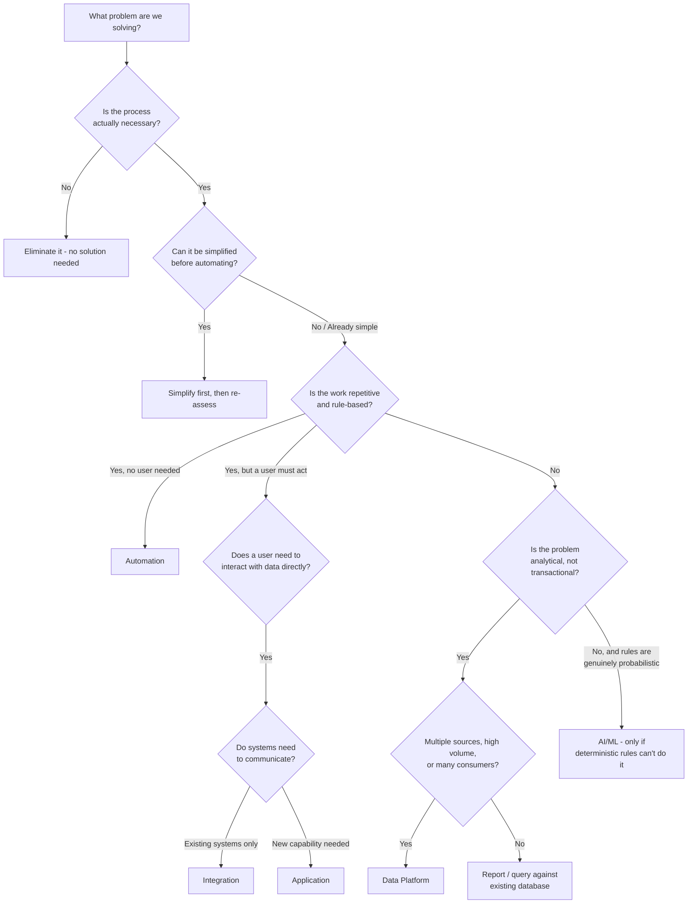

# Choosing the Right Solution

**Level:** 🟡 Intermediate - assumes basic familiarity with how software/business processes work

This page is the decision framework that ties together everything else in [Business & Solution Foundations](/business-foundations/overview). Use it once you understand the business problem ([What is a Business Problem?](/business-foundations/what-is-a-business-problem)) and the real process behind it ([Understanding Business Processes](/business-foundations/understanding-business-processes)).

## Start here

::: tip Core idea
**What problem are we solving?**
:::

Not "what should we build" - that question comes later. If you can't state the problem in one sentence without naming a technology, go back to [What is a Business Problem?](/business-foundations/what-is-a-business-problem).

## The questions to ask, in order

## The full checklist

- Is the process actually necessary, or is it legacy overhead nobody has questioned?
- Can the process be simplified before you build anything at all?
- Is the work repetitive, with clear, stable rules?
- Does a user genuinely need to interact with the system (enter, view, approve), or would they only ever look at output?
- Do systems need to communicate that don't today?
- Is the problem transactional (run a process) or analytical (understand a pattern)?
- How much data is involved, and from how many sources?
- How many different consumers need this data or capability?
- Is real-time interaction genuinely required, or is "by tomorrow morning" fine?
- Is historical analysis required, or only current state?
- Are there complex business rules that justify custom logic, or are the rules simple?
- Are there approvals or judgment calls a person must make?
- Is AI/ML genuinely required - i.e., can a deterministic, explainable rule not do the job at least as well?

## Solution options and their trade-offs

| Solution | Complexity | Time to value | Best for |
|---|---|---|---|
| Process improvement | Low | Fast | The process itself is wrong, independent of tooling |
| SOP / documentation | Low | Fast | Inconsistency from unclear expectations, not missing tooling |
| Spreadsheet | Low | Fast | Low volume, single/few users, no audit requirement |
| Script / automation | Low-Medium | Fast | Repetitive, rule-based, no UI needed |
| Workflow tool | Medium | Fast-Medium | Multi-step approvals without custom logic |
| Application | Medium-High | Medium | Users need to directly interact with data or each other |
| API / event integration | Medium | Medium | Existing systems need to share data reliably |
| Database / reporting | Medium | Medium | Structured operational data with light reporting needs |
| Data platform | High | Slow | Multiple sources, high volume, historical/analytical, many consumers |
| AI / ML | High | Slow | Genuinely probabilistic problems deterministic rules can't solve well |

Every option should also be weighed on: **cost, maintainability, scalability, reliability, security, user experience, and operational burden** - not just how fast it can be built. See [Measuring Business Value](/business-foundations/measuring-business-value) for turning this into a decision you can defend with numbers.

## Worked example, start to finish

**Business problem:** A finance team spends 4 hours/day manually comparing Excel files, validating records, and updating another system.

1. Is the process necessary? Yes - invoice reconciliation is a real control requirement.
2. Can it be simplified? Somewhat - but the manual comparison itself is the core waste.
3. Repetitive and rule-based? Mostly yes, with exceptions needing human judgment.
4. Does a user need to interact directly? Only for exceptions.
5. Do systems need to communicate? Yes - the result needs to reach another system.
6. Analytical or transactional? Transactional - this runs a process, it doesn't analyze trends.
7. Multiple sources / high volume / many consumers? No - one file source, one destination, one team.

**Conclusion:** automation for validation, a small application for the exception-approval step, and an API integration to update the downstream system. **Not** a data platform - see [Application vs Data Platform](/business-foundations/application-vs-data-platform) for why this specific example is used throughout this playbook.

## Where this leads

Once a general direction is chosen, move into [Solution Design](/delivery-lifecycle/design-phase) to turn it into a concrete design, and read [Architecture Standards](/architecture/standards) for the architecture-level version of this same discipline (don't reach for microservices, Kubernetes, or event-driven architecture by default either - the same "choose based on the problem" logic applies one level down, inside the technical design).
