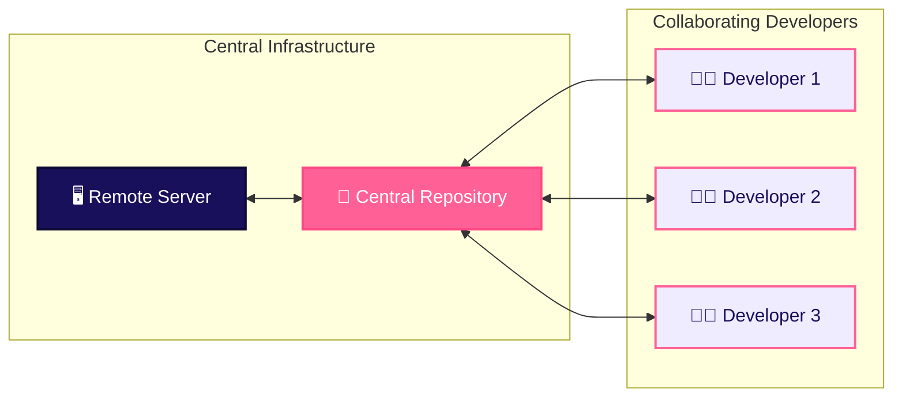

# Version Control Systems - Overview

A **Version Control System (VCS)** is a software tool designed to track, record, and manage modifications made to source code files over time.

> 💡 **Google Docs Analogy**: When you write a document in Google Docs, it automatically saves every edit and allows you to view or restore older versions. A Version Control System does the same thing for code-tracking *who* changed *what* and *why*, allowing an entire team to edit code simultaneously without stepping on each other's work.

## 1. Objectives & Core Benefits

- **Chronological History**: Maintains a structured, audit-ready record of every modification made to the codebase.
- **Concurrent Collaboration**: Enables multiple developers to work on the same codebase simultaneously without overwriting work.
- **Safety & Version Restoration**: Allows teams to compare code revisions, debug regressions, and revert to earlier stable releases.
- **Central Synchronization**: Connects developers to shared remote repositories for peer review and automated testing.

## 2. Infrastructure & Developer Flow

## 3. Core Terminology

| Component | Description |
|---|---|
| **Repository (Repo)** | A storage container that holds all project files, history metadata, author details, and commit logs. |
| **Commit** | A cryptographically hashed snapshot of staged changes saved to the repository history. |
| **Revision / Hash** | A unique SHA-1 identifier assigned to a specific commit snapshot. |
| **Branch** | An independent line of development used to isolate new features or bug fixes. |
| **Merging** | The operation of combining changes from one branch into another. |

## Next Sub-topics

Explore the detailed sub-sections in this module:
- [Types of VCS (Local, Centralized, DVCS)](/basics/git-version-control/vcs-types)
- [Git vs GitHub](/basics/git-version-control/git-vs-github)
- [Git Core & The 3 Areas](/basics/git-version-control/core-concepts-three-areas)
- [Branching & Team Workflow](/basics/git-version-control/branching-workflow)
- [Handling Merge Conflicts](/basics/git-version-control/merge-conflicts)
