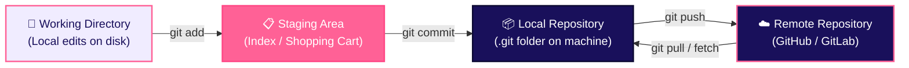

# Git Core Concepts & The 3 Areas

Before writing commands, understanding **where code lives** inside Git is the single most important concept in version control.

## 1. The Three Areas of Git (+ Remote)

Git manages files across four distinct environments as changes progress from local edits to remote servers:



| Area | Description |
|---|---|
| **Working Directory** | The filesystem folder on your machine where you actively edit files. Changes here are untracked or modified. |
| **Staging Area (Index)** | A intermediate preview area where you curate and review specific edits before saving them permanently. |
| **Local Repository** | The permanent history database stored inside the hidden `.git/` folder on your computer. |
| **Remote Repository** | The cloud-hosted copy (e.g., GitHub) shared across the engineering team. |

## 2. Complete Step-by-Step Setup & Initializing Git

Setting up a repository from scratch involves configuring developer identity, initializing the repository, setting the main branch, committing files, and linking to a remote server (e.g., GitHub).

### Step 1: Configure Global User Profile & Default Branch
Set your identity and ensure new repositories default to `main` instead of `master`:
```bash
git config --global user.name "Jane Developer"
git config --global user.email "jane@example.com"
git config --global init.defaultBranch main
```

### Step 2: Initialize the Local Repository
Navigate to your project directory and initialize Git tracking:
```bash
cd /path/to/my-project
git init
```

### Step 3: Set Default Branch Name to `main`
If your Git version defaults to `master`, explicitly set the primary branch to `main`:
```bash
git branch -M main
```

### Step 4: Stage and Make Initial Commit
Add all project files to the staging area and save the initial commit:
```bash
git add .
git commit -m "feat: initial project setup"
```

### Step 5: Link Remote Repository (GitHub / GitLab)
Connect your local repository to a remote server host:
```bash
git remote add origin git@github.com:username/my-project.git
```

### Step 6: Push to Remote & Set Upstream Tracking
Upload your initial commit to the remote `main` branch and link local `main` to `origin/main`:
```bash
git push -u origin main
```
> 💡 **What `-u` (or `--set-upstream`) does**: It links your local `main` branch to `origin/main` so that in the future, you can simply run `git push` or `git pull` without specifying the remote name and branch every time.

## 3. Essential Git Commands Reference

| Command | Usage Example | Purpose |
|---|---|---|
| `git init` | `git init` | Initializes a brand-new Git repository in current folder. |
| `git clone` | `git clone git@github.com:org/repo.git` | Downloads a full repository clone from a remote server. |
| `git status` | `git status` | Inspects untracked, modified, and staged files. |
| `git add` | `git add src/index.ts` | Stages specific file changes for the next commit. |
| `git commit` | `git commit -m "fix: resolve auth bug"` | Saves staged changes as a new commit in local history. |
| `git push` | `git push origin main` | Uploads local branch commits to the remote repository. |
| `git pull` | `git pull origin main` | Fetches and merges remote commits into local branch. |
| `git log` | `git log --oneline` | Displays commit history log. |
