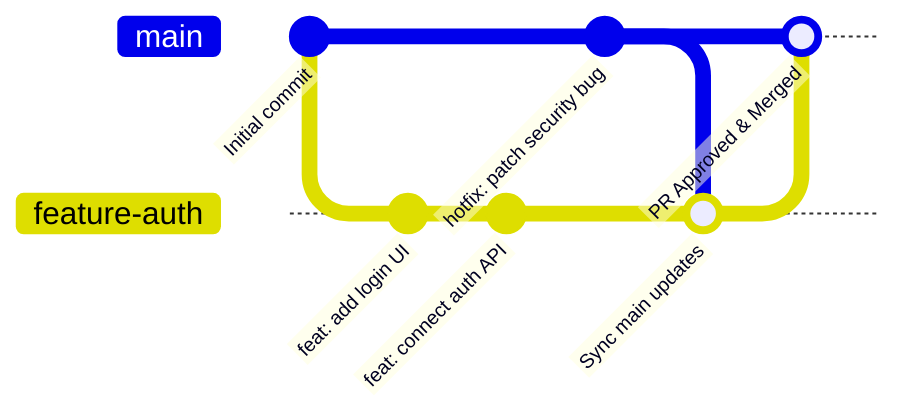

# Git Branching & Team Workflow

A **Git branch** is an independent workspace created within a repository. It allows developers to make edits, test ideas, and fix bugs in total isolation without disturbing the stable main project.

## 1. Introduction to Git Branching

### How Git Branching Works


- **Main Branch**: Holds stable, production-ready code and remains deployable at all times.
- **Feature Branch**: Created to develop new features or fix bugs in isolation.
- **Commits**: Saves incremental snapshots of work without affecting other branches.
- **Merging**: Integrates completed, peer-reviewed work back into the main branch.

## 2. Common Types of Branches in Git

To maintain clean project organization, Git workflows categorize branches by their role:

| Branch Type | Description & Purpose | Lifecycle |
|---|---|---|
| 🚀 **Main (or Master)** | Stores final, stable, production-ready code that is deployed to live environments. | Permanent |
| 🛠️ **Develop** | Combines completed features for integration testing and ongoing sprint development. | Permanent |
| ✨ **Feature Branch** | Created to build a single feature or task in isolation. | Short-lived (deleted after merge) |
| 📦 **Release Branch** | Prepares a new version for release, allowing final QA validation and minor bug fixes. | Short-lived (merged to main & develop) |
| 🚑 **Hotfix Branch** | Created directly from `main` to quickly patch critical production outages or vulnerabilities. | Emergency / Short-lived |

## 3. Essential Git Branching Commands

### Listing & Creating Branches

| Command | Purpose & Description |
|---|---|
| `git branch` | Lists all local branches in your repository. The active branch is marked with an asterisk (`*`). |
| `git branch <branch-name>` | Creates a new branch with the specified name without switching to it. |
| `git checkout <branch-name>` | Switches your working directory to an existing branch. |
| `git checkout -b <branch-name>` | Creates a new branch and immediately switches to it (*classic command*). |

### Modern Git Switch Commands (Git 2.23+)

| Command | Purpose & Description |
|---|---|
| `git switch <branch-name>` | Modern, intuitive command designed specifically for switching branches. |
| `git switch -c <branch-name>` | Creates (`-c` for create) a new branch and switches to it immediately. |

### Rebasing Branches (`git rebase`)

Rebasing rewrites feature branch commits so they appear as if they were created directly on top of the latest commit of the target branch, creating a clean, linear history.

```bash
git checkout feature-branch
git rebase main
```

#### Rebase Visual Comparison:

```
BEFORE REBASE:
main:    A --- B --- C
              \
feature:       D --- E

AFTER REBASE (git rebase main):
main:    A --- B --- C
                      \
feature:               D' --- E'
```

### Deleting Branches

| Command | Purpose & Description |
|---|---|
| `git branch -d <branch-name>` | **Safe Delete**: Deletes the specified branch only if it has already been fully merged into its upstream branch. |
| `git branch -D <branch-name>` | **Force Delete**: Forcefully deletes the specified branch even if it contains unmerged changes (*use with caution*). |

## 4. Standard 9-Step Professional Team Workflow

In engineering teams, code changes follow a structured lifecycle before merging to production:

1. **Pull Latest Main**:
   ```bash
   git checkout main
   git pull origin main
   ```
2. **Create & Switch to Feature Branch**:
   ```bash
   git switch -c feature/auth-jwt-implementation
   ```
3. **Make Code Edits & Check Status**:
   ```bash
   git status
   ```
4. **Stage Changes**:
   ```bash
   git add src/auth/
   ```
5. **Commit Staged Code**:
   ```bash
   git commit -m "feat(auth): implement JWT token verification service"
   ```
6. **Push Branch to Remote Repository**:
   ```bash
   git push origin feature/auth-jwt-implementation
   ```
7. **Open Pull Request (PR)**: Submit a PR on GitHub / GitLab for automated CI testing and team code review.
8. **Merge PR**: Once approved and test suites pass, merge the PR into `main`.
9. **Delete Feature Branch**:
   ```bash
   git branch -d feature/auth-jwt-implementation
   git push origin --delete feature/auth-jwt-implementation
   ```

## 5. Handling Merge Conflicts

A **merge conflict** occurs when two developers modify the exact same lines of code in conflicting ways:

```
<<<<<<< HEAD (Current Change - main)
const API_URL = "https://api.production.com";
=======
const API_URL = "https://api.v2.production.com";
>>>>>>> feature/auth-jwt-implementation (Incoming Change)
```

### Resolution Steps:
1. Open conflicting files in your editor.
2. Select the correct code and delete conflict markers (`<<<<<<<`, `=======`, `>>>>>>>`).
3. Stage resolved files: `git add .`
4. Complete the commit: `git commit -m "fix: resolve merge conflict with main"`
