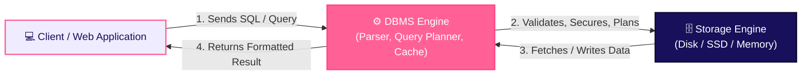

# Databases - Overview

A **database** is a systematically organized digital repository for storing, managing, analyzing, and securing collections of data. Databases allow organizations to centrally manage information, enforce data integrity and security standards, and enable reliable, high-performance data access for applications.

> 💡 **Real-world analogy**: Think of a database like a library. A library stores thousands of books (data), organizes them by category (schema), lets you search and find what you need (queries), and restricts access based on membership (security). Without the library system, books would be a chaotic pile-impossible to manage or retrieve.

## 1. What a Database Is Not

The term "database" is often used loosely, which causes confusion.

| What people call a database | What it actually is |
|---|---|
| **Microsoft Excel** | A spreadsheet application-stores data in single files with no central management, advanced concurrency, or multi-user security. |
| **Amazon / Google** | Large-scale web applications that *rely* on databases-not databases themselves. |
| **CSV / JSON files** | Flat data files-no query engine, no indexing, no relational integrity enforcement. |

A true database is a **centrally managed system** that handles multi-user concurrency, enforces data integrity rules, supports indexing, and processes complex queries.

## 2. Database vs. Database Management System (DBMS)

Although commonly used interchangeably, a Database and a DBMS serve distinct roles:

- **Database**: The structured collection of data itself (stored as tables, documents, key-value pairs, or graphs).
- **DBMS (Database Management System)**: The software layer that interacts with the database. It provides administrative tools, query processing, security controls, backup/recovery, and concurrency management.

> 📦 **Analogy**: A **database** is the container holding the information, while a **DBMS** (e.g., PostgreSQL, MongoDB, MySQL, Oracle) is the tool that organizes and manages the container.

## 3. Core Database Components & Structure

How data is structured determines how efficiently it can be stored and retrieved:

- **Tables / Collections**: Fundamental storage units holding records for a single entity type (e.g., `users`, `orders`).
- **Rows / Documents**: Individual records within a table or collection.
- **Columns / Fields**: Specific attributes belonging to each record (e.g., `email`, `created_at`).
- **Primary Key**: A unique identifier assigned to every single record in a table.
- **Foreign Key**: A column referencing a primary key in another table to establish relationships.

## 4. How a Database Works

At a runtime level, applications do not access physical disk files directly-they send queries to the DBMS layer:

## 5. Why Databases Matter

### Data Usability & Intelligence
Centralized databases allow applications to curate and analyze enterprise data. Organized data fuels decision-making, business intelligence dashboards, and AI/ML model training.

### Data Integrity & Validation
Databases enforce constraints (e.g., `NOT NULL`, `UNIQUE`, data type limits) so bad data is rejected before it corrupts system state.

### Data Security & Access Control
Databases implement **Role-Based Access Control (RBAC)**, row-level security, and encryption at rest/in transit to comply with regulatory standards like GDPR, HIPAA, and SOC2.

## Next Sub-topics

Explore the detailed sub-sections in this module:
- [Database Types & Structures](/basics/databases/database-types)
- [SQL vs NoSQL Decision Guide](/basics/databases/sql-vs-nosql)
- [Modern Trends & Architecture](/basics/databases/database-architecture-trends)
- [Querying, ORMs & Migrations](/basics/databases/querying-migrations-orms)
