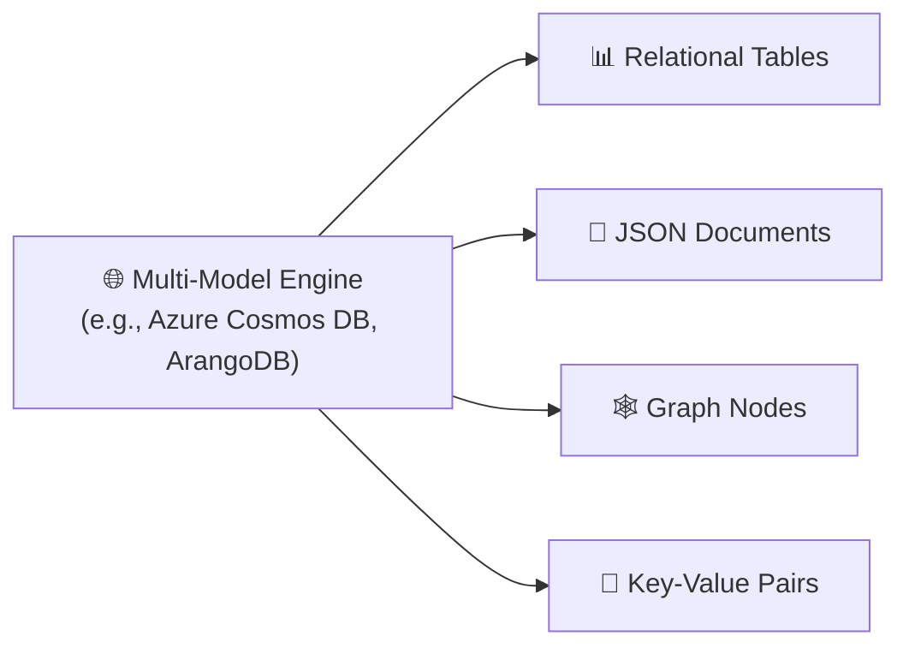
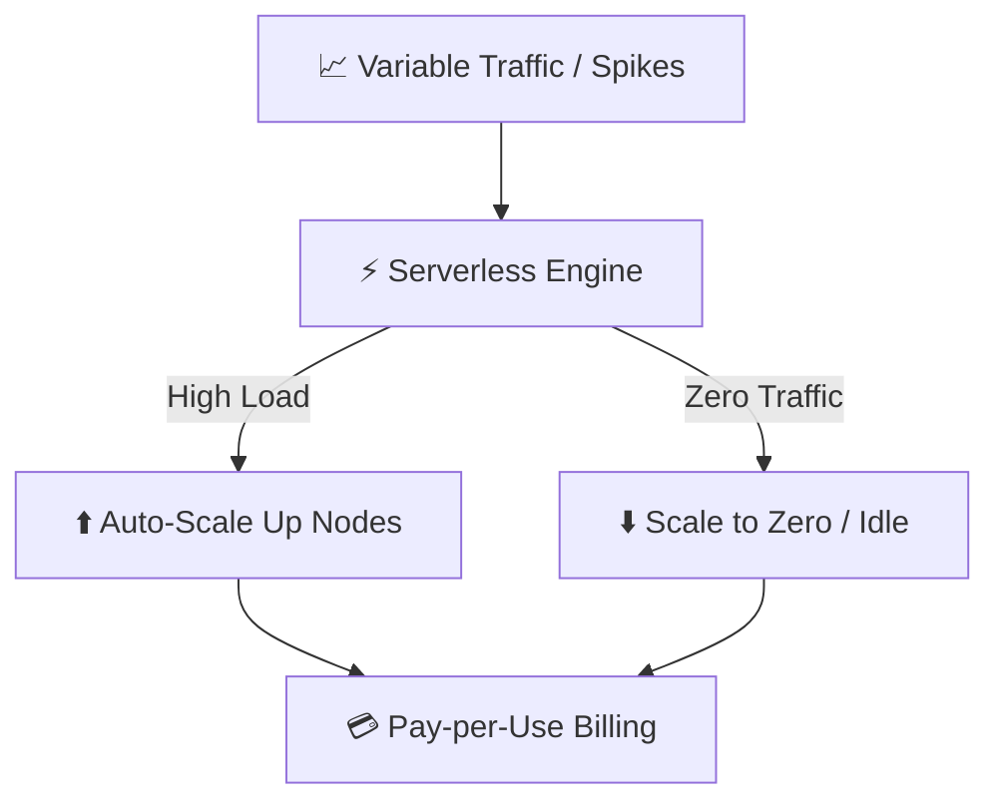

# Modern Database Architecture Trends

As cloud infrastructure and AI workloads expand, database architectures have evolved beyond traditional single-node engines into multi-model, AI-driven, and serverless platforms.

## 1. Multi-Model Databases

Historically, engineering teams managed separate database clusters for different paradigms (e.g., PostgreSQL for SQL, Redis for caching, Neo4j for graphs). **Multi-Model Databases** support multiple data engines within a single unified platform.

### Key Benefits
- **Reduced Operational Overhead**: Maintain a single database cluster instead of managing four distinct database engines.
- **Unified Data Access**: Query different data representations within the same transactional boundary.
- **Examples**: Microsoft Azure Cosmos DB, ArangoDB, Amazon DynamoDB (with Document & Key-Value extensions).

## 2. AI-Driven Databases & Vector Integration

Modern databases incorporate machine learning to automate infrastructure management and handle AI vector embeddings natively.

### Key Capabilities
- **Autonomous Operations**: Automated query tuning, index creation, adaptive caching, and anomaly detection without DBA intervention (e.g., Oracle Autonomous Database, Redshift ML).
- **Native Vector Extensions**: Traditional relational engines add vector search capabilities directly alongside SQL (e.g., PostgreSQL `pgvector`, Snowflake Vector types).
- **Natural Language Querying**: Built-in NLP interface allowing developers and analysts to query data using plain English.

## 3. Serverless Databases

Cloud-native **serverless databases** automatically handle provisioning, auto-scaling, patching, and capacity management, charging strictly for consumed resources.

### Key Benefits
- **Instant Auto-Scaling**: Scales compute and storage independently in response to unpredictable traffic spikes.
- **Zero Maintenance**: No manual cluster provisioning or storage pre-allocation.
- **Examples**: AWS Aurora Serverless, Google Cloud Firestore, Neon Serverless Postgres, PlanetScale.

## 4. Databases vs Data Lakes vs Data Warehouses vs Lakehouses

Understanding the differences between operational, analytical, and archival storage layers:

| Component | Primary Purpose | Data Structure | Query Speed | Primary Examples |
|---|---|---|---|---|
| **Transactional Database (OLTP)** | Real-time CRUD app transactions | Highly structured (Normalized) | Milliseconds | PostgreSQL, MySQL, MongoDB |
| **Data Warehouse (OLAP)** | Business Intelligence & analytical queries | Structured & cleaned (Denormalized) | Seconds to minutes | Snowflake, Google BigQuery, Redshift |
| **Data Lake** | Low-cost storage for raw big data | Raw (Structured, Semi-structured, Images, Logs) | Minutes to hours | AWS S3, Azure Data Lake Storage |
| **Data Lakehouse** | Unified platform merging Lake storage with Warehouse query speeds | Open formats (Parquet, Delta Lake) | Real-time to seconds | Databricks Lakehouse, Apache Iceberg |
