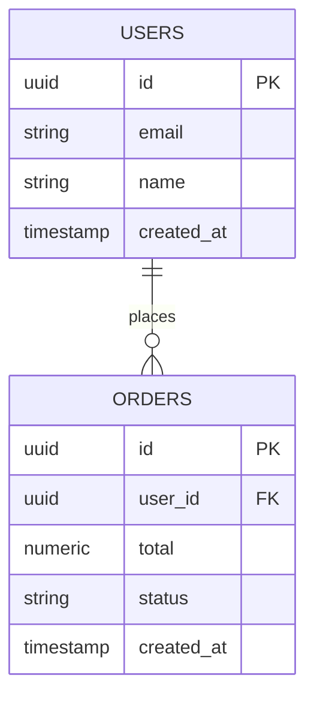

# Querying, ORMs & Migrations

In modern full-stack development, interacting with a database involves schema definitions, versioned migrations, and Object-Relational Mappers (ORMs) to keep backend code in sync with storage layers.

## 1. Concrete Example: From Schema to Code Query

### Step 1: Defining Relational SQL Tables

```sql
-- Create Users Table
CREATE TABLE users (
  id UUID PRIMARY KEY DEFAULT gen_random_uuid(),
  email VARCHAR(255) UNIQUE NOT NULL,
  name VARCHAR(100) NOT NULL,
  created_at TIMESTAMP DEFAULT now()
);

-- Create Orders Table with Foreign Key
CREATE TABLE orders (
  id UUID PRIMARY KEY DEFAULT gen_random_uuid(),
  user_id UUID NOT NULL REFERENCES users(id) ON DELETE CASCADE,
  total NUMERIC(10, 2) NOT NULL,
  status VARCHAR(20) NOT NULL DEFAULT 'pending',
  created_at TIMESTAMP DEFAULT now()
);
```

### Entity-Relationship (ER) Diagram



## 2. Querying with an ORM (Prisma Example)

An **ORM (Object-Relational Mapper)** bridges programming language objects with database tables, enabling type-safe database queries directly in TypeScript/JavaScript without writing manual raw SQL strings.

```typescript
// Querying using Prisma ORM
import { PrismaClient } from '@prisma/client';
const prisma = new PrismaClient();

async function getRecentUserOrders(userId: string) {
  const userWithOrders = await prisma.user.findUnique({
    where: { id: userId },
    include: {
      orders: {
        where: { status: 'shipped' },
        orderBy: { createdAt: 'desc' },
      },
    },
  });

  return userWithOrders;
}
```

### The Equivalent Raw SQL Generated Under the Hood

```sql
SELECT 
  u.id AS user_id, 
  u.email, 
  u.name, 
  o.id AS order_id, 
  o.total, 
  o.status, 
  o.created_at
FROM users u
LEFT JOIN orders o ON o.user_id = u.id AND o.status = 'shipped'
WHERE u.id = '123e4567-e89b-12d3-a456-426614174000'
ORDER BY o.created_at DESC;
```

## 3. Database Migration Workflow

A **migration** is a version-controlled, repeatable SQL script that safely modifies the database schema (e.g., adding a column or table). Production databases must **never** be edited by hand.

```mermaid
flowchart LR
    Dev["👨‍💻 Engineer creates\nmigration script"] --> Git["🐙 Committed\nto Git Repo"]
    Git --> CI["🧪 CI Pipeline runs\nagainst test DB"]
    CI --> Review["🔍 PR Reviewed\n& Merged"]
    Review --> Staging["🚀 Migration executes\non Staging DB"]
    Staging --> Prod["🏭 Migration executes\non Production DB"]

    style Dev fill:#f0ecff,color:#19105b,stroke:#ff6196,stroke-width:2px
    style Git fill:#f0ecff,color:#19105b,stroke:#ff6196,stroke-width:2px
    style CI fill:#f0ecff,color:#19105b,stroke:#ff6196,stroke-width:2px
    style Review fill:#ff6196,color:#fff,stroke:#ff4785,stroke-width:2px
    style Staging fill:#19105b,color:#fff,stroke:#0d0a33,stroke-width:2px
    style Prod fill:#19105b,color:#fff,stroke:#0d0a33,stroke-width:2px
```



## 4. Key Vocabulary Cheat Sheet

| Term | Meaning & Purpose |
|---|---|
| **Schema** | The formal blueprint defining tables, columns, data types, constraints, and relationships. |
| **Migration** | A versioned SQL script (e.g., `20260728_add_status_to_orders.sql`) that alters schema state predictably. |
| **ORM** | Library translating code objects to database queries (e.g., Prisma, TypeORM, Drizzle, Hibernate). |
| **Index** | B-Tree or Hash data structure that accelerates `SELECT` queries at the cost of slightly slower writes. |
| **Connection Pooling** | Reusing a pool of active database connections to avoid TCP connection setup overhead per HTTP request. |
| **ACID** | Guarantees of transactional integrity (*Atomicity, Consistency, Isolation, Durability*). |
| **Query** | Command issued to a database (SQL or MQL) to read, insert, update, or delete data. |
| **DBMS** | The engine software (e.g., PostgreSQL, MongoDB) managing storage, indexing, and security. |
