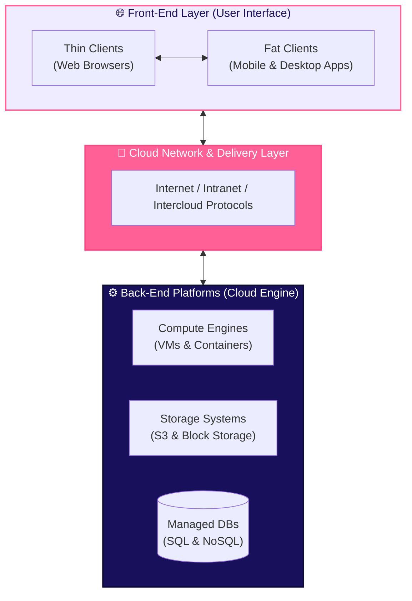

# Cloud Architecture & Core Characteristics

To understand cloud systems, developers must understand how cloud components communicate and the fundamental traits defined by cloud computing standards.

## 1. Cloud Architecture Components

Cloud computing architecture consists of front-end client platforms, back-end cloud processing engines, and network pipelines connecting them:

### Architectural Layers

1. **Front-End (User Interaction Enhancement)**
   - **Thin Clients**: Lightweight user interfaces running inside web browsers (e.g. Chrome, Safari). The browser handles rendering while relying on backend APIs for data processing.
   - **Fat Clients**: Native desktop or mobile applications (e.g. iOS/Android apps) that handle offline logic and local processing before syncing with cloud backends.

2. **Back-End Platforms (Cloud Computing Engine)**
   - The underlying server pools, high-speed storage systems, virtualization hypervisors, and managed database engines that process application business logic and persist data.

3. **Cloud-Based Delivery & Network**
   - Provides access to cloud services over high-speed networks (**Internet**, private **Intranets**, or multi-provider **Interclouds**) for secure communication and data transfer.

## 2. The 5 Essential Characteristics of Cloud Computing

The National Institute of Standards and Technology (NIST) defines five fundamental characteristics that all true cloud services must possess:

| Characteristic | Description | Developer Impact |
|---|---|---|
| ⚡ **On-Demand Self-Service** | Users can provision compute, storage, and database resources automatically without human provider intervention. | Spin up servers via web console or CLI instantly without submitting IT tickets. |
| 🌐 **Broad Network Access** | Capabilities are available over the network and accessed via standard mechanisms (laptops, phones, tablets). | Access infrastructure APIs from anywhere using standard web protocols. |
| 🏊 **Resource Pooling** | Physical and virtual resources are pooled to serve multiple customers (multi-tenancy) dynamically. | High efficiency and reduced costs as cloud hardware is shared across tenants safely. |
| 📈 **Rapid Elasticity** | Resources can automatically scale out during load spikes and scale in when demand drops. | Applications stay online during flash sales or viral traffic surges. |
| 📊 **Measured Service** | Resource usage is metered and reported automatically (CPU hours, data transferred, gigabytes stored). | Complete cost transparency - you pay only for active utilization. |

## Where This Leads Next

- [Service & Deployment Models](/basics/cloud/service-deployment-models) - IaaS, PaaS, SaaS, FaaS, and Public/Private/Hybrid clouds
- [Security & Shared Responsibility](/basics/cloud/security-shared-responsibility) - understanding cloud security boundaries
