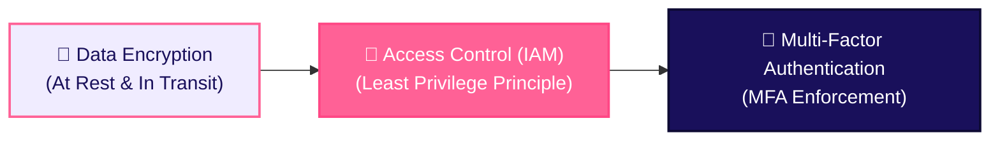

# Cloud Security & Shared Responsibility Model

Security in the cloud is a shared partnership between the cloud service provider and the customer organization. This framework is known as the **Shared Responsibility Model**.

## 1. The Shared Responsibility Model

Understanding who is responsible for which security layer is critical to preventing data breaches and system misconfigurations.

```mermaid
flowchart LR
    subgraph Customer ["👤 Customer Responsibility\n(Security IN the Cloud)"]
        direction TB
        Data["Customer Data & File Encryption"]
        IAM["IAM & Credentials Management"]
        AppSec["Application Code Security"]
        OS["OS Patches & Firewall Rules"]
    end

    subgraph Provider ["☁️ Cloud Provider Responsibility\n(Security OF the Cloud)"]
        direction TB
        Hardware["Physical Data Centers & Host Servers"]
        Facilities["Power, Cooling & Environmental Security"]
        InfraNet["Global Network & Hypervisors"]
    end

    Customer <--> Provider

    style Customer fill:#f0ecff,color:#19105b,stroke:#ff6196,stroke-width:2px
    style Provider fill:#19105b,color:#fff,stroke:#0d0a33,stroke-width:2px
```

### Breakdown of Responsibilities

1. **The Cloud Provider (e.g. AWS, Azure, GCP)**
   - Responsible for **Security OF the Cloud**.
   - Manages physical data center security, hardware replacement, power redundancy, host hypervisors, and global network backbone infrastructure.

2. **The Customer (You)**
   - Responsible for **Security IN the Cloud**.
   - Manages Identity and Access Management (IAM), data encryption at rest and in transit, application code vulnerabilities, firewall rules, and guest OS security patches.

> 💡 **Service Model Impact**: The exact division of responsibility shifts based on service model:
> - **IaaS**: Customer manages OS, runtime, and app security.
> - **PaaS**: Provider manages OS and runtime; Customer manages app code and data.
> - **SaaS**: Provider manages infrastructure, OS, and app runtime; Customer manages user access credentials and data permissions.

## 2. Cloud Security Best Practices

To safeguard cloud applications and data against unauthorized access, engineering teams enforce three core security layers:

### 1. Data Encryption
- **Encryption at Rest**: Ensures that stored files, database volumes, and object backups are encrypted using strong algorithms (e.g., AES-256 via AWS KMS or HashiCorp Vault) so stolen raw disks cannot be read.
- **Encryption in Transit**: Forces all network traffic between clients, microservices, and databases to travel over TLS/HTTPS tunnels.

### 2. Access Control & IAM (Least Privilege)
- Define granular **Identity and Access Management (IAM)** policies.
- Enforce the **Principle of Least Privilege**: Grant users, service accounts, and cloud functions only the exact minimum permissions required to perform their tasks.

### 3. Multi-Factor Authentication (MFA)
- Require **Multi-Factor Authentication (MFA)** (e.g. authenticator app OTPs, hardware keys) across all developer, administrator, and cloud console user accounts to eliminate credential theft risks.

## Where This Leads Next

- [Cloud Providers](/basics/cloud/providers) - top cloud providers and enterprise cloud ecosystems
- [Security Guardrails](/security/security-guardrails) - organizational security standards and compliance
