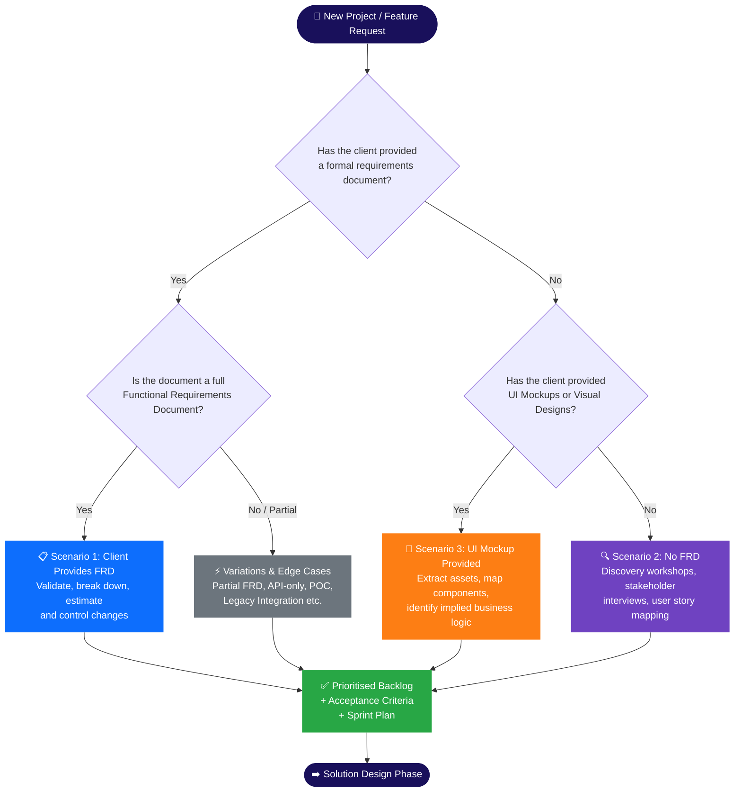

# Requirement Intake

The Requirement Intake phase is critical for establishing a shared understanding between Product Management, Design, and Engineering. It ensures that development teams have a clear, prioritized, and well-understood backlog before committing to development work.

## Entry Criteria
- Business justification and ROI established by Product Leadership.
- High-level Epics created in the project tracking system (e.g., Jira, Azure DevOps).
- Initial UX/UI concepts or wireframes available (if applicable).

## Core Activities

### 1. Requirements Gathering & PRD
The **Product Requirements Document (PRD)** serves as the single source of truth for the feature. It must include:
- **Objective & Value Proposition**: What problem are we solving?
- **Target Audience/Personas**: Who is this for?
- **User Journeys**: High-level flow of the user experience.
- **Out of Scope**: Explicitly stating what will *not* be built to prevent scope creep.
- **Success Metrics**: How will we measure adoption and success (e.g., conversion rate, reduced latency)?

### 2. Gathering Non-Functional Requirements (NFRs)
Engineering must define NFRs alongside functional requirements. These include:
- **Performance**: Expected throughput, maximum latency (e.g., "API must respond in < 200ms").
- **Scalability**: Expected concurrent users.
- **Security & Compliance**: Data residency, PII handling, GDPR/SOC2 compliance.
- **Accessibility**: Minimum WCAG 2.1 AA compliance required.

## Decision: Which Intake Scenario Applies?

Before selecting a scenario, use the decision flowchart below to determine which intake path to follow based on what the client has provided:

## Requirement Intake Scenarios

Depending on the format and completeness of requirements provided at the start of the project, follow one of the three primary delivery intake scenarios or adapt to specific edge cases:

### Primary Scenarios

* **[Scenario 1: Client Provides FRD](/delivery-lifecycle/requirement-intake/scenario-1-client-provides-frd)**
  Used when a comprehensive Functional Requirements Document or specification is provided. The focus is on validation, breakdown, estimation, and change control.
  
* **[Scenario 2: No FRD (Discovery & Elicitation)](/delivery-lifecycle/requirement-intake/scenario-2-no-frd)**
  Used when requirements need to be gathered from scratch through workshops, stakeholder interviews, user story mapping, and prototyping.
  
* **[Scenario 3: UI Mockup Provided](/delivery-lifecycle/requirement-intake/scenario-3-ui-mockup)**
  Used when visual designs/mockups are the primary source of requirements. Focuses on asset extraction, component mapping, and defining implied business logic.

### Variations & Edge Cases

* **[Additional Variations & Edge Cases](/delivery-lifecycle/requirement-intake/variations-edge-cases)**
  Guidelines for hybrid or specialized intake scenarios, including:
  * Partial FRD Available
  * Evolving/Agile Requirements
  * API-Only / Backend Services
  * Legacy System Integration
  * Proof of Concept (POC) / MVP
  * Third-Party Vendor Dependencies

## Quick Navigation

| Scenario | When to Use | Link |
|---|---|---|
| 📋 Scenario 1: Client Provides FRD | Full requirements document exists | [→ View](/delivery-lifecycle/requirement-intake/scenario-1-client-provides-frd) |
| 🔍 Scenario 2: No FRD | No formal requirements - needs discovery | [→ View](/delivery-lifecycle/requirement-intake/scenario-2-no-frd) |
| 🎨 Scenario 3: UI Mockup | Visual designs are the primary reference | [→ View](/delivery-lifecycle/requirement-intake/scenario-3-ui-mockup) |
| ⚡ Variations & Edge Cases | Partial FRD, POC, API-only, legacy | [→ View](/delivery-lifecycle/requirement-intake/variations-edge-cases) |

> **Next Phase:** After completing Requirement Intake, proceed to [Solution Design](/delivery-lifecycle/design-phase) where the architecture and technical approach are defined.
