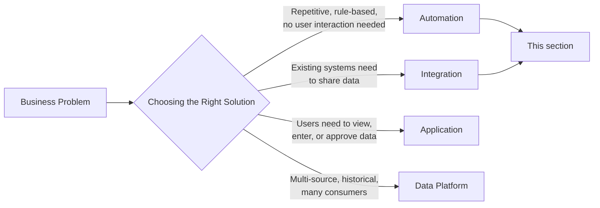

# Automation & Integration

**Level:** 🟢 Beginner - readable with no technical background

Once [Choosing the Right Solution](/business-foundations/choosing-the-right-solution) points toward automation, integration, or both, this section covers how to design them well. It picks up exactly where [Application vs Automation](/business-foundations/application-vs-automation) and [Application vs Integration](/business-foundations/application-vs-integration) left off - this section assumes you've already decided automation/integration is the right shape of solution, and now need to build it properly.

## What this section covers

| Page | What it answers |
|---|---|
| [What is Automation?](/automation-integration/what-is-automation) | A precise definition, separate from "application" and "script" |
| [Identifying Automation Opportunities](/automation-integration/identifying-opportunities) | How to spot a good candidate for automation, and how to spot a bad one |
| [Workflow Automation](/automation-integration/workflow-automation) | Multi-step processes with approvals and handoffs |
| [API-based Automation](/automation-integration/api-based-automation) | Automations that move data or trigger actions between systems via APIs |
| [Scheduled Jobs](/automation-integration/scheduled-jobs) | Cron/batch-style automation - timing, idempotency, retries |
| [Event-driven Automation](/automation-integration/event-driven-automation) | Reacting to events instead of polling on a schedule |
| [Human-in-the-loop Automation](/automation-integration/human-in-the-loop) | Automating the routine 90% and routing exceptions to a person |
| [Automation Failure Handling](/automation-integration/failure-handling) | Monitoring, alerting, retries, and why silent failure is dangerous |
| [Measuring Automation ROI](/automation-integration/measuring-roi) | Quantifying time saved and errors avoided |

## Where this sits relative to other solution types

Automation and integration are frequently combined - an automation's job is often *to* integrate two systems (see [API-based Automation](/automation-integration/api-based-automation) and [Event-driven Automation](/automation-integration/event-driven-automation)). Neither replaces an application when people genuinely need to interact with the data directly, and neither becomes a data platform just because it moves data - see [Application vs Data Platform](/business-foundations/application-vs-data-platform) if volume, source count, or analytical need starts growing.

## Where this leads

Once an automation or integration is designed, [Solution Design](/delivery-lifecycle/design-phase) and the [Delivery Lifecycle](/delivery-lifecycle/overview) apply the same way they would to an application - it still needs requirements, design review, testing, deployment, and monitoring like any other production system.
