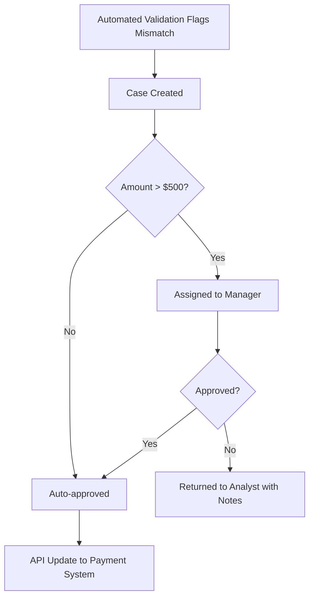

# Workflow Automation

**Level:** 🟡 Intermediate - assumes basic familiarity with how software/business processes work

## Simple explanation

Workflow automation handles processes made of multiple steps, handoffs, and approvals - where the sequence and the "who does what next" matters as much as any single action. Unlike a single scheduled job or API call, a workflow tracks state across steps that may happen minutes, hours, or days apart, and may involve more than one person.

## Real-world analogy

Think of a purchase order approval: submit → manager reviews → finance reviews if over a threshold → PO is issued. Each step depends on the previous one finishing, different people are responsible for different steps, and the whole thing needs to be trackable ("where is my PO right now?"). That coordination is what workflow automation manages.

## When to reach for a workflow tool vs. custom code

| Situation | Workflow tool (e.g. low-code workflow engine) | Custom code |
|---|---|---|
| Steps and approvers change occasionally, business users need to adjust them | ✅ | ❌ (requires a deploy every time) |
| The logic is genuinely complex - conditional branches with custom business rules | ❌ (fights the tool) | ✅ |
| You need audit trail, visual status tracking, and non-engineers configuring flows | ✅ | ❌ (you'd be rebuilding the tool) |
| Deep integration with a specific internal system beyond what the tool supports | ❌ | ✅ |

Many real systems combine both: a workflow tool orchestrates the human steps and approvals, while custom code (via API-based automation) does the heavy data lifting between steps.

## Worked example

**Problem:** Invoice reconciliation (the running finance example) has an exception path - mismatches over $500 need manager approval before the record can be corrected.

This is a workflow: it has state (`pending`, `approved`, `returned`), it spans people, and it needs a visible status. It is a small piece of a larger solution that also includes [API-based Automation](/automation-integration/api-based-automation) for the actual system update, and [Scheduled Jobs](/automation-integration/scheduled-jobs) for the nightly validation run that creates these cases in the first place.

## When to use

- Multiple approvers or handoffs, where tracking "whose turn is it" has real value.
- The process changes occasionally and non-engineers should be able to adjust steps or approvers without a deployment.
- An audit trail of who approved what, and when, is a genuine requirement.

## When NOT to use

::: warning When NOT to use
- There's only one step and no approval - that's just automation ([API-based Automation](/automation-integration/api-based-automation) or [Scheduled Jobs](/automation-integration/scheduled-jobs)), not a workflow.
- The "workflow" is actually one person making a judgment call with no handoff - that's better served by a small application screen.
- The business logic is so complex and system-specific that the workflow tool becomes a worse, harder-to-debug version of code you'd otherwise just write.
:::

## Common mistakes

- Building a heavyweight workflow engine for a two-step process that a simple status field would have handled.
- Losing visibility into where a case actually is because the workflow tool's state isn't surfaced anywhere people look.
- No timeout/escalation - a case sits "pending manager approval" for two weeks with nobody notified.

## Where this leads

- [Human-in-the-loop Automation](/automation-integration/human-in-the-loop) - the broader pattern this example belongs to
- [API-based Automation](/automation-integration/api-based-automation) - for the system-to-system parts of the same flow
- [Delivery Lifecycle: Solution Design](/delivery-lifecycle/design-phase) - how to design and document a workflow before building it
