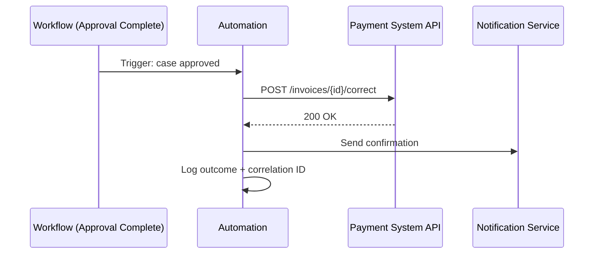

# API-based Automation

**Level:** 🟡 Intermediate - assumes basic familiarity with how software/business processes work

## Simple explanation

API-based automation is code that moves data or triggers actions between systems by calling their APIs directly - no user interface, no manual export/import, just a program that calls one system's API, transforms the result if needed, and calls another system's API.

## Real-world analogy

Instead of a person exporting a spreadsheet from System A, emailing it, and someone else re-typing it into System B, a small program asks System A directly for the data and hands it straight to System B. No inbox, no re-typing, no delay.

## Where it fits

This is one of the two most common ways automation actually gets built, alongside [Scheduled Jobs](/automation-integration/scheduled-jobs) - often the two are combined: a scheduled job triggers, and the work it does is a series of API calls. It's also the most common concrete form of the "integration" concept from [Application vs Integration](/business-foundations/application-vs-integration).

## Worked example

**Problem:** Once the invoice reconciliation exception is approved (see [Workflow Automation](/automation-integration/workflow-automation)), the corrected record needs to be written into the payment system.

No person re-types anything into the payment system. The automation owns exactly one responsibility: take an approved case and apply it via the API, reliably.

## Design principles

- **Idempotency** - calling the automation twice with the same input (e.g. a retried request) should not create duplicate records. Use an idempotency key or check-before-write logic.
- **Validation before the call** - don't rely on the destination API to catch bad data; validate what you're about to send, and fail loudly if it's wrong.
- **Correlation IDs** - every automated call should be traceable end-to-end, the same way a user request would be (see [How Software Works in Real Life](/business-foundations/how-software-works-in-real-life) for why this matters even for automated calls).
- **Rate limits and backoff** - automations often run in batches; respect the destination system's rate limits with exponential backoff, not a tight retry loop.
- **Least privilege credentials** - the automation should hold only the API scopes it needs, not a broad admin credential.

## When to use

- Two systems both expose APIs, and the goal is to keep their data consistent or trigger one from the other.
- The interaction is either immediate (real-time API call) or can tolerate the latency of a scheduled batch - see [Event-driven Automation](/automation-integration/event-driven-automation) for the real-time-without-polling alternative.

## When NOT to use

::: warning When NOT to use
- One of the "systems" is actually a spreadsheet or manual process with no API - there's nothing to call. Fix that with [From Manual to Digital](/business-foundations/manual-to-digital) first.
- The interaction needs to fan out to many independent consumers who don't all need to be called synchronously - that's a better fit for [Event-driven Automation](/automation-integration/event-driven-automation).
:::

## Common mistakes

- No idempotency handling, so a retried call after a timeout creates a duplicate record.
- Hardcoding credentials or endpoints instead of managing them like any other production secret (see [Environments](/basics/environments)).
- No logging or monitoring, so when a call silently starts failing, nobody notices until someone downstream complains. See [Automation Failure Handling](/automation-integration/failure-handling).

## Where this leads

- [Scheduled Jobs](/automation-integration/scheduled-jobs) - how these calls are usually triggered on a cadence
- [Automation Failure Handling](/automation-integration/failure-handling)
- [API Standards](/architecture/api-standards) - the engineering-level contract standards these calls should follow
