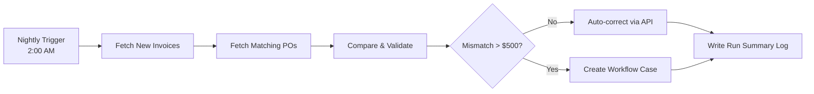

# Scheduled Jobs

**Level:** 🟡 Intermediate - assumes basic familiarity with how software/business processes work

## Simple explanation

A scheduled job (often called a cron job or batch job) runs automation on a fixed cadence - every night at 2am, every hour, every Monday morning - rather than in response to a specific event. It's the simplest and most common way to trigger automation.

## Real-world analogy

A scheduled job is like a recycling truck that comes every Tuesday whether or not your bin is full. It doesn't need to be told "please come now" - it runs on its own timetable. Compare this to [Event-driven Automation](/automation-integration/event-driven-automation), which is more like calling for a pickup the moment your bin fills up.

## Worked example, in full

Returning to the running example: the finance team's invoice reconciliation.

This single nightly job replaces the 4-hour manual process described in [Application vs Automation](/business-foundations/application-vs-automation) - with the exception path handed off to [Workflow Automation](/automation-integration/workflow-automation) rather than handled inline.

## Design principles

- **Idempotency** - if the job runs twice for the same day (a retry after a crash, or someone re-running it manually), it must not double-process the same invoices. Track a processed/unprocessed state per record, not just "did the job run."
- **Time zone and DST awareness** - "every night at 2am" needs an explicit time zone; silent drift around daylight saving changes is a classic, easy-to-miss bug.
- **Bounded run time** - a job that occasionally runs long enough to overlap with its next scheduled run needs a lock or a skip-if-already-running guard.
- **A visible run history** - every run should log what it processed, what it skipped, what failed, and how long it took, so a missed or partial run is obvious without digging through raw logs.
- **A clear owner** - someone should be paged, or at least notified, if a scheduled job fails silently. See [Automation Failure Handling](/automation-integration/failure-handling).

## When to use

- The work doesn't need to happen the instant a trigger occurs - "by tomorrow morning" is genuinely fine.
- Batching many records together is more efficient than processing them one at a time as they arrive.
- The source data naturally arrives in batches (e.g. an overnight file drop) rather than as discrete events.

## When NOT to use

::: warning When NOT to use
- The business needs a near-real-time reaction (e.g. inventory going out of stock should update within seconds, not overnight) - see [Event-driven Automation](/automation-integration/event-driven-automation).
- The "schedule" is really just a workaround for not knowing when the triggering event actually happens - that's a sign an event-driven approach would be more accurate and often simpler.
:::

## Common mistakes

- No idempotency, so a re-run after a partial failure duplicates work already done.
- Jobs with no monitoring, so a silent failure isn't noticed until someone asks "why hasn't this updated in three days?"
- Overlapping runs when a job occasionally takes longer than the interval between runs, corrupting shared state.
- Treating a scheduled job as "fire and forget" infrastructure rather than an owned, monitored piece of production software - the same standard applies as any other deployed code, see [CI/CD Pipeline](/coding-standards/ci-cd) and [Observability](/operations/observability).

## Where this leads

- [Automation Failure Handling](/automation-integration/failure-handling)
- [Event-driven Automation](/automation-integration/event-driven-automation) - the alternative trigger model
- [Measuring Automation ROI](/automation-integration/measuring-roi)
