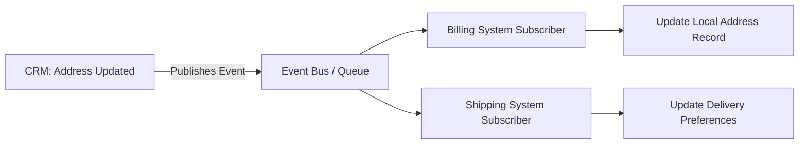

# Event-driven Automation

**Level:** 🟡 Intermediate - assumes basic familiarity with how software/business processes work

## Simple explanation

Event-driven automation reacts the moment something happens, instead of waiting for the next scheduled run or being asked. A system publishes an event ("InvoiceReceived", "OrderShipped", "StockBelowThreshold") and automation listens for it and reacts immediately.

## Real-world analogy

A smoke detector doesn't check every hour whether there's smoke - it reacts instantly when smoke is present. Compare that to a scheduled fire inspection that only happens once a month: both are valid safety measures, but they suit different kinds of risk. Event-driven automation is the smoke detector; [Scheduled Jobs](/automation-integration/scheduled-jobs) are the monthly inspection.

## How it differs from scheduled jobs

| | Scheduled Jobs | Event-driven Automation |
|---|---|---|
| Trigger | A clock (every night, every hour) | Something happening (a record created, a threshold crossed) |
| Latency | Up to one full interval | Near-immediate |
| Best for | Batchable work, non-urgent updates | Time-sensitive reactions, multiple independent consumers |
| Complexity | Lower - a single job to reason about | Higher - requires an event source, delivery guarantees, and idempotent consumers |
| Failure mode | A missed run is usually easy to detect and re-run | A missed or duplicated event can be subtler to catch |

## Worked example

**Problem:** The CRM and billing system need to stay in sync on customer addresses (the example from [Application vs Integration](/business-foundations/application-vs-integration)).

One event, multiple independent consumers, no polling, and no need for the CRM to know who's listening. This is the multi-consumer case where event-driven automation clearly beats a scheduled batch sync - adding a third consumer later requires no changes to the CRM at all.

## Design principles

- **At-least-once delivery is common, not exceptional** - most event systems can redeliver the same event. Every consumer must be idempotent (processing the same event twice produces the same result as processing it once).
- **Decoupling, not tight coupling** - the publisher shouldn't need to know who's listening, or care if a listener is temporarily down.
- **Dead-letter handling** - when a consumer repeatedly fails to process an event, it needs somewhere to go besides silently disappearing. See [Automation Failure Handling](/automation-integration/failure-handling).
- **Ordering assumptions, made explicit** - if event order matters (e.g. "created" must be processed before "updated"), the system must guarantee or reconstruct that order; don't assume it for free.

See [API vs Events](/architecture/standards) for the deeper architectural trade-off between synchronous API calls and asynchronous events.

## When to use

- Multiple independent systems need to react to the same change, and you don't want to hardcode each one into the source system.
- Near-real-time reaction genuinely matters to the business outcome.
- The systems involved can reasonably support publishing/subscribing to events (a message broker, webhooks, or a platform-native event system).

## When NOT to use

::: warning When NOT to use
- There's only one consumer and no real-time requirement - a scheduled job is simpler to build, run, and debug. Don't reach for event-driven architecture "because it's more scalable" if nothing about the problem needs that.
- The team has no experience operating message brokers or event infrastructure, and the volume/urgency doesn't justify the new operational burden.
- Strict, simple ordering or transactional guarantees are required that are much easier to get from a single synchronous call.
:::

## Common mistakes

- Building event-driven automation for a single-consumer, non-urgent case where a scheduled job would have been simpler and easier to operate.
- Consumers that aren't idempotent, causing duplicate side effects (double-charging, double-shipping) when an event is redelivered.
- No dead-letter queue or alerting, so a consistently failing consumer silently drops events forever.

## Where this leads

- [Scheduled Jobs](/automation-integration/scheduled-jobs) - the alternative trigger model
- [Automation Failure Handling](/automation-integration/failure-handling)
- [Architecture Standards](/architecture/standards) - event-driven patterns at the technical/architectural level
