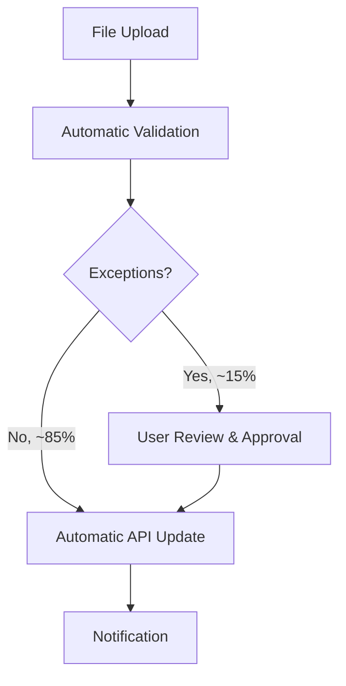

# Human-in-the-loop Automation

**Level:** 🟢 Beginner - readable with no technical background

## Simple explanation

Human-in-the-loop automation handles the routine, predictable majority of a process automatically, and routes only the genuine exceptions - the cases that need judgment - to a person. It is the most common real-world shape of "automation," because very few business processes are 100% rule-based with zero edge cases.

## Real-world analogy

An airport security scanner checks every bag automatically. The overwhelming majority pass through with no human involvement. When the scanner flags something ambiguous, a person looks closer. Nobody would want a human manually checking every single bag by hand (too slow), and nobody would want the scanner making the final call on a genuinely suspicious item with no human review (too risky). The combination is the point.

## Why this pattern matters so much

Fully automating a process end-to-end sounds appealing, but most real processes have a long tail of exceptions that are rare individually but common in aggregate, and that genuinely need judgment: an amount over a threshold, a mismatch that doesn't fit the expected pattern, a customer flagged for extra care. Trying to write rules for every one of these either:

- Takes enormous effort chasing diminishing returns, or
- Forces bad automated decisions on cases that needed a human.

Human-in-the-loop design accepts this from the start: automate the 80-90% that's genuinely routine, and build a clean, fast path for a person to handle the rest.

## The reference example, complete

This is the finance reconciliation example used throughout [Application vs Automation](/business-foundations/application-vs-automation) and [Workflow Automation](/automation-integration/workflow-automation). The 85/15 split is illustrative - the actual ratio should come from real data, not be assumed.

## Designing the human step well

- **Make the exception queue small and clear** - a person should see exactly what's wrong and why it was flagged, not raw data they have to re-diagnose from scratch.
- **Show the automation's reasoning** - "flagged because amount exceeds $500 threshold" is far more useful than an unexplained flag.
- **Keep the human step fast** - if reviewing an exception takes as long as the original manual process did, the automation hasn't actually saved much.
- **Feed corrections back** - if a person routinely overrides the same kind of flag, that's a signal the automation's rules should be tuned; treat this as ongoing product feedback, not a one-time build.

## When to use

- The core process is repetitive and rule-based, but has a meaningful tail of cases that need judgment, approval, or extra context.
- The cost or risk of a fully automated wrong decision on an exception is meaningfully higher than the cost of a brief human review.

## When NOT to use

::: warning When NOT to use
- Exceptions are actually the majority of cases - at that point, you likely don't have a good automation candidate yet (see [Identifying Automation Opportunities](/automation-integration/identifying-opportunities)), you have a process that needs a proper application and a human-driven workflow.
- The "human review" step never actually gets attention (no owner, no SLA) - an exception queue nobody looks at is worse than doing the whole process manually, because now it's automated *and* broken.
:::

## Common mistakes

- Building the automated 85% well and treating the exception path as an afterthought, so the hardest cases get the least design attention.
- No feedback loop - the same avoidable exceptions keep appearing because nobody ever adjusts the automation's rules.
- No SLA on the human step, letting exceptions pile up invisibly while the automated path looks perfectly healthy.

## Where this leads

- [Workflow Automation](/automation-integration/workflow-automation) - the mechanism that usually implements the human step
- [Measuring Automation ROI](/automation-integration/measuring-roi)
- [Choosing the Right Solution](/business-foundations/choosing-the-right-solution)
