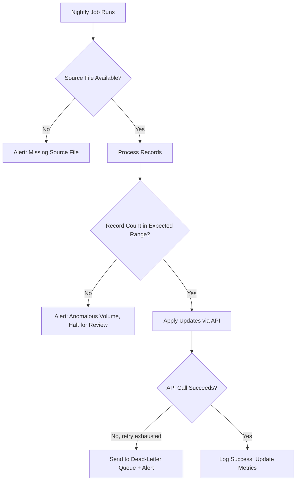

# Automation Failure Handling

**Level:** 🟡 Intermediate - assumes basic familiarity with how software/business processes work

## Simple explanation

An automation that fails silently is worse than doing the task manually, because a manual process at least has a person who notices when something isn't right. Automation removes that natural check - which means the automation itself must be responsible for noticing and surfacing its own failures.

## Why this matters more than it seems to

When a person forgets to do a task, they usually realize eventually, or someone asks about it. When an automation silently stops working - a credential expires, an API changes its response shape, a source file arrives in a slightly different format - nothing obviously changes on the surface. Data quietly stops updating, or starts updating incorrectly, and by the time anyone notices, real damage may already be done (missed payments, stale reports, incorrect customer data).

## The failure-handling checklist

- **Every run is logged**, including successful ones - "it ran and did nothing wrong" is a fact worth recording, not just failures.
- **Retries with backoff** for transient failures (a network blip, a momentary rate limit) - but with a limit, and clear logging when retries are exhausted.
- **Alerting on failure**, routed to whoever actually owns the automation - not just a log line nobody reads.
- **A dead-letter path** for records/events that repeatedly fail to process, so they're visible and recoverable rather than silently dropped. See [Event-driven Automation](/automation-integration/event-driven-automation).
- **Sanity checks on output volume** - if a job that normally processes ~500 records processes 0 or 50,000, that's worth flagging even if no individual step technically "failed."
- **A documented recovery procedure** - when it does fail, whoever's on call should be able to find out what to do without reverse-engineering the automation from scratch.

## Worked example

Continuing the invoice reconciliation job from [Scheduled Jobs](/automation-integration/scheduled-jobs):



Notice that "the job ran without an exception" is not the same as "the job succeeded." A missing source file, an anomalous record count, and an exhausted retry are all distinct failure modes that need their own handling and their own alert.

## Illustrative example of what silent failure costs

```text
Automation runs nightly, silently fails on day 1 due to an expired credential.
Nobody is alerted because there is no failure monitoring.

By day 12, when someone finally notices:
- 12 days of reconciliation went undone
- Manual catch-up takes longer than the 12 days of automation would have saved
- Some records are now impossible to reconstruct accurately
```

This is an illustrative scenario, not a real incident - but it is exactly the kind of cost that a basic alert on failure would have prevented for near-zero additional effort.

## When to invest more heavily in failure handling

- The automation affects money, compliance, or customer-facing data - invest early and thoroughly.
- The automation has a long feedback loop (nobody would notice a problem for days or weeks without direct monitoring) - invest early.
- The automation is low-stakes and highly visible if it fails (someone would immediately notice and flag it) - basic logging may be enough initially.

## Common mistakes

::: warning Common mistakes
- Treating "no errors thrown" as equivalent to "worked correctly" - many failure modes (wrong data, missing data, partial runs) don't throw exceptions at all.
- Alerting to a channel or inbox nobody actually monitors.
- No distinction between transient failures (worth retrying) and permanent ones (worth alerting immediately, not endlessly retrying).
- Building failure handling as an afterthought rather than part of the initial design - see [Observability](/operations/observability) for the equivalent discipline applied to applications.
:::

## Where this leads

- [Measuring Automation ROI](/automation-integration/measuring-roi)
- [Observability](/operations/observability) - the same monitoring discipline applied across the whole platform
- [Incident Management](/operations/incident-management) - what happens once a failure is detected and needs a response
