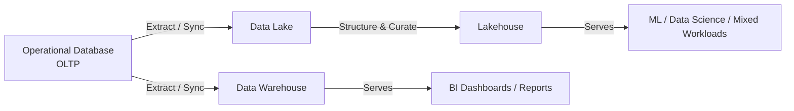

# Database vs Warehouse vs Lake/Lakehouse

**Level:** 🟡 Intermediate - assumes basic technical/business context

## Simple explanation

These are four different shapes data infrastructure can take, each optimized for a different job. Picking the wrong one doesn't just add cost - it actively fights the problem you're trying to solve.

## The comparison

| | Operational Database (OLTP) | Data Warehouse | Data Lake | Lakehouse |
|---|---|---|---|---|
| **Primary job** | Run the application | Structured analytics & BI | Store everything, cheaply, in any format | Combine lake flexibility with warehouse structure |
| **Data shape** | Structured, normalized | Structured, modeled for querying | Structured, semi-structured, unstructured | Mixed, but with table/schema management on top |
| **Typical users** | The application itself | Analysts, BI tools | Data engineers, data scientists | Both analysts and data scientists |
| **Query pattern** | Fast, small reads/writes | Complex aggregations, joins | Ad-hoc, exploratory, ML feature extraction | Both |
| **Cost profile** | Moderate, scoped to app needs | Higher (compute for large queries) | Cheap storage, cost grows with compute added later | Similar to lake, structured layer adds tooling cost |
| **Example technology** | PostgreSQL, MySQL, MongoDB | Snowflake, BigQuery, Redshift | S3/ADLS + a catalog | Databricks, Delta Lake, Iceberg-based platforms |

## When each is the right fit

- **Operational database** - the default. If the problem is running a process, this is very likely all you need. See [Data in Applications](/data-analytics/data-in-applications).
- **Data warehouse** - structured, well-understood reporting needs across one or more sources, where consistent schemas and fast BI queries matter more than flexibility.
- **Data lake** - you need to retain large volumes of raw, varied data (logs, events, documents, images) cheaply, often before you know exactly how it will be used, frequently to support data science or ML.
- **Lakehouse** - you need both the flexibility of a lake and the reliable, queryable structure of a warehouse, typically because both analysts and data scientists depend on the same underlying data.

## Common mistakes

::: warning Common mistakes
- Choosing a data lake because it's the most flexible option, then never adding the structure/governance needed to make it actually usable - this is often called a "data swamp."
- Building a warehouse before the source systems and their data quality are stable, requiring repeated rework as upstream schemas change.
- Assuming a lakehouse is a free upgrade over a warehouse or lake - it adds real tooling and operational complexity, and is only worth it when you genuinely need both workload types.
- Choosing based on what's trendy rather than what the actual consumers (BI tool? ML pipeline? both?) require.
:::

## Where this leads

- [ETL / ELT](/data-analytics/etl-elt) - how data actually gets from source systems into these stores
- [When to Build a Data Platform](/data-analytics/when-to-build-a-data-platform)
- [Databases](/basics/databases/overview) - for OLTP database engine details (SQL vs NoSQL, indexing, etc.)
