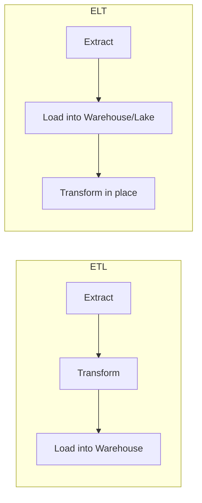

# ETL / ELT

**Level:** 🟡 Intermediate - assumes basic technical/business context

## Simple explanation

ETL and ELT are two orders of doing the same three things - **Extract** data from a source, **Transform** it into a usable shape, and **Load** it into a destination. The difference is just *when* the transformation happens relative to loading.

## Real-world analogy

Imagine moving house. **ETL** is like sorting and packing everything into labeled boxes before you leave (transform, then load) - the truck only carries organized boxes. **ELT** is like throwing everything into the truck as-is and sorting it once it's all in the new house (load, then transform) - faster to get moving, but you need space and a plan to sort later.

## The two approaches

| | ETL | ELT |
|---|---|---|
| **Transform happens** | Before loading, in a separate processing step | After loading, inside the destination system |
| **Best fit** | Smaller volumes, destinations with limited compute, strict pre-load validation | Large volumes, modern cloud warehouses/lakes with strong compute |
| **Flexibility** | Lower - reprocessing means re-running the whole pipeline | Higher - raw data is preserved, transformations can be re-run or changed later |
| **Typical tooling** | Traditional ETL tools, custom scripts | Cloud data warehouses (Snowflake, BigQuery) + transformation tools (dbt) |

## Why it matters

The choice affects how quickly you can adapt when business rules change. With ETL, a changed transformation rule often means re-extracting and re-processing from the source. With ELT, the raw data is already loaded, so you can often just change the transformation logic and re-run it - a meaningfully faster iteration loop, which is a large part of why ELT has become the default for modern cloud data platforms.

## Where this fits in the bigger picture

ETL/ELT is the mechanism that moves data from operational sources into the analytical stores discussed in [Database vs Warehouse vs Lake/Lakehouse](/data-analytics/database-vs-warehouse-vs-lake). It only becomes necessary once you've established that an analytical store is actually justified - see [When to Build a Data Platform](/data-analytics/when-to-build-a-data-platform). Building ETL/ELT pipelines before that justification exists is a common way data platform projects balloon in scope.

## Common mistakes

::: warning Common mistakes
- Building complex transformation logic before validating the source data is even reliable - see [Data Quality](/data-analytics/data-quality).
- Choosing ETL/ELT tooling based on trend rather than the actual volume, latency, and flexibility needs of the problem.
- No monitoring on pipeline runs, so a silent failure means stale or missing data for days before anyone notices - the same failure-handling discipline that applies to automation applies here too.
- Treating a one-time data migration as if it needs the same pipeline infrastructure as ongoing, recurring ingestion.
:::

## Where this leads

- [Database vs Warehouse vs Lake/Lakehouse](/data-analytics/database-vs-warehouse-vs-lake)
- [Data Quality](/data-analytics/data-quality)
- [APIs vs Data Pipelines](/data-analytics/apis-vs-data-pipelines)
