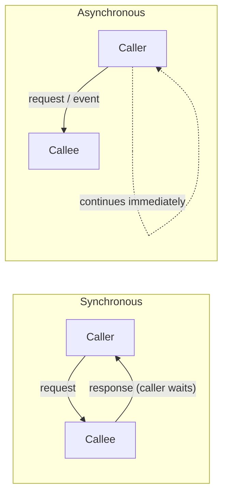

# Synchronous vs Asynchronous

**Level:** 🔴 Advanced - architecture/technical-decision depth

## Simple explanation

**Synchronous** means the caller waits for a response before doing anything else - like a phone call. **Asynchronous** means the caller fires off a request and moves on, getting the result later (or not needing one at all) - like sending a text message.

## The trade-off

| | Synchronous | Asynchronous |
|---|---|---|
| Caller experience | Waits for a result | Continues immediately |
| Coupling | Tighter - caller depends on callee's availability right now | Looser - callee can be slow, down, or scaled independently |
| Complexity | Lower - straightforward request/response | Higher - needs a broker/queue, retry logic, and eventual consistency handling |
| Failure mode | Immediate and visible (the call fails) | Delayed and can be silent if not monitored |
| Best for | The caller genuinely needs the result to proceed | The caller doesn't need to wait, or many independent consumers care about the same event |

## When to use synchronous

- The caller cannot proceed without the result (e.g. "is this item in stock?" before confirming an order).
- The interaction is simple, low-latency, and doesn't need to survive the callee being temporarily down.
- Debuggability matters more than decoupling - a synchronous call is far easier to trace and reason about.

## When to use asynchronous

- The caller doesn't need an immediate answer (e.g. "send a confirmation email" after an order is placed).
- Multiple independent systems need to react to the same occurrence, and you don't want the originating system to know or care who they are.
- The downstream work is slow, bursty, or should be retried without blocking the original request.

## Common mistakes

::: warning Common mistakes
- Making everything synchronous by default and creating a fragile chain where one slow downstream call degrades the entire request.
- Making everything asynchronous by default "for scalability," adding message brokers, eventual consistency, and retry logic to problems that never needed them - see [API vs Events](/architecture/api-vs-events) for the specific version of this mistake.
- Forgetting that asynchronous failures are invisible unless explicitly monitored - see [Observability](/operations/observability).
- Using async messaging without idempotent consumers, so retries or at-least-once delivery cause duplicate side effects (a double charge, a duplicate email).
:::

## Where this leads

- [API vs Events](/architecture/api-vs-events)
- [Monolith vs Microservices](/architecture/monolith-vs-microservices)
- [Event-driven Patterns](/architecture/standards) *(existing standard this page extends)*
