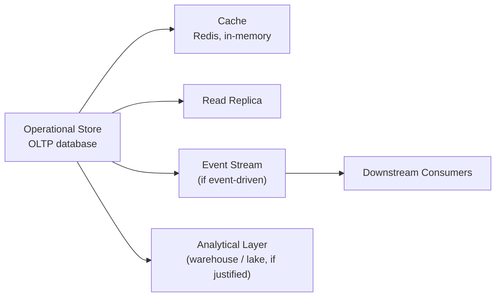

# Data Architecture

**Level:** 🔴 Advanced - architecture/technical-decision depth

Data architecture is about deciding where data lives, who owns it, and how it flows through a system - separate from the choice of any single database engine (covered in [Databases](/basics/databases/overview)). Getting this wrong quietly turns into either data duplication chaos or a single overloaded database trying to serve every purpose.

## The layers data typically flows through

| Layer | Purpose | Owned by |
|---|---|---|
| **Operational store** | The source of truth for running the application - current state, transactional | The service/application that owns the business capability |
| **Cache** | Fast, temporary access to frequently-read data | The same service, as an optimization, never a source of truth |
| **Read replica** | Offloads read traffic from the primary store without a new architectural layer | Same owner, replicated infrastructure |
| **Event stream** | Lets other systems react to changes without querying the store directly | The producer publishes; consumers own their own copies |
| **Analytical layer** | Historical, cross-source data for reporting/analytics - only when justified | A separate, deliberately-owned layer - see [Application vs Data Platform](/business-foundations/application-vs-data-platform) |

## Ownership: the rule that prevents chaos

::: tip Core idea
Each piece of data has exactly one system that owns it and is the source of truth. Every other system that needs that data either calls the owner's API, subscribes to its events, or consumes a deliberately-built analytical copy - it never reaches directly into another service's database.
:::

This is the same rule behind the [Microservice Checklist](/architecture/standards)'s "must never share a database," and it holds even inside a monolith: a module should own its data and expose it deliberately, not let other modules query its tables directly.

## When data needs its own architectural layer

Most applications are fine with an operational store, maybe a cache, and maybe a read replica. Data earns a dedicated architectural layer (a warehouse, a lake, a proper data platform) when the same signals from [Application vs Data Platform](/business-foundations/application-vs-data-platform) show up: multiple source systems, high volume, genuine historical/analytical needs, or multiple consumers who shouldn't each build their own copy independently. Until then, adding an analytical layer is premature complexity - see the [when-not-to](/business-foundations/application-vs-data-platform) guidance.

## Common mistakes

- Letting a second service read directly from a first service's database "just this once" - this becomes an unversioned, undocumented contract that breaks the first service's ability to change its own schema.
- Using a cache as if it were a source of truth, so a cache eviction or bug silently loses data that was never actually persisted.
- Building an analytical layer before establishing which system owns which data operationally - you end up architecting against a moving, undefined target.
- Replicating data everywhere "for performance" without a plan for keeping copies consistent, or accepting and documenting the staleness that's actually fine.

## Where this leads

- [Application vs Data Platform](/business-foundations/application-vs-data-platform)
- [Data & Analytics](/data-analytics/overview) - the full treatment of analytical layers, warehouses, and lakes
- [Architecture Trade-offs](/architecture/architecture-trade-offs)
- [Databases](/basics/databases/overview)
