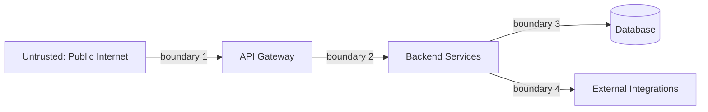

# Security Architecture

**Level:** 🔴 Advanced - architecture/technical-decision depth

[Security Guardrails](/security/security-guardrails) and the [General Security Checklist](/security/security-checklist) define the concrete, checklist-level controls every system must meet. This page is one level up: the structural, architecture-time decisions that determine whether those controls even have somewhere sound to attach to.

## Trust boundaries

A trust boundary is any point where data or a request crosses from one zone of trust to another - the public internet into your API gateway, an authenticated user's request into your business logic, one internal service calling another. Every trust boundary is a place where input must be treated as untrusted until verified, regardless of how "internal" the caller seems.

Common mistake: treating everything inside the network perimeter as trusted. Internal services should still authenticate and authorize each other - a compromised internal service should not have unchecked access to every other internal service.

## Defense in depth

No single control should be the only thing standing between an attacker and a breach. Layer controls so that a failure in one doesn't collapse the whole system:

- **Network layer**: segmentation, firewalls, private subnets for anything that doesn't need public exposure.
- **Application layer**: input validation, authentication, authorization checks on every request, not just at the edge.
- **Data layer**: encryption at rest and in transit, least-privilege database credentials per service.
- **Detection layer**: logging, alerting, and monitoring that would catch an attacker who got past the earlier layers - see [Observability](/operations/observability).

## Secrets and credentials

- Secrets (API keys, database credentials, signing keys) belong in a secrets manager, never in source control or plain environment files committed to a repo.
- Every service should hold the minimum credential it needs - a reporting service that only reads data should never hold a credential that can write.
- Rotate credentials on a schedule and immediately on suspected compromise; architecture should make rotation possible without a deployment (i.e. don't hardcode secrets into build artifacts).

## Network segmentation

Not every component needs to be reachable from everywhere. A database should generally be unreachable from the public internet and only reachable from the specific services that need it. A service that only talks to one downstream dependency shouldn't have open network access to the entire internal environment. Segmentation limits blast radius: if one component is compromised, segmentation determines whether the attacker got a foothold or got the whole environment.

## How this differs from the Security Guardrails checklist

[Security Guardrails](/security/security-guardrails) tells you the specific, concrete practices every service must follow (SAST/SCA scanning, secret scanning, dependency checks). This page is about the *shape* of the system those controls get applied to - a well-designed trust boundary and segmentation model makes the checklist controls actually effective; a flat, unsegmented architecture with everything trusting everything else means even a perfect checklist can't contain a single compromised component.

## Common mistakes

::: warning Common mistakes
- Designing the architecture first and considering security afterward - trust boundaries are far cheaper to get right at design time than to retrofit.
- Assuming "internal" means "trusted" - most real breaches spread through internal lateral movement, not the initial entry point.
- Centralizing every credential in one shared service account "for simplicity," turning it into a single point of catastrophic compromise.
:::

## Where this leads

- [Security Guardrails](/security/security-guardrails)
- [General Security Checklist](/security/security-checklist)
- [DevSecOps Standards](/coding-standards/devsecops-standards)
