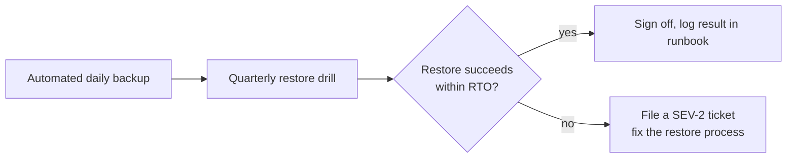

# Disaster Recovery & Backup Policy

"Database backups configured and tested" appears as a single checklist line in [Production Readiness](/templates/production-readiness) and the [Release Checklist](/coding-standards/checklists/release-checklist) - this page defines what "tested" actually requires: concrete targets, cadence, and the DR runbook every service must have.

## RPO and RTO - the two numbers that matter

| Term | Meaning | Default target |
|---|---|---|
| **RPO** (Recovery Point Objective) | How much data can we afford to lose? | ≤ 5 minutes of data loss for production databases (point-in-time recovery) |
| **RTO** (Recovery Time Objective) | How long can we be down while recovering? | ≤ 1 hour for SEV-1 database failure (see [Incident Management](/operations/incident-management) severity matrix) |

A service with tighter business requirements (e.g. payments) must document stricter targets in its runbook - these are the floor, not a ceiling.

## Backup requirements

- **Production databases**: automated daily full snapshot + continuous point-in-time recovery (WAL/binlog archiving), retained for 30 days minimum.
- **Backups must be stored in a separate region/account** from the primary database - a backup that fails over in the same outage that took out production is not a real backup.
- **Encryption at rest** for all backup storage, same as the primary database.

## Restore testing - the part everyone skips

A backup that has never been restored is a hope, not a plan.

- **Cadence**: every production database must have a documented, successful restore-to-a-clean-environment performed at least **quarterly**, not just when an incident forces it.
- **Owner**: the service's Tech Lead signs off on each drill; the result (pass/fail, actual time taken) is logged in the service's runbook.

## The DR Runbook

Every microservice's `RUNBOOK.md` (see [Documentation Standards](/engineering/documentation)) must include a Disaster Recovery section with:

1. This service's specific RPO/RTO targets.
2. Exact restore procedure (commands/console steps, not just "restore from backup").
3. Who to page and in what order (see [Incident Management](/operations/incident-management)).
4. Date and result of the last restore drill.

## Where this leads next

- [Incident Management](/operations/incident-management) - severity matrix and on-call process a real disaster invokes
- [Release Management](/operations/release-management) - the rollback policy that handles most *deployment*-caused incidents, as distinct from infrastructure/data-loss disasters
