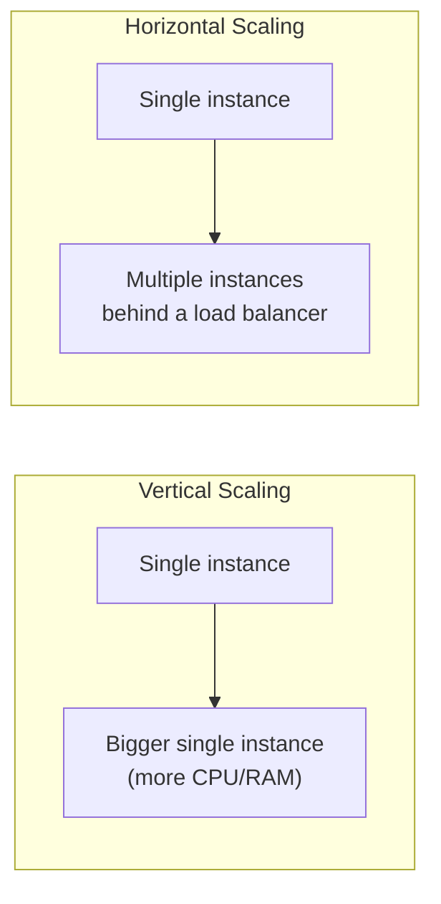

# Scalability

**Level:** 🟡 Intermediate - assumes basic technical/business context

## Simple explanation

Scalability is a system's ability to handle more load - more users, more data, more requests - without a proportional (or worse) degradation in performance or reliability.

## Vertical vs horizontal scaling

| | Vertical (scale up) | Horizontal (scale out) |
|---|---|---|
| How | Add more CPU/RAM to one machine | Add more machines/instances |
| Simplicity | Simple - no architecture change needed | Requires statelessness, load balancing, and often a distributed data strategy |
| Ceiling | Hard limit - you eventually run out of bigger machines | Effectively unbounded, if the architecture supports it |
| Failure impact | One machine, one point of failure | Failure of one instance doesn't take down the whole system |

Vertical scaling is often the right first move - it's cheap, requires no architectural change, and covers a surprising amount of real-world growth. Horizontal scaling becomes necessary once a single machine's ceiling is a genuine, approaching constraint, and it requires the system to already be stateless (or externalize its state) to work.

## When scalability work is necessary

- [Capacity Planning](/production-reliability/capacity-planning) shows you are approaching a real, measured limit, not a hypothetical one.
- The cost of an outage from hitting that limit under real load exceeds the cost of building headroom now.
- Growth is measured and projected, not assumed.

## When scalability work is premature optimization

- The system serves a known, bounded set of users (e.g. an internal tool for a 50-person team) that will never need to handle internet-scale traffic.
- Scalability work is being done "just in case," ahead of any evidence of approaching a real limit, at the cost of complexity the team now has to maintain indefinitely.
- The bottleneck hasn't been measured - scaling the wrong component (adding more app servers when the database is the actual constraint) doesn't help and adds cost.

## A practical sequence

1. Measure the actual current load and the actual current limit (see [Capacity Planning](/production-reliability/capacity-planning)).
2. Identify the real bottleneck - don't guess.
3. Try the cheapest fix first (a query optimization, an index, a cache, vertical scaling).
4. Reach for horizontal scaling and architectural change only when the cheaper options are genuinely exhausted.

## Common mistakes

::: warning Common mistakes
- Designing for a scale the product may never reach, at the cost of velocity and simplicity today - this is one of the most common ways over-engineering enters a codebase.
- Assuming horizontal scaling is automatically achieved by adding servers - if the application holds state in memory or the database is the real bottleneck, more app servers change nothing.
- Ignoring the database as the eventual scaling constraint while focusing entirely on the application tier.
:::

## Where this leads

- [Capacity Planning](/production-reliability/capacity-planning)
- [Performance](/production-reliability/performance)
- [Architecture Trade-offs](/architecture/architecture-trade-offs)
