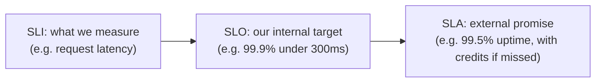

# SLI / SLO / SLA

**Level:** 🔴 Advanced - architecture/technical-decision depth

These three terms are related but distinct, and mixing them up leads to targets that are either meaningless or unenforceable.

## The three definitions

| Term | What it is | Who it's for |
|---|---|---|
| **SLI** (Service Level Indicator) | A measured metric of actual behavior - e.g. "% of requests completed in under 300ms" | Engineering - this is a raw measurement |
| **SLO** (Service Level Objective) | An internal target for that indicator - e.g. "99.9% of requests under 300ms, measured over 30 days" | Engineering and product - this is the goal the team designs and operates toward |
| **SLA** (Service Level Agreement) | An external, often contractual commitment, usually with consequences for missing it - e.g. "99.9% uptime or a service credit" | Customers/clients - this is a promise, and SLAs are typically set looser than the internal SLO to leave margin |

## Worked example

**Service**: A public order-status API.

- **SLI**: The percentage of requests to `/orders/{id}` that return within 300ms, measured continuously.
- **SLO**: 99.9% of requests complete within 300ms, measured over a rolling 30-day window. This is the number engineering designs, tests, and gets paged against.
- **SLA**: 99.5% uptime guaranteed to customers in the contract, with service credits if missed. Deliberately looser than the internal SLO, so there's margin to detect and fix a degradation before it becomes an SLA breach.

## Tying SLOs to actual business impact, not round numbers

The most common mistake is picking an SLO because it sounds impressive ("let's do 99.99%") rather than because it reflects what the business and its users actually need. A good SLO process asks:

- What does the user actually experience below this threshold - do they notice, or complain, or leave?
- What does missing this target cost the business, concretely?
- What does *achieving* a tighter target cost in engineering effort and infrastructure - see [Availability](/production-reliability/availability)'s downtime-by-nines table and [Cost Management](/production-reliability/cost-management)?

An internal reporting tool with an SLO of 99% is probably fine - a few hours a month of unavailability. A payment authorization path likely needs something closer to 99.95%+, because the cost of failure (lost transactions, customer trust) is much higher. The right SLO is the one that's cheapest to hit while still meeting the actual business requirement - not the highest number achievable.

## Error budgets

Once an SLO is set, the allowed failure margin (100% - SLO) becomes an **error budget** - a resource the team can deliberately spend on risk (a faster release cadence, an experimental feature) as long as they stay within it. Burning through the error budget is a signal to slow down and prioritize reliability work over new features until it recovers.

## Common mistakes

::: warning Common mistakes
- Setting an SLA equal to the internal SLO, leaving no margin to catch and fix problems before they become a broken customer promise.
- Choosing SLO targets by convention ("everyone does 99.9%") rather than by what the specific system and its users actually need.
- Measuring an SLI that doesn't reflect what users actually experience (e.g. average latency instead of p95/p99, which hides the tail of bad experiences that users actually remember).
:::

## Where this leads

- [Availability](/production-reliability/availability)
- [Cost Management](/production-reliability/cost-management)
- [Measuring Business Value](/business-foundations/measuring-business-value)
