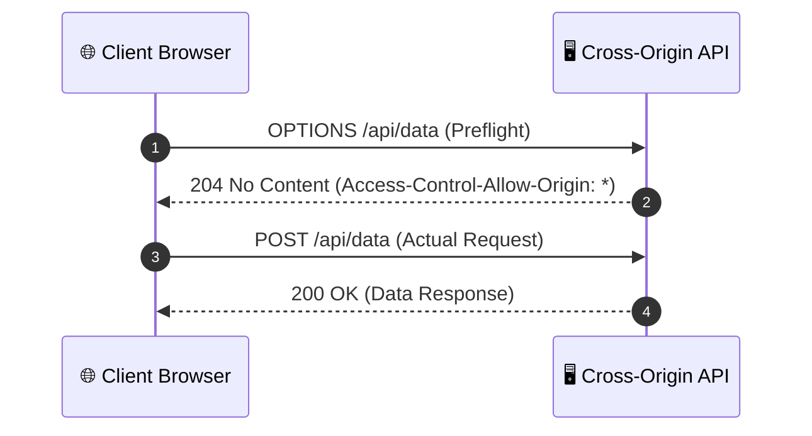

# Advanced HTTP Concepts & Protocols

As APIs scale in production, understanding browser security boundaries, performance caching, versioning, rate limiting, and real-time communication protocols becomes essential for full-stack developers.

---

## 1. CORS & Same-Origin Policy (SOP)

### Same-Origin Policy (SOP)
The **Same-Origin Policy** is a fundamental browser security mechanism that restricts a web page from making requests to a domain different from the one that served the page. 

An **Origin** is defined by three components: **Protocol + Domain + Port**.

```
http://example.com:8080/page.html
│      │           │
│      │           └─ Port (8080)
│      └───────────── Domain (example.com)
└──────────────────── Protocol (http)
```

Two URLs have the *same origin* only if all three match exactly.

### Cross-Origin Resource Sharing (CORS)
**CORS** is an HTTP-header based protocol that allows a server to explicitly indicate any origins (other than its own) from which a browser should permit loading resources.



### Key CORS Headers
| Header | Type | Description |
|---|---|---|
| `Access-Control-Allow-Origin` | Response | Specifies permitted origins (e.g., `https://myapp.com` or `*`). |
| `Access-Control-Allow-Methods` | Response | Lists allowed HTTP methods (e.g., `GET, POST, PUT, DELETE`). |
| `Access-Control-Allow-Headers` | Response | Lists allowed headers in actual requests (e.g., `Content-Type, Authorization`). |
| `Access-Control-Max-Age` | Response | Seconds the preflight result can be cached by browser. |

---

## 2. API Versioning Strategies

When an API evolves, versioning prevents breaking existing client applications.

| Strategy | Example | Pros | Cons |
|---|---|---|---|
| **URI Path** *(Most Popular)* | `GET /v1/users`<br>`GET /v2/users` | Explicit, easy to route, browser-friendly | Clutters URL space |
| **Query Parameter** | `GET /users?version=2` | Easy to implement default versions | Harder to cache at CDN layer |
| **Custom Header** | `X-API-Version: 2` | Clean URLs | Hidden dependency, harder to test in browser |
| **Content Negotiation** | `Accept: application/vnd.company.v2+json` | RESTful pure standard | Complex for client developers |

---

## 3. HTTP Caching & Conditional Requests

HTTP caching reduces network latency and server load by storing copies of target responses.

### Key Caching Directives (`Cache-Control`)
- `max-age=<seconds>`: Specifies maximum time a response is considered fresh.
- `no-cache`: Must revalidate with origin server before using cached copy.
- `no-store`: Do not cache anything anywhere (sensitive data).
- `private`: Only cacheable by end-user browser (not shared CDNs/proxies).

### Validation via Validation Headers (ETags)
When a cached resource might be stale, the browser sends a conditional request using `If-None-Match`:

```http
GET /api/products/42
If-None-Match: "w34a9x8"
```

If the data hasn't changed, the server returns `304 Not Modified` with **no response body**, saving bandwidth.

---

## 4. Rate Limiting & Throttling

Rate limiting controls the rate of traffic sent to or received by a server to prevent DDoS attacks and resource exhaustion.

### Standard Response Headers
When rate limiting is enforced, servers return status code `429 Too Many Requests` alongside headers:

```http
HTTP/1.1 429 Too Many Requests
X-RateLimit-Limit: 100
X-RateLimit-Remaining: 0
X-RateLimit-Reset: 1690000000
Retry-After: 60
```

### Common Rate Limiting Algorithms
1. **Token Bucket**: Tokens are added to a bucket at a fixed rate. Each request consumes one token.
2. **Leaky Bucket**: Requests enter a queue and are processed at a constant output rate.
3. **Sliding Window Log**: Tracks timestamps of requests per user to calculate dynamic window limits.

---

## 5. Real-Time Protocols: HTTP vs WebSockets vs SSE

Standard HTTP is stateless and request-response driven. For real-time applications, alternative protocols are used:

| Protocol | Direction | Transport | Best For |
|---|---|---|---|
| **HTTP Polling** | Unidirectional (Client Pull) | Short-lived HTTP | Low-frequency periodic updates |
| **Server-Sent Events (SSE)** | Unidirectional (Server Push) | Persistent HTTP connection | Stock tickers, news feeds, AI text streaming |
| **WebSockets** | Full-Duplex (Bi-directional) | Upgraded TCP socket | Chat apps, multiplayer gaming, collaborative editing |
