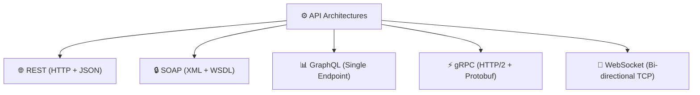
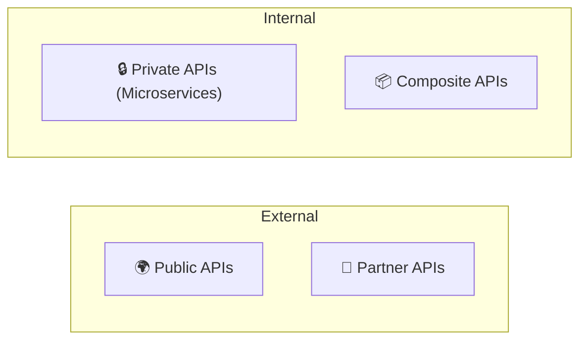

# API Architectures & Classification Guide

Different API architectures define how clients and servers communicate, while accessibility and scope classifications dictate how APIs are exposed, secured, and consumed across organizations.

---

## 1. Foundational API Architectures

Modern software applications rely on five foundational API architectures, each optimized for specific communication patterns, payload structures, and performance requirements.



---

### 1. REST APIs (Representational State Transfer)

#### What is REST?
Proposed by Roy Fielding in 2000, **REST** is the most widely used architecture for web services. A REST API treats data as resources identified by unique URL endpoints and relies on standard HTTP methods.

#### How it works
Requests use standard HTTP verbs (`GET`, `POST`, `PUT`, `PATCH`, `DELETE`) with stateless communication—every request carries all necessary context.

```http
GET /api/v1/users/123 HTTP/1.1
Host: api.example.com
Authorization: Bearer eyJhbGciOiJIUzI1...
Accept: application/json
```

#### When to Use & Examples
- **Best For**: Public web services, mobile apps needing broad compatibility, and standard CRUD microservices.
- **Examples**: Stripe Payments API, GitHub REST API, Spotify Web API.

#### Advantages & Limitations
- ✅ **Pros**: Simple to learn, highly cacheable via native HTTP headers, supported by virtually every language/framework.
- ❌ **Cons**: Can lead to **over-fetching** (receiving unnecessary fields) or **under-fetching** (requiring multiple round-trips for related data).

---

### 2. SOAP APIs (Simple Object Access Protocol)

#### What is SOAP?
Created in the late 1990s, **SOAP** is a strict, protocol-based architecture that relies exclusively on XML messaging. It relies on **WSDL** (Web Services Description Language) files to formally define operations, schemas, and endpoints.

#### How it works
Requests and responses are wrapped in structured XML envelopes containing Headers (metadata/auth) and a Body.

```xml
<?xml version="1.0"?>
<soap:Envelope xmlns:soap="http://www.w3.org/2003/05/soap-envelope">
  <soap:Header>
    <auth:token>token_abc123</auth:token>
  </soap:Header>
  <soap:Body>
    <getUserRequest>
      <userId>42</userId>
    </getUserRequest>
  </soap:Body>
</soap:Envelope>
```

#### When to Use & Examples
- **Best For**: Enterprise systems requiring strict ACID compliance, financial/banking operations, and legal/healthcare systems with rigorous security standards.
- **Examples**: Salesforce SOAP API, PayPal Legacy Payments, Oracle Fusion Middleware.

#### Advantages & Limitations
- ✅ **Pros**: Built-in WS-Security standards (encryption & digital signatures), strict WSDL contract validation, supports multiple transport protocols (HTTP, SMTP, TCP).
- ❌ **Cons**: Verbose XML payloads increase bandwidth, steep learning curve, rigid structure slows down rapid iteration.

---

### 3. GraphQL APIs

#### What is GraphQL?
Developed by Meta in 2012 and open-sourced in 2015, **GraphQL** is a query language and server-side runtime for APIs. It uses a single endpoint where clients explicitly query only the data fields they require.

#### How it works
Clients send structured queries to a single POST endpoint (typically `/graphql`). The server resolves only the requested fields and returns matching JSON.

```graphql
query {
  user(id: "42") {
    name
    email
    posts(limit: 2) {
      title
      createdAt
    }
  }
}
```

#### When to Use & Examples
- **Best For**: Mobile apps with bandwidth constraints, complex dashboards aggregating data from multiple services, and rapidly evolving frontend requirements.
- **Examples**: GitHub GraphQL API, Shopify Admin API, Contentful Content API.

#### Advantages & Limitations
- ✅ **Pros**: Eliminates over-fetching and under-fetching, self-documenting via schema introspection, strongly typed.
- ❌ **Cons**: Bypasses standard HTTP caching (requires gateway/application-level caching), complex nested queries can degrade database performance.

---

### 4. gRPC APIs (Google Remote Procedure Call)

#### What is gRPC?
Released by Google in 2015, **gRPC** is an open-source, high-performance RPC framework. It uses **Protocol Buffers (protobuf)** for binary serialization over **HTTP/2** transport.

#### How it works
Services and message structures are defined in `.proto` files, which compile into strongly-typed client and server stubs across multiple programming languages.

```protobuf
syntax = "proto3";

service UserService {
  rpc GetUser (UserRequest) returns (UserResponse);
}

message UserRequest {
  string user_id = 1;
}
```

#### When to Use & Examples
- **Best For**: Internal microservice communication, low-latency high-throughput systems, IoT devices, and streaming workloads.
- **Examples**: Google Cloud Internal APIs, Netflix Microservices, Uber Push Platform.

#### Advantages & Limitations
- ✅ **Pros**: Extremely compact binary payloads, ultra-fast serialization, HTTP/2 multiplexing and streaming, auto-generated client code.
- ❌ **Cons**: Poor direct browser support (requires gRPC-Web proxies), binary payloads are harder to inspect and debug than JSON.

---

### 5. WebSocket APIs

#### What is WebSocket?
**WebSocket** is an event-driven protocol providing full-duplex, persistent bidirectional communication channels over a single TCP connection.

#### How it works
After an initial HTTP handshake requesting an upgrade, the connection transitions to a persistent WebSocket channel (`wss://`) where both client and server emit messages at any time.

```javascript
const socket = new WebSocket('wss://api.example.com/live');

socket.onopen = () => socket.send(JSON.stringify({ type: 'subscribe', channel: 'trades' }));
socket.onmessage = (event) => console.log('Live Data:', JSON.parse(event.data));
```

#### When to Use & Examples
- **Best For**: Live chat apps, collaborative multi-user tools, real-time financial price feeds, and multiplayer gaming.
- **Examples**: Zoom Real-Time Signaling, Slack WebSockets, Crypto Exchange Live Feeds.

#### Advantages & Limitations
- ✅ **Pros**: Low latency, eliminates polling overhead, true bi-directional server push.
- ❌ **Cons**: Stateful open connections require sticky sessions and complex load-balancing, firewalls may block upgraded connections.

---

## 2. API Architecture Comparison Matrix

| Feature | REST | SOAP | GraphQL | gRPC | WebSocket |
|---|---|---|---|---|---|
| **Protocol** | HTTP / HTTPS | HTTP, SMTP, TCP | HTTP / HTTPS | HTTP/2 | TCP / WebSocket |
| **Data Format** | JSON, XML, HTML | XML only | JSON | Protocol Buffers (Binary) | Text, JSON, Binary |
| **Learning Curve** | Low | High | Medium | Medium | Low |
| **Performance** | Good | Moderate | Good | **Excellent** | **Excellent** |
| **Browser Support** | Full | Full | Full | Limited (needs gRPC-Web) | Full |
| **Caching** | Native HTTP Caching | Custom | Custom Gateway / App | Custom | N/A |
| **Real-time Support** | No (Polling required) | No | Subscriptions | Streaming | **Native (Bi-directional)** |
| **State Management** | Stateless | Can be stateful | Stateless | Stateless | **Stateful (Persistent)** |
| **Security** | HTTPS, OAuth2, API Keys | WS-Security, TLS | Custom, OAuth2 | TLS, Custom | TLS, Tokens |
| **Versioning** | URI path or Header | WSDL versioning | Schema Evolution | Protobuf Versioning | Custom Messages |
| **Error Handling** | HTTP Status Codes | SOAP Faults | GraphQL Errors array | gRPC Status Codes | Custom Messages |
| **Best For** | General Web Services | Regulated Enterprise | Client-driven Apps | Microservices & Internal APIs | Real-Time Live Apps |

---

## 3. REST API & Resource Conventions

REST remains the standard for web APIs. It maps HTTP methods to **CRUD** operations (*Create, Read, Update, Delete*):

| Method + Path | CRUD Operation | What It Does | Common Status Code |
|---|---|---|---|
| `GET /users/123` | **Read** | Fetches data for user 123 | `200 OK` |
| `POST /users` | **Create** | Creates a new user resource | `201 Created` |
| `PUT /users/123` | **Update (Replace)** | Replaces the entire user record | `200 OK` / `204 No Content` |
| `PATCH /users/123` | **Update (Partial)** | Updates only specified fields | `200 OK` |
| `DELETE /users/123` | **Delete** | Removes user 123 | `200 OK` / `204 No Content` |

### Method Breakdown Examples

#### 1. GET Method
```http
GET /users/123
```
*Retrieves resource. On error, returns `404 Not Found` or `400 Bad Request`.*

#### 2. POST Method
```http
POST /users
Content-Type: application/json

{ "name": "Anne", "email": "gfg@example.com" }
```
*Creates resource. On success, returns `201 Created` with a `Location` header.*
> ⚠️ **Note**: `POST` is neither safe nor idempotent.

#### 3. PUT Method
```http
PUT /users/123
Content-Type: application/json

{ "name": "Anne", "email": "gfg@example.com" }
```
*Replaces entire record at URL or creates it if non-existent.*

#### 4. PATCH Method
```http
PATCH /users/123
Content-Type: application/json

{ "email": "new.email@example.com" }
```
*Modifies only provided fields.*

##### PUT vs PATCH Comparison

| Feature | PUT | PATCH |
|---|---|---|
| **Scope** | Replaces entire resource | Modifies specific fields |
| **Payload** | Requires full representation | Requires only modified fields |
| **Idempotency** | **Idempotent** | **Not guaranteed idempotent** |

#### 5. DELETE Method
```http
DELETE /users/123
```
*Deletes resource. Returns `200 OK` or `204 No Content`.*

---

## 4. API Classification by Exposure & Scope

Beyond communication protocols, APIs are classified by their intended audience and exposure boundary:



| Category | Description | Access Control | Primary Examples |
|---|---|---|---|
| **Public (Open) APIs** | Publicly accessible to external developers to build third-party integrations. | OAuth2, API Keys | Stripe, GitHub, Weather API |
| **Private (Internal) APIs** | Exposed strictly within an organization to connect internal backend microservices. | Internal Network / mTLS | Internal Auth, Payment Queue |
| **Partner APIs** | Shared with specific business partners under contractual agreements. | Restricted Tokens / IP Whitelist | B2B Logistics, Payment Gateway Sync |
| **Composite APIs** | Combines multiple API endpoints into a single request/response payload to minimize round-trips. | Standard API Auth | Mobile Dashboard Aggregators |

---

## 5. Architectural Decision Framework

Use this decision matrix when choosing an API architecture for a new project:

1. **Use REST** when building general web services, public-facing APIs, or simple CRUD applications requiring broad client compatibility and HTTP caching.
2. **Use GraphQL** when building frontend/mobile applications with complex data requirements, multi-resource dashboards, or bandwidth constraints.
3. **Use gRPC** for high-performance internal microservices requiring ultra-low latency, streaming, and strong type safety.
4. **Use WebSockets** when building real-time, interactive applications requiring continuous bi-directional server pushes.
5. **Use SOAP** for regulated enterprise systems (finance, healthcare, government) with strict XML compliance, WS-Security, and WSDL contracts.
