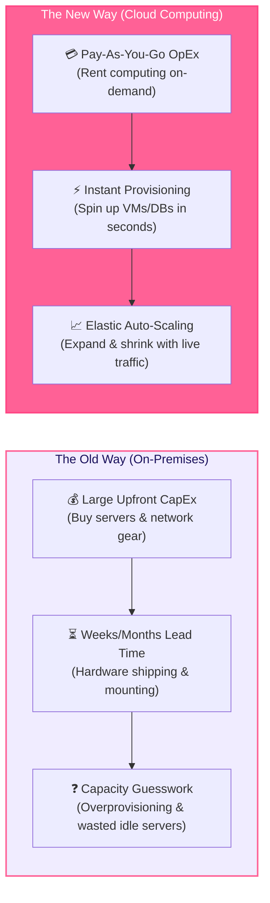

# Cloud Computing Overview

**Cloud Computing** is the on-demand delivery of computing services—including servers, storage, databases, networking, software, and analytics—over the internet ("the cloud"). Instead of purchasing and maintaining physical data centers, organizations rent access to storage and computing power from cloud providers on a pay-as-you-go basis.

> 💡 **Core Value Proposition**: Cloud computing eliminates large upfront infrastructure costs, enabling engineering teams to scale applications dynamically and deploy features globally in seconds.

---

## The Problem Cloud Computing Solves

Before cloud computing, launching an application required buying physical hardware, setting up data centers, and managing infrastructure—a slow, expensive, and rigid process.

### Detailed Comparison: On-Premises vs. Cloud

| Aspect | On-Premises (Traditional) | Cloud Computing (Modern) |
|---|---|---|
| **Financial Model** | **Capital Expenditure (CapEx)**: Huge upfront investment in physical servers, data centers, cooling, and power. | **Operational Expenditure (OpEx)**: Pay-as-you-go based strictly on active resource consumption. |
| **Speed & Agility** | **Slow**: Procurement, shipping, racking, and configuring servers can take weeks or months. | **Instant**: Virtual instances and managed databases are provisioned in seconds via UI or API. |
| **Capacity Planning** | **Fixed Capacity**: Must purchase server headroom for peak traffic events, leading to idle waste during normal hours. | **Dynamic Elasticity**: Infrastructure expands automatically during traffic spikes and contracts during quiet periods. |
| **Maintenance** | **In-House Overhead**: Engineering teams handle hardware replacement, power redundancy, and physical security. | **Provider Managed**: Cloud providers handle physical facilities, hardware lifecycle, and environmental controls. |
| **Global Reach** | **Limited**: Expanding globally requires building or renting new international data centers. | **Worldwide Footprint**: Deploy applications globally across dozens of international cloud regions in minutes. |

---

## Where This Leads Next

- [Architecture & Characteristics](/basics/cloud/architecture-characteristics) — client-server cloud architecture and 5 NIST characteristics
- [Service & Deployment Models](/basics/cloud/service-deployment-models) — IaaS, PaaS, SaaS, FaaS, and Public/Private/Hybrid clouds
- [Security & Shared Responsibility](/basics/cloud/security-shared-responsibility) — security OF the cloud vs IN the cloud
- [Cloud Providers](/basics/cloud/providers) — AWS, Azure, GCP, and enterprise cloud ecosystems
