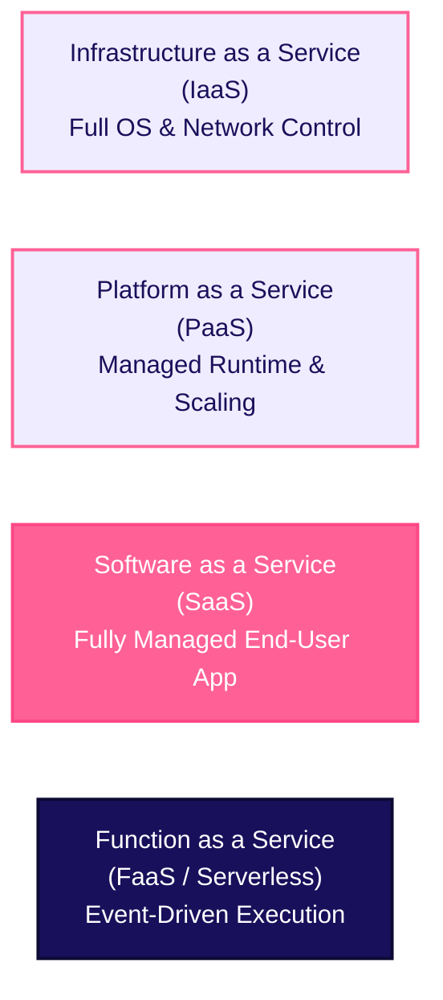
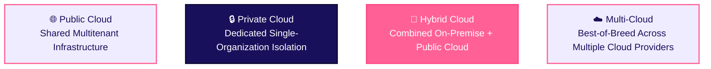

# Cloud Service & Deployment Models

Cloud computing provides varying levels of administrative control, infrastructure management, and deployment isolation depending on business needs.

---

## 1. Cloud Service Delivery Models

Cloud services are categorized into four primary service models based on how much infrastructure management is handled by the provider vs. the developer:

### 1. Infrastructure as a Service (IaaS)
IaaS gives access to virtualized IT building blocks: virtual machines, raw block storage, and virtual networks over the internet. You do not manage physical hardware, but you retain full administrative control over operating systems, software runtime, and network configurations.
- **Example**: **AWS EC2**, **Google Compute Engine**, **Azure VMs**.
- **Key Benefits**: Maximum operational flexibility and control; zero physical hardware maintenance.

### 2. Platform as a Service (PaaS)
PaaS provides a complete, managed runtime environment where developers deploy application code without worrying about server provisioning, OS patching, runtime installation, or load balancer configuration.
- **Example**: **AWS Elastic Beanstalk**, **Heroku**, **Google App Engine**.
- **Key Benefits**: Eliminates infrastructure management overhead; speeds up development time to market.

### 3. Software as a Service (SaaS)
SaaS delivers complete, web-hosted end-user applications. The provider handles all maintenance, infrastructure, OS patches, and data storage—users simply log in via a browser.
- **Example**: **Google Docs**, **Salesforce**, **Microsoft 365**, **Slack**.
- **Key Benefits**: Zero installation or local maintenance; accessible anywhere over the internet.

### 4. Function as a Service (FaaS / Serverless)
FaaS lets developers upload individual snippets of code that run automatically in response to specific triggers or events (e.g. database updates, file uploads, HTTP requests). The platform spins up micro-containers on demand and destroys them immediately when finished.
- **Example**: **AWS Lambda**, **Google Cloud Functions**, **Azure Functions**.
- **Key Benefits**: Pure event-driven execution; zero idle server cost (pay only for active execution milliseconds); automatic micro-scaling.

---

## 2. Cloud Deployment Models

Organizations choose different deployment models depending on data security, regulatory compliance, and architectural goals:

| Deployment Model | Description | Best For |
|---|---|---|
| **Public Cloud** | Owned and operated by third-party cloud providers (AWS, GCP, Azure) and delivered over the public internet to multiple organizations. | Modern web apps, SaaS platforms, startups, highly scalable services. |
| **Private Cloud** | Infrastructure dedicated exclusively to a single organization. Can be managed internally or by a third party on-premise or off-premise. | Banks, healthcare providers, and government agencies requiring strict data control. |
| **Hybrid Cloud** | Connects a private cloud/on-premise center with one or more public cloud services, allowing data and applications to be shared between them. | Retaining core sensitive data on-premise while bursting extra web traffic to the public cloud. |
| **Multi-Cloud** | Strategy using services from two or more distinct public cloud providers (e.g., AWS for compute + GCP for BigData/AI). | Eliminating vendor lock-in and picking specialized best-of-breed services per provider. |

---

## Where This Leads Next

- [Security & Shared Responsibility](/basics/cloud/security-shared-responsibility) — understanding cloud security boundaries
- [Cloud Providers](/basics/cloud/providers) — exploring top cloud providers and services
