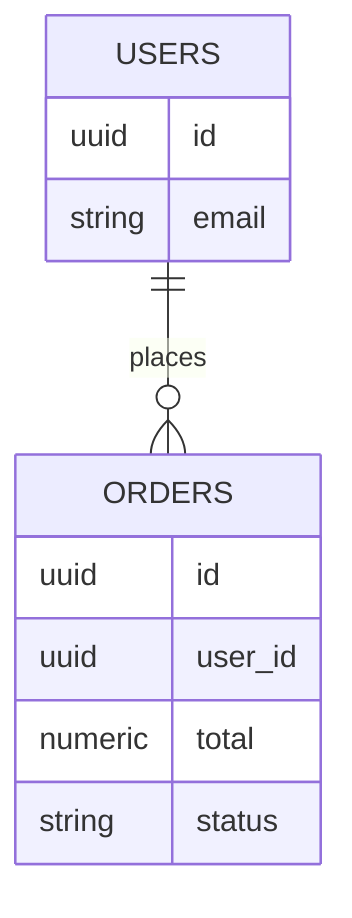
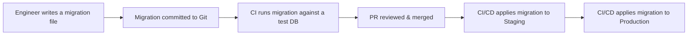

# Databases 101

A database stores data so it survives after your application restarts. Two families are used in this org, and they solve different problems.

## SQL vs NoSQL

| | SQL (PostgreSQL, MySQL) | NoSQL (MongoDB) |
|---|---|---|
| **Structure** | Fixed schema — rows in tables, columns are defined ahead of time | Flexible schema — documents (JSON-like) can vary in shape |
| **Relationships** | Strong support via foreign keys and joins | Relationships are modeled by embedding or referencing manually |
| **Best for** | Structured data with clear relationships (orders, users, invoices) | Rapidly changing or loosely structured data (logs, catalogs, content) |
| **Consistency guarantee** | ACID by default | Eventually consistent by default (tunable) |

## Key vocabulary

| Term | Plain-English meaning |
|---|---|
| **Schema** | The blueprint of what tables/columns (or document shapes) exist |
| **Migration** | A version-controlled, repeatable script that changes the schema (e.g. "add a `status` column") — never edit a production database by hand |
| **ORM** | A library (e.g. Prisma) that lets you query the database using code instead of writing raw SQL |
| **Index** | A structure that makes lookups on a column fast, at the cost of slightly slower writes |
| **Connection pooling** | Reusing a small set of open database connections instead of opening a new one per request, which is expensive |
| **ACID** | Atomicity, Consistency, Isolation, Durability — the guarantee that a transaction either fully happens or not at all, even if the server crashes mid-way |

## From schema to a query, concretely

A schema describes the shape of your data. Two related tables might look like this:

```sql
CREATE TABLE users (
  id UUID PRIMARY KEY DEFAULT gen_random_uuid(),
  email VARCHAR(255) UNIQUE NOT NULL,
  created_at TIMESTAMP DEFAULT now()
);

CREATE TABLE orders (
  id UUID PRIMARY KEY DEFAULT gen_random_uuid(),
  user_id UUID NOT NULL REFERENCES users(id),
  total NUMERIC(10, 2) NOT NULL,
  status VARCHAR(20) NOT NULL DEFAULT 'pending'
);
```



A **migration** is that same schema change, but written as a versioned, repeatable script instead of a one-off command run by hand:

```ts
// Prisma migration (generated from a schema change)
export async function up(db) {
  await db.schema.createTable('orders', (table) => {
    table.uuid('id').primary().defaultTo(db.raw('gen_random_uuid()'));
    table.uuid('user_id').notNullable().references('id').inTable('users');
    table.decimal('total', 10, 2).notNullable();
    table.string('status', 20).notNullable().defaultTo('pending');
  });
}
```

And an **ORM** lets application code query this without writing raw SQL:

```ts
// Prisma
const usersWithRecentOrders = await prisma.user.findMany({
  where: { orders: { some: { createdAt: { gte: lastWeek } } } },
  include: { orders: true },
});
```

```sql
-- The equivalent raw SQL the ORM generates for you
SELECT u.* FROM users u
WHERE EXISTS (
  SELECT 1 FROM orders o
  WHERE o.user_id = u.id AND o.created_at >= '2026-07-15'
);
```

## How a migration flows through the system



**Why this matters**: schema changes are code, reviewed and tested exactly like application code — never a manual `ALTER TABLE` run by hand against production (see [Vision & Principles](/vision-principles), principle #6).

## Where this leads next

- [Databases: Overview & ORM Guide](/coding-standards/database/overview) — how to choose between Postgres/MySQL/MongoDB on a real project
- [PostgreSQL](/coding-standards/database/postgres), [MySQL](/coding-standards/database/mysql), [MongoDB](/coding-standards/database/mongodb) — stack-specific standards
