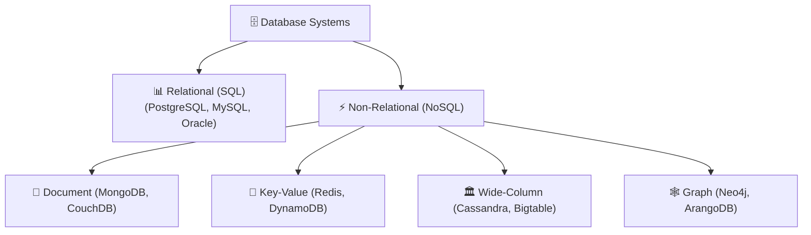

# Database Types & Structures

Databases have evolved from flat files and hierarchical trees into sophisticated relational, NoSQL, and vector storage engines tailored for specific data models and workloads.

---

## 1. Primary Classification: Relational vs NoSQL

The database ecosystem is broadly split into two primary paradigms:

---

## 2. Relational Databases (SQL)

Relational databases organize data into **structured tables** consisting of rows and columns. They use **Structured Query Language (SQL)** for data definition and manipulation.

### Key Characteristics
- **Strict Schema**: Tables require predefined columns and data types.
- **ACID Guarantees**: Strict transactional integrity (*Atomicity, Consistency, Isolation, Durability*).
- **Primary & Foreign Keys**: Establish explicit relationships between tables.

### Common Examples & Use Cases
- **Popular Systems**: PostgreSQL, MySQL, Microsoft SQL Server, Oracle Database.
- **Ideal For**: Financial applications, e-commerce order processing, inventory systems, ERP/CRM applications.

---

## 3. The 4 Types of NoSQL Databases

NoSQL databases offer flexible, schema-less data structures designed to scale horizontally across distributed clusters.

### 1. Document-Oriented Databases
Store data records as semi-structured documents (typically JSON, BSON, or XML).

- **Strengths**: Flexible schema, nested objects/arrays, matches object-oriented code.
- **Popular Systems**: MongoDB, CouchDB.
- **Best For**: Content management systems, e-commerce product catalogs, user profiles.

### 2. Key-Value Stores
Store data as simple key-value pairs optimized for lightning-fast lookups by primary key.

- **Strengths**: Sub-millisecond latency, extreme read/write throughput.
- **Popular Systems**: Redis, Amazon DynamoDB, Riak.
- **Best For**: Caching, session management, real-time leaderboards, shopping carts.

### 3. Wide-Column Stores
Organize data into rows containing dynamic families of columns, distributed across cluster nodes.

- **Strengths**: High write throughput, scalable across petabytes of data.
- **Popular Systems**: Apache Cassandra, Google Bigtable.
- **Best For**: Time-series logs, IoT sensor telemetry, real-time ad serving metrics.

### 4. Graph Databases
Use nodes (entities) and edges (relationships with properties) to represent highly interconnected data.

- **Strengths**: Traverses complex multi-hop relationships without expensive SQL JOINs.
- **Popular Systems**: Neo4j, ArangoDB, OrientDB.
- **Best For**: Social network friend graphs, recommendation engines, fraud detection networks, knowledge graphs.

---

## 4. Specialized Database Structures

### Vector Databases (AI & Machine Learning)
Specialized systems designed to store, index, and query high-dimensional vector embeddings generated by AI models (e.g., OpenAI, LLMs, CLIP).

- **Key Capability**: Performs fast **Approximate Nearest Neighbor (ANN)** similarity searches (e.g., Cosine Similarity).
- **Popular Systems**: Pinecone, Weaviate, Milvus, Qdrant, PostgreSQL (`pgvector`).
- **Best For**: Semantic search, Retrieval-Augmented Generation (RAG), AI recommendation systems, image/audio similarity.

### Object-Oriented Databases
Store data directly as objects, preserving object-oriented programming concepts (classes, inheritance, methods).

- **Popular Systems**: Versant, db4o, ZODB.
- **Best For**: Complex CAD/CAM engineering models, telecommunications topology.

### Hierarchical & Network Databases (Legacy Systems)
- **Hierarchical**: Tree structure with single-parent relationships (e.g., IBM IMS, Windows Registry).
- **Network**: Graph-like structure allowing multiple parent relationships (e.g., Integrated Data Store - IDS).

---

## 5. Comprehensive Database Type Comparison Matrix

| Database Type | Data Structure | Scalability | Flexibility | Query Complexity | Primary Use Cases |
|---|---|---|---|---|---|
| **Relational (SQL)** | Structured tables (Rows/Cols) | Vertical (RAM/CPU) | Predefined schema | Complex SQL joins & aggregations | Financial systems, E-commerce, CRM |
| **Document (NoSQL)** | JSON / BSON Documents | Horizontal (Clusters) | Schema-less / Dynamic | Rich query on document fields | Content management, User profiles |
| **Key-Value (NoSQL)** | Unique Key → Value payload | Horizontal | Unstructured payload | Lookup by Key | Caching, Session store, Leaderboards |
| **Wide-Column (NoSQL)** | Dynamic Column Families | Horizontal (Petabytes) | Flexible column schema | Range queries by Partition Key | IoT telemetry, Time-series metrics |
| **Graph (NoSQL)** | Nodes & Edges | Scalable | Flexible properties | Path traversal & graph queries | Social networks, Fraud detection |
| **Vector DB** | High-dimensional vectors | Highly Scalable | Vector embeddings | Similarity search (ANN) | RAG, Semantic search, AI products |
| **Object-Oriented** | Language Objects & Classes | Vertical / Moderate | Class inheritance | Object methods & queries | CAD software, Engineering models |
