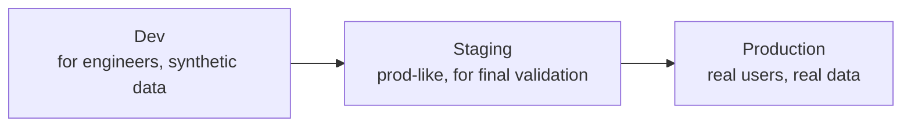
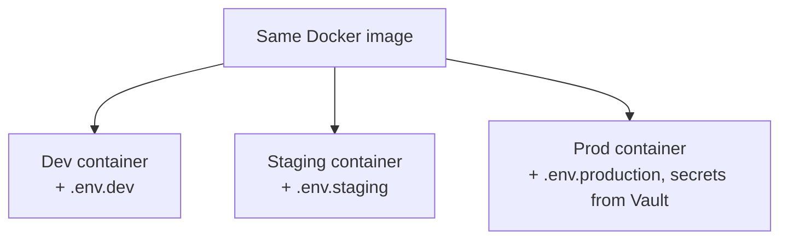

# Environments & Cloud Basics

An **environment** is a separate, isolated copy of the whole application (frontend + backend + database) running somewhere. We keep multiple environments so we can test changes safely before real users see them.

## The three environments you'll work with



| Environment | Purpose | Typical data |
|---|---|---|
| **Dev** | Where merged code is continuously integration-tested | Synthetic / seed data |
| **Staging** | Final rehearsal — as close to production as possible | Anonymized or prod-like data |
| **Production** | What real users actually use | Real, sensitive data |

In practice, this org also uses two more environments before code ever reaches Dev: **Local** (your own laptop, via Docker Compose) and **Preview** (a short-lived, disposable environment automatically spun up per Pull Request, so reviewers can click through the actual change before it merges). These five together — Local → Preview → Dev → Staging → Production — are the full picture; see [Environment Strategy](/engineering/environments) for how each is configured.

## Environment variables

Code should never hardcode things like database passwords or API URLs — these differ per environment and some are secrets. Instead, they're injected at runtime as **environment variables** (e.g. `DATABASE_URL`, `API_KEY`). The same Docker image runs in Dev, Staging, and Production unchanged — only the environment variables differ.

**The same code, three different configs:**
```bash
# .env.dev
DATABASE_URL=postgres://dev-db.internal:5432/app
LOG_LEVEL=debug
PAYMENT_GATEWAY_URL=https://sandbox.payments.example.com

# .env.production
DATABASE_URL=postgres://prod-db.internal:5432/app   # value itself injected via secrets manager, not committed
LOG_LEVEL=info
PAYMENT_GATEWAY_URL=https://api.payments.example.com
```



| Variable (example) | Purpose |
|---|---|
| `DATABASE_URL` | Connection string the backend uses to reach its database |
| `API_BASE_URL` | Where the frontend sends its API requests |
| `LOG_LEVEL` | How verbose logging is (`debug` in Dev, `info`/`warn` in Production) |
| `NODE_ENV` | Tells frameworks whether to enable dev-only behavior (verbose errors, hot reload) |
| Secrets (`JWT_SECRET`, `PAYMENT_GATEWAY_KEY`, ...) | Never in `.env` files committed to Git — injected at runtime, see [Environment Strategy](/engineering/environments) |

## "The cloud" in one paragraph

Instead of buying and maintaining physical servers, we rent computing resources (servers, databases, storage) from a cloud provider (AWS/Azure/GCP), and infrastructure is defined as code (Terraform) rather than clicked together manually — so environments can be recreated identically and changes are reviewable, just like application code.

## Where this leads next

- [Deployment & Operations Overview](/operations/overview) — how code actually moves between these environments
- [Environment Strategy](/engineering/environments) — this org's concrete environment configuration standards
