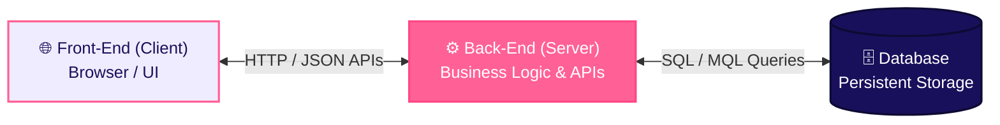
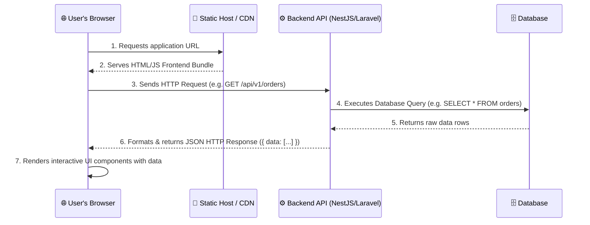
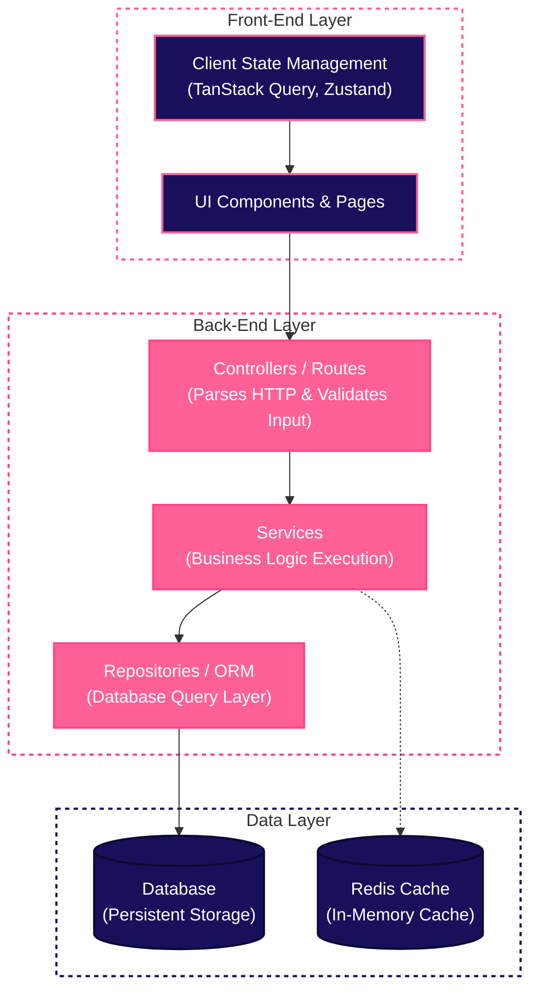

# Full-Stack Architecture

**Full-Stack Development** refers to the end-to-end development of both the **front-end (client-side)** and **back-end (server-side)** portions of a web application. A full-stack developer handles the entire software lifecycle—from designing responsive user interfaces to engineering backend API services, enforcing data security, and managing databases.

---

## 1. The 3 Core Layers of Full-Stack Architecture

A modern web application consists of three primary tiers:

| Layer | Primary Role | Core Technologies & Tools |
|---|---|---|
| **Front-End (Client)** | Renders the visual user interface in the browser and handles user interactions. | HTML5, CSS3, JavaScript / TypeScript, React, Next.js, Angular, Tailwind CSS |
| **Back-End (Server)** | Processes business logic, authenticates users, parses requests, and exposes APIs. | Node.js (NestJS, Express), Python (Django), PHP (Laravel), Java (Spring Boot) |
| **Database** | Stores, retrieves, and organizes application data durably. | PostgreSQL, MySQL, MongoDB, Redis |

---

## 2. Front-End Technologies & Ecosystem

The front-end represents the visible portion of a web application that users directly interact with.

### Core Languages
- **HTML (HyperText Markup Language)**: Defines the semantic structure and content of web pages using tags.
- **CSS (Cascading Style Sheets)**: Controls visual styling, typography, colors, and responsive page layouts independently of HTML structure.
- **JavaScript / TypeScript**: Adds dynamic interactivity, handles user events, executes browser logic, and fetches server data.

### Front-End Frameworks & Libraries
- **React.js**: A declarative, component-based UI library maintained by Meta, focused on building reusable view components.
- **Next.js**: A full-stack React framework enabling Server-Side Rendering (SSR), Static Site Generation (SSG), and file-based API routing.
- **AngularJS / Angular**: An enterprise open-source framework supporting two-way data binding and TypeScript-first development.
- **CSS Tooling & Frameworks**: Tailwind CSS, SASS/SCSS (CSS pre-processor), Bootstrap, Shadcn UI, Material-UI.
- **Utility Libraries**: jQuery (DOM manipulation), Axios / Fetch API (HTTP data fetching).

---

## 3. Back-End Technologies & Ecosystem

The back-end operates on the server, managing application functionality, database queries, and security validation triggered by client commands.

### Server Runtimes & Languages
- **Node.js**: An open-source, cross-platform V8 runtime environment for executing JavaScript outside the browser. Used by PayPal, Netflix, and Uber for high-concurrency API services.
- **Python**: Versatile language known for high developer velocity, data science integration, and web backends.
- **PHP**: Server-side scripting language powers a massive portion of the web, optimized for web servers.
- **Java**: Enterprise-grade, highly scalable language offering strong typing and high concurrency.
- **Other Languages**: Go (Golang), C# (.NET), Ruby, Rust.

### Back-End Frameworks
- **Express.js & NestJS** (Node.js)
- **Django & Fast-API** (Python)
- **Laravel** (PHP)
- **Spring Boot** (Java)
- **Ruby on Rails** (Ruby)

---

## 4. Popular Full-Stack Technology Stacks

Developers often group complementary technologies into standardized "stacks":

| Technology Stack | Front-End | Back-End | Database | Best For |
|---|---|---|---|---|
| **Next.js Full-Stack** | React / Next.js | Next.js Server Actions / API | PostgreSQL / Prisma ORM | Modern Web SaaS & SEO applications |
| **MERN Stack** | React.js | Node.js + Express.js | MongoDB (NoSQL) | Flexible JSON-heavy SPA applications |
| **MEAN Stack** | Angular | Node.js + Express.js | MongoDB (NoSQL) | Enterprise single-page applications |
| **Django Stack** | HTML/React | Python + Django | PostgreSQL / MySQL | Data-intensive and AI-integrated applications |
| **LAMP Stack** | HTML/CSS/JS | PHP + Apache Web Server | MySQL | Classic web applications and CMS engines |

---

## 5. Request Lifecycle & Web Page Execution

### Core Architecture Rules:
1. **Security Boundary**: The frontend **never** connects directly to the database. All reads and writes pass through the backend API to enforce authentication, authorization, and validation.
2. **Client vs. Server**: "Client" initiates requests; "Server" processes and responds. In local development, all three layers can run on a single laptop.
3. **Stateless Communication**: Modern REST/GraphQL APIs treat each request independently without relying on server session memory. Identity is verified per-request typically via stateless Bearer JWT tokens (or via server-side session stores when statefulness is explicitly required).

---

## 6. Worked Example: "Add to Cart" End-to-End

Walking through one feature across all three layers demonstrates how data flows seamlessly through a full-stack application without getting bogged down in specific code syntax:

### 1. Front-End (Client)
- **User Action**: The user clicks the **"Add to Cart"** button on a product page.
- **HTTP Request**: The browser captures the event and sends a `POST /api/v1/cart/items` request containing the `productId` and `quantity` in the request body.

### 2. Back-End (Server)
- **Parse & Authenticate**: The server receives the request, identifies the user, and extracts the payload.
- **Validate Business Logic**: Checks inventory to ensure the product exists and is currently in stock.
- **Execute Persistence**: Instructs the database layer to persist the updated cart information.

### 3. Database (Storage)
- **Write Record**: Inserts a new record into the `cart_items` table matching the user's ID, product ID, and quantity.
- **Acknowledge**: Confirms successful persistence back to the backend service.

### 4. Response & UI Update
- **Server Response**: The backend returns an HTTP `200 OK` JSON response containing the updated cart state.
- **Re-render UI**: The front-end receives the response and updates the UI instantly (e.g., updating the shopping cart counter badge in the navbar).

---

## 7. Layered Architecture Pattern

To maintain clean code separation, back-end code is organized into distinct layers:

This strict boundary ensures that `Controllers` handle HTTP input, `Services` execute business logic, and `Repositories` interact with the database (see [Backend Folder Structure](/coding-standards/backend/folder-structure)).

---

## Where This Leads Next

- [APIs & HTTP](/basics/apis-http/overview) — the contract between frontend and backend
- [Databases](/basics/databases/overview) — how the backend stores and retrieves data
- [Coding Standards: Frontend](/coding-standards/frontend/folder-structure) and [Coding Standards: Backend](/coding-standards/backend/folder-structure) — concrete rules for each layer
- [Architecture Standards](/architecture/standards) — how multiple services fit together at scale
