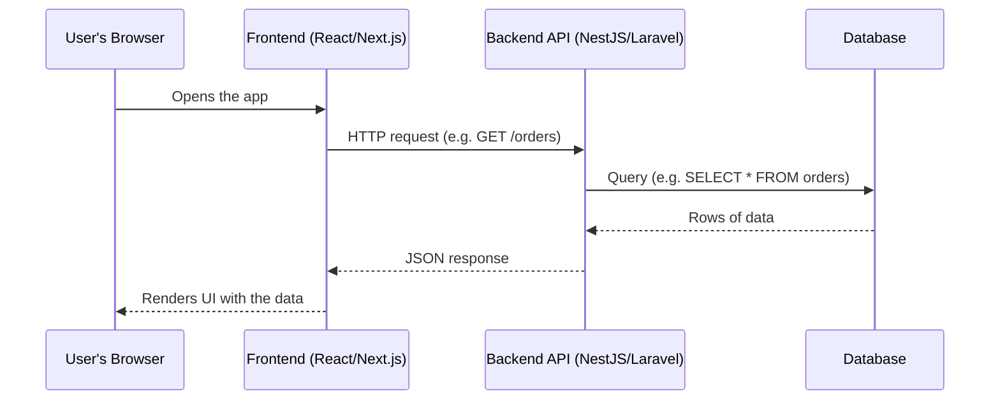
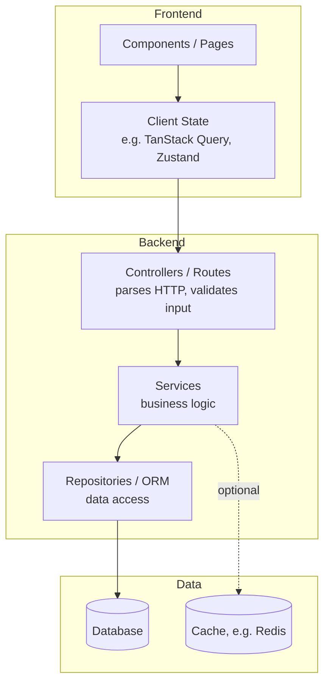

# Full-Stack Architecture 101

"Full stack" means an application has (at least) three layers, and a full-stack engineer can work across all of them:

| Layer | What it does | Examples used in this org |
|---|---|---|
| **Frontend (Client)** | Renders the UI in the user's browser/app and reacts to their actions | React, Next.js |
| **Backend (Server)** | Contains business logic, talks to the database, enforces rules/permissions | NestJS, Laravel |
| **Database** | Stores data durably | PostgreSQL, MySQL, MongoDB |

## What happens when you load a web page



A few things worth internalizing early:

- **The frontend never talks to the database directly.** It always goes through the backend API, which is what enforces permissions and validation. This is a security boundary, not just a style choice.
- **"Client" and "server" are about who initiates and who responds**, not about physical machines — in local development, all three layers can run on your own laptop.
- **Statelessness**: most backend APIs don't remember who you are between requests. Every request carries its own proof of identity (see [Basics: APIs & HTTP](/basics/apis-http) on authentication).

## Worked example: "Add to Cart"

Walking through one real feature end-to-end makes the layers concrete. Say a user clicks "Add to Cart" on a product page.

**1. Frontend — capture the click and call the API**
```tsx
// React component
async function handleAddToCart(productId: string) {
  const res = await fetch('/api/v1/cart/items', {
    method: 'POST',
    headers: {
      'Content-Type': 'application/json',
      Authorization: `Bearer ${token}`,
    },
    body: JSON.stringify({ productId, quantity: 1 }),
  });
  if (!res.ok) throw new Error('Failed to add item');
  const { data } = await res.json();
  setCart(data); // update UI state with the server's response
}
```

**2. Backend — validate, apply business rules, persist**
```ts
// NestJS controller + service (simplified)
@Post('cart/items')
async addItem(@Body() dto: AddCartItemDto, @CurrentUser() user: User) {
  const product = await this.productsService.findOrThrow(dto.productId);
  if (product.stock < dto.quantity) {
    throw new BadRequestException('Insufficient stock');
  }
  return this.cartService.addItem(user.id, product.id, dto.quantity);
}
```

**3. Database — the actual row that gets written**
```sql
INSERT INTO cart_items (user_id, product_id, quantity, created_at)
VALUES ('user_123', 'prod_456', 1, now());
```

**4. Response flows back up** — the backend returns the updated cart as JSON, and the frontend re-renders with it. Notice each layer only knows about the layer directly next to it: the frontend never saw SQL, and the database never saw HTTP.

## Layered view of a typical service



This is why folder structures in this org separate `controllers/`, `services/`, and `repositories/` (see [Backend Folder Structure](/coding-standards/backend/folder-structure)) — each box above maps to a real folder, and each layer should only call the one directly below it.

## Where this leads next

- [APIs & HTTP](/basics/apis-http) — the contract between frontend and backend
- [Databases 101](/basics/databases) — how the backend stores and retrieves data
- [Coding Standards: Frontend](/coding-standards/frontend/folder-structure) and [Coding Standards: Backend](/coding-standards/backend/folder-structure) — this org's concrete rules for each layer
- [Architecture Standards](/architecture/standards) — how multiple services/frontends fit together at a larger scale
