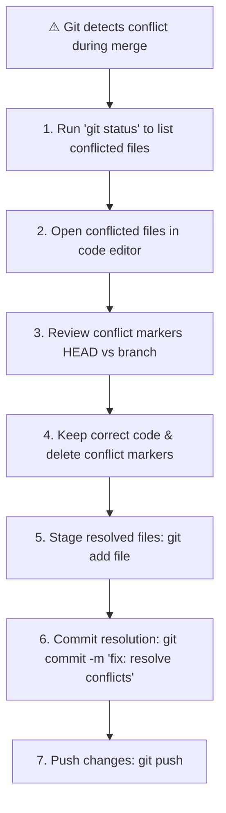

# Handling Merge Conflicts in Git

A **merge conflict** occurs when Git cannot automatically combine changes from different branches due to conflicting edits. When this happens, Git pauses the merge process and requires human resolution before completing the commit.

---

## 1. Why Merge Conflicts Occur

Git automatically merges files when edits happen on different lines. However, a merge conflict occurs when:
1. **Same line changed in two branches**: Person A and Person B edit the exact same line in different ways.
2. **Delete vs. Modify Conflict**: One developer deletes a file while another developer edits that same file.
3. **Rename vs. Modify / Delete**: One branch renames a file while another branch modifies or removes it.

---

## 2. Real-World Scenario: Two People Editing the Same File

Imagine a file called `notes.txt` on the `main` branch containing:
```text
Hello, this is the project note.
```

1. **Person A (on `main`)** changes the line to:
   ```text
   Hello, this is the updated project note by A.
   ```
   ...and commits the change.

2. **Person B (on `feature`)** changes the same line to:
   ```text
   Hello, this is the feature note by B.
   ```
   ...and commits the change.

3. **Person A attempts to merge `feature` into `main`**:
   ```bash
   git merge feature
   ```

Git pauses and injects **conflict markers** into `notes.txt`:

```text
<<<<<<< HEAD
Hello, this is the updated project note by A.
=======
Hello, this is the feature note by B.
>>>>>>> feature
```

### Understanding Conflict Markers
- `<<<<<<< HEAD`: Marks the start of the conflict. The text below it represents code in your **current branch** (`main`).
- `=======`: The divider line separating the two conflicting versions.
- `>>>>>>> feature`: Marks the end of the conflict and shows code coming from the **incoming branch** (`feature`).

---

## 3. The 8 Types of Git Merge Conflicts

| Conflict Type | Cause & Trigger |
|---|---|
| **1. Content Conflicts (Edit–Edit)** | Two branches modify the exact same line(s) of text in a file. |
| **2. Delete–Modify Conflicts** | One branch deletes a file while another branch edits it. |
| **3. Rename–Modify / Delete** | One branch renames a file while another edits or deletes it. |
| **4. Structural (Directory–File)** | One branch replaces a file with a directory (or vice versa). |
| **5. Submodule Conflicts** | Two branches point to conflicting versions of a Git submodule. |
| **6. Binary File Conflicts** | Both branches modify non-text binary files (e.g., `.png`, `.pdf`, `.zip`). |
| **7. File Mode Conflicts** | One branch changes execution permissions (`chmod +x`) while another does not. |
| **8. Index / Rebase Conflicts** | Staging index conflicts during complex operations like `git rebase`. |

---

## 4. Step-by-Step Resolution Guide



### Command Sequence

#### Step 1: Identify Conflicted Files
```bash
git status
```
*Git will report unmerged paths: `both modified: notes.txt`.*

#### Step 2: Resolve Conflict in Editor
Open `notes.txt`, remove `<<<<<<< HEAD`, `=======`, `>>>>>>> feature`, and save the clean final code.

#### Step 3: Stage, Commit, and Push
```bash
git add notes.txt
git commit -m "fix: resolve merge conflict between main and feature"
git push origin main
```

---

## 5. Pre-Merge Errors & Troubleshooting

### Error 1: Local Uncommitted Changes Collision
```text
error: Entry 'app.ts' not uptodate. Cannot merge.
error: Entry 'app.ts' would be overwritten by merge. Cannot merge.
```

#### Fix Option A: Stash local uncommitted changes
```bash
git stash push -m "work in progress before merge"
git merge feature-branch
git stash pop
```

#### Fix Option B: Discard local uncommitted changes
```bash
git checkout app.ts
git merge feature-branch
```

### Aborting a Broken Merge Safely
If a merge gets too complicated or messy, you can safely abort it and return your repository to its exact state before `git merge` was executed:

```bash
git merge --abort
```
