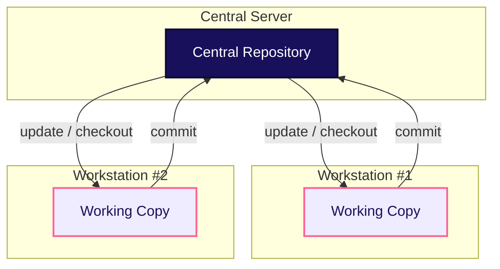
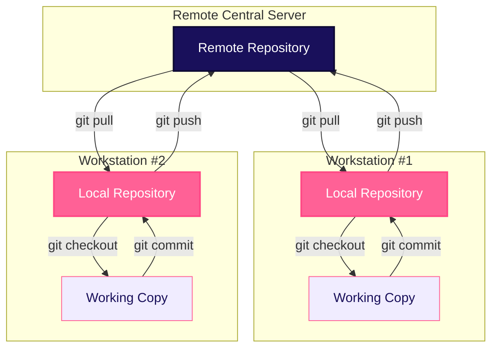

# Types of Version Control Systems

Version Control Systems are categorized based on their underlying storage architecture and collaboration model.

---

## 1. Local Version Control Systems (LVCS)

Local VCS stores all file versions directly on a **single developer machine**.

- **Characteristics**: Works entirely offline, requires no network connection, intended for single-user projects.
- **Drawback**: **Single point of failure**. If the local hard drive is corrupted, the entire history is permanently lost.

---

## 2. Centralized Version Control Systems (CVCS)

Centralized VCS uses a single central server that contains the full project history. Developers check out files from the central server and commit changes back directly.

### Popular Examples
- **Subversion (SVN)**: Widely used in enterprise systems requiring strict administrative access control over subfolders.
- **CVS (Concurrent Versions System)**: An early pioneer system from the 1990s that laid the groundwork for SVN.

### Pros & Cons
- ✅ **Pros**: Simple mental model, fine-grained folder-level access permissions.
- ❌ **Cons**: Single point of failure. If the central server goes offline, developers cannot commit code or view history.

---

## 3. Distributed Version Control Systems (DVCS)

In a Distributed VCS, every developer mirrors the **full repository locally**, including its complete commit history.

### Popular Examples
- **Git**: Created by Linus Torvalds in 2005. The global standard for software development.
- **Mercurial**: Designed as a fast, simpler alternative to Git.
- **Bazaar**: Developed by Canonical (Ubuntu), supports both centralized and distributed workflows.

### Pros & Cons
- ✅ **Pros**: Fast local operations (commits, diffs, log checks happen offline), extreme fault tolerance (every clone is a full backup).
- ❌ **Cons**: Slightly steeper learning curve (requires understanding `commit` vs `push`).

---

## 4. Comparison Summary

| Feature | Centralized (CVCS) | Distributed (DVCS) |
|---|---|---|
| **Local Copy** | Working files only | Full repository & history clone |
| **Offline Operations** | Restricted | Full access (Commit, Log, Branch, Diff) |
| **Commit Process** | Single step (Saves directly to server) | Two steps (`commit` to local $\rightarrow$ `push` to remote) |
| **Speed** | Network-dependent | Blazing fast (local disk reads) |
| **Primary Tool** | Subversion (SVN) | **Git** |
