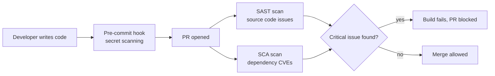

# Security 101

Security in this playbook isn't a separate team's job done at the end — it's baked into everyday engineering ("shift left," see [Vision & Principles](/vision-principles) principle #4). This page defines the vocabulary you'll see used elsewhere.

## Key terms

| Term | Plain-English meaning |
|---|---|
| **CVE** (Common Vulnerabilities and Exposures) | A publicly cataloged, known security flaw in a piece of software (e.g. a specific version of a library) |
| **SAST** (Static Application Security Testing) | Scans your *source code* for security issues without running it (e.g. spotting SQL injection patterns) |
| **SCA** (Software Composition Analysis) | Scans your *dependencies* (npm/composer packages) for known CVEs |
| **OWASP Top 10** | The 10 most common and dangerous web application vulnerability categories, published by the Open Web Application Security Project |
| **Secrets** | Passwords, API keys, tokens — must never be committed to Git, always injected via environment variables or a secrets manager |

## Where these checks run



## A few OWASP Top 10 categories worth knowing early

| Category | In plain terms |
|---|---|
| **Injection (e.g. SQL Injection)** | Untrusted input is executed as a command instead of treated as data — always use parameterized queries/ORMs, never string-concatenate SQL |
| **Broken Access Control** | A user can do or see something they shouldn't (e.g. accessing another user's data by changing an ID in the URL) |
| **Cryptographic Failures** | Sensitive data (passwords, tokens) stored or transmitted without proper encryption/hashing |
| **Security Misconfiguration** | Default credentials left in place, verbose error messages leaking internals, unnecessary services exposed |

## Vulnerable vs. fixed, side by side

**SQL Injection:**
```ts
// ✗ Vulnerable — user input concatenated directly into SQL
const user = await db.query(`SELECT * FROM users WHERE email = '${input}'`);
// input = "' OR '1'='1" returns every row in the table

// ✓ Fixed — parameterized query; the driver treats input strictly as data
const user = await db.query('SELECT * FROM users WHERE email = $1', [input]);
```

**Broken Access Control:**
```ts
// ✗ Vulnerable — any authenticated user can fetch any order by guessing IDs
@Get('orders/:id')
getOrder(@Param('id') id: string) {
  return this.ordersService.findById(id);
}

// ✓ Fixed — the query is scoped to the caller's own data
@Get('orders/:id')
getOrder(@Param('id') id: string, @CurrentUser() user: User) {
  return this.ordersService.findByIdForUser(id, user.id);
}
```

**Secrets in code:**
```ts
// ✗ Vulnerable — hardcoded, and now permanently in Git history even if removed later
const apiKey = 'sk_live_51H8x...';

// ✓ Fixed — read from environment at runtime, never committed
const apiKey = process.env.PAYMENT_GATEWAY_KEY;
```

A pre-commit secret scanner and SAST rule both exist specifically to catch these last two patterns before they ever reach a PR — see the flow diagram above.

## Where this leads next

- [Security Guardrails: Playbook Coverage](/security/security-guardrails) — how this org enforces these controls
- [General Security Checklist](/security/security-checklist) — a practical, per-project checklist
- [DevSecOps Standards](/coding-standards/devsecops-standards) — how SAST/SCA are wired into the pipeline
