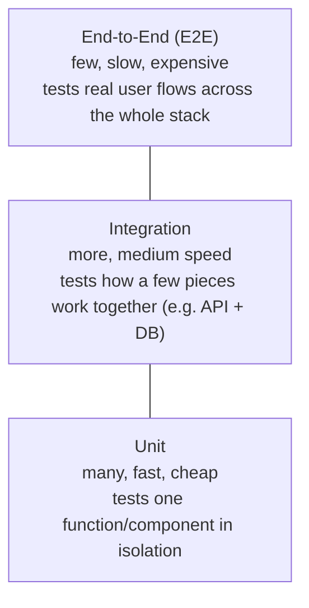

# Testing 101

Automated tests exist so a human doesn't have to manually re-check the entire application every time something changes. Different test types check different things, at different costs.

## The testing pyramid



The pyramid shape is intentional: write **lots** of fast unit tests, a **moderate** number of integration tests, and only a **few** slow E2E tests for the most critical user journeys (e.g. login, checkout).

| Test type | Answers | Example |
|---|---|---|
| **Unit** | Does this one function/component work correctly? | `calculateDiscount(100, 0.1)` returns `90` |
| **Integration** | Do these pieces work together correctly? | Calling the `/orders` API actually writes a row to the database |
| **E2E** | Does the whole user journey work, from the browser's perspective? | A simulated browser logs in, adds an item, and completes checkout |

## Each test type, in real code

**Unit test** — one function, no external dependencies:
```ts
// discount.test.ts
test('applies a 10% discount correctly', () => {
  expect(calculateDiscount(100, 0.1)).toBe(90);
});
```

**Integration test** — the API and a real (test) database working together:
```ts
// orders.integration.test.ts
test('POST /orders persists a new order', async () => {
  const res = await request(app)
    .post('/orders')
    .set('Authorization', `Bearer ${testToken}`)
    .send({ items: [{ productId: 'prod_1', quantity: 1 }] });

  expect(res.status).toBe(201);
  const saved = await db.query('SELECT * FROM orders WHERE id = $1', [res.body.data.id]);
  expect(saved.rows).toHaveLength(1);
});
```

**E2E test** — a real browser driving the whole stack:
```ts
// checkout.e2e.ts (Playwright)
test('user can complete checkout', async ({ page }) => {
  await page.goto('/products/prod_1');
  await page.click('text=Add to Cart');
  await page.click('text=Checkout');
  await page.fill('#card-number', '4242 4242 4242 4242');
  await page.click('text=Place Order');
  await expect(page.locator('text=Order confirmed')).toBeVisible();
});
```

Notice the difference in what's real: the unit test mocks everything away, the integration test uses a real database but not a real browser, and the E2E test uses both — which is exactly why E2E tests are slower and reserved for critical paths only.

## Why this matters here

Test coverage is enforced as a [quality gate](/quality-gates/testing-gates) — code below the coverage threshold, or with a failing test, cannot merge or deploy. This isn't bureaucracy for its own sake: it's what lets the org ship many small changes per day ([Vision & Principles](/vision-principles), principle #1) without breaking production.

## Where this leads next

- [Testing Strategy](/coding-standards/testing/overview) — this org's coverage thresholds and tooling
- [Unit Testing](/coding-standards/testing/unit-testing), [Integration Testing](/coding-standards/testing/integration-testing), [E2E Testing](/coding-standards/testing/e2e-testing)
