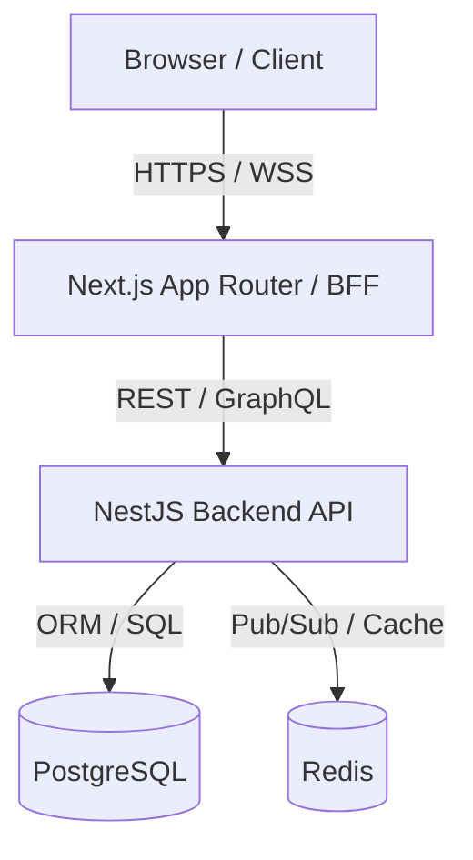
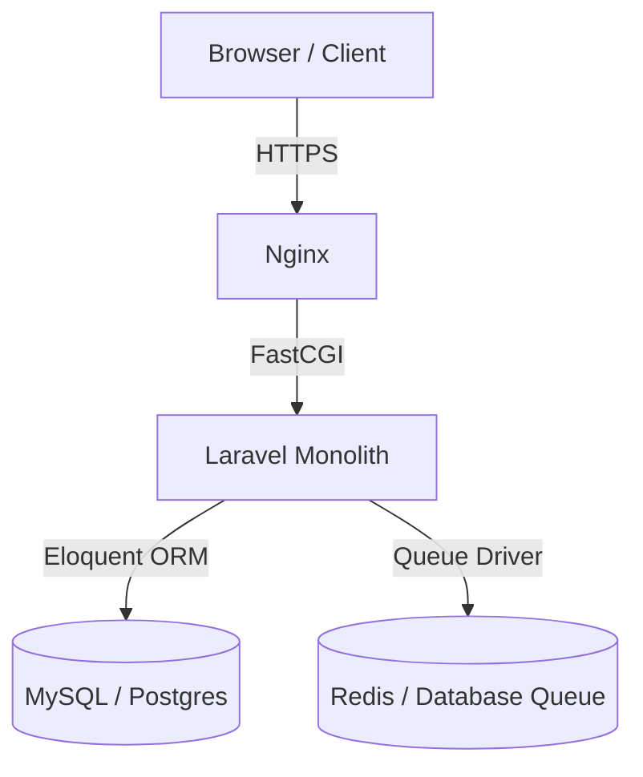
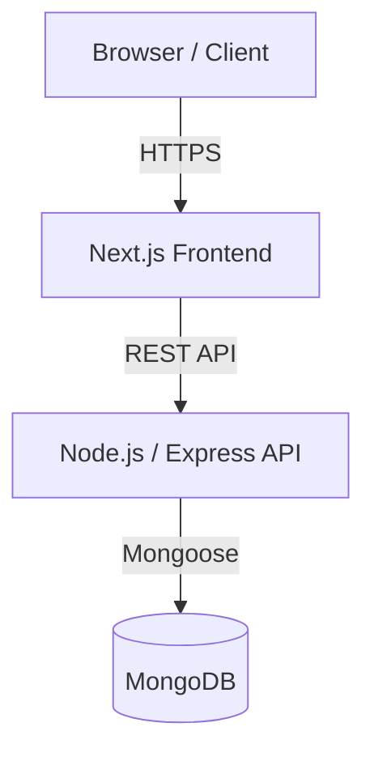

# Solution Design Phase

The Solution Design phase translates business requirements into a robust technical blueprint. It mitigates architectural risks early, ensures alignment with enterprise standards, and establishes clear contracts for parallel development by frontend and backend teams.

## Entry Criteria
- Approved Product Requirements Document (PRD).
- Definition of Ready (DoR) met for initial foundational stories.
- Clear understanding of Non-Functional Requirements (NFRs).

## Tech Stack Selection & Justification

Selecting the appropriate tech stack is dictated by the business domain, scalability goals, and development velocity requirements of the specific solution.

### 1. Enterprise Web Applications (Heavy API, Real-time)
* **Stack**: Next.js (Frontend) + Node.js (NestJS Backend) + PostgreSQL (Database)
* **Justification**: NestJS provides a structured, highly scalable, enterprise-grade architecture with native TypeScript support, perfect for complex microservices or modular monoliths. Next.js offers server-side rendering (SSR) for SEO and performance. PostgreSQL offers ACID-compliant, structured relational persistence.
* **Architecture Slide (Container Level)**:

### 2. Rapid Web Applications / SaaS Products (Monolithic/Rapid Iteration)
* **Stack**: React (Frontend) + PHP Laravel (Backend) + MySQL/PostgreSQL (Database)
* **Justification**: Laravel has rich out-of-the-box features (authentication, queues, notifications, Eloquent ORM) that accelerate time-to-market. MySQL or PostgreSQL provides standard, reliable relational storage.
* **Architecture Slide (Container Level)**:

### 3. Content/Data-Rich or Dynamic Content Management (Flexible Schema)
* **Stack**: React / Next.js + Node.js (Express/NestJS) + MongoDB (NoSQL)
* **Justification**: Used when schema flexibility is critical, handling large volumes of unstructured or semi-structured data (e.g. logs, dynamic catalogs, user profiles).
* **Architecture Slide (Container Level)**:

---

## Threat Modeling

Every new service or major architectural change must go through a lightweight threat modeling pass before development starts — this is what "Security by Default / Shift Left" (see [Vision & Principles](/vision-principles)) means concretely at the design stage, not just in CI scans.

**Process:**
1. Using the Container-level architecture diagram already produced above, the Tech Lead and one InfoSec/Security-Champion reviewer walk through each trust boundary (e.g. Client → Gateway, Gateway → API, API → Database).
2. For each boundary, apply **STRIDE**: could this interaction allow **S**poofing, **T**ampering, **R**epudiation, **I**nformation disclosure, **D**enial of service, or **E**levation of privilege?
3. Findings and mitigations are logged in the design's ADR (or a short `THREAT-MODEL.md` alongside it) — not left as a verbal discussion.

| Trust boundary example | Question to ask | Typical mitigation |
|---|---|---|
| Client → API Gateway | Can an unauthenticated request reach a protected endpoint? | AuthGuard on every route by default, not opt-in |
| API → Database | Can user input reach a query unparameterized? | ORM/parameterized queries only — see [Security 101](/basics/security) |
| Service → Service (async) | Can a malicious/duplicate event be replayed? | Idempotent consumers — see [Architecture Standards](/architecture/standards) |

This output feeds directly into the [ARB review](/governance/approvals) for any change that requires one.

## Exit Criteria
- Architecture diagram and tech stack justification documented in an ADR.
- Threat modeling pass completed and logged for any new service or major architectural change.
- API contracts (REST/GraphQL schemas) agreed between frontend and backend so both can build in parallel.

---

## Architectural Tool & Component Comparisons

To guide architectural decisions during the design phase, teams must evaluate database and email component alternatives based on their trade-offs:

### 1. Database Options

| Database | Official Website | Advantages | Limitations |
| :--- | :--- | :--- | :--- |
| **PostgreSQL** | [postgresql.org](https://www.postgresql.org/) | • Advanced SQL features (window functions, CTEs). • Excellent JSONB support for semi-structured data. • Strict ACID compliance. | • Can be complex to tune under massive concurrent loads. • Horizontal scaling requires sharding/clustering tools. |
| **MongoDB** | [mongodb.com](https://www.mongodb.com/) | • Flexible document-based schema (BSON). • Highly scalable horizontally (native sharding). • Fast read/write performance for non-relational queries. | • Lack of rigid data constraints can lead to inconsistency. • Joins (using `$lookup`) are less performant than relational joins. |
| **MySQL** | [mysql.com](https://www.mysql.com/) | • Extremely simple setup and massive community support. • Fast read performance on basic queries. • Reliable replication support. | • Less advanced than PostgreSQL for complex querying and GIS data. • Rigid schemas complicate alterations in production. |

### 2. Email Service Options

| Service | Advantages | Limitations |
| :--- | :--- | :--- |
| **Amazon SES** | • Extremely cost-effective ($0.10 per 1000 emails). • Seamless IAM integration for AWS services. • Automatically scales output rates. | • Very basic analytics and template management. • Strict sandbox mode initially requires support tickets to lift. • Complex configuration for SPF/DKIM/DMARC in console. |
| **SendGrid** | • Rich template builders and marketing suite. • Powerful real-time analytics and deliverability insights. • Easy setup with solid SDKs. | • Significantly more expensive than Amazon SES. • Strict IP reputation management is required to avoid delivery blocks. |
| **Mailgun** | • Tailored for developers with robust inbound email routing/parsing. • Detailed logs and tracking metadata. • Excellent email address validation API. | • Free/low tiers are very restrictive. • Inbound route management can scale rapidly in complexity. |

### 3. Application Frameworks & Client Libraries

| Technology | Official Website | Core Use Cases | Advantages | Limitations |
| :--- | :--- | :--- | :--- | :--- |
| **React** | [react.dev](https://react.dev/) | • Highly interactive Single Page Applications (SPAs). • Custom internal portals and SaaS dashboards. • Dynamic consumer-facing applications. | • Component-driven architecture promotes reusability. • Large ecosystem of libraries (state, UI components). • Fast virtual DOM reconciliation. | • Client-side routing and client-side rendering are bad for SEO. • Requires significant setup/configuration (bundlers, linters) when used raw. |
| **Next.js** | [nextjs.org](https://nextjs.org/) | • SEO-critical websites (e-commerce, blogs, corporate portals). • Full-stack applications with built-in API Routes. • Backend-for-Frontend (BFF) layers. | • Supports Server-Side Rendering (SSR) & Static Site Generation (SSG). • File-system routing and automatic image/font optimization. • API routes enable serverless or microservice orchestration. | • Stiffer learning curve for developers new to SSR hydration rules. • Server hosting requires Node.js runtime management if not deployed on Vercel. |
| **NestJS** | [nestjs.com](https://nestjs.com/) | • Structured enterprise APIs and microservice backends. • Real-time communication engines (WebSockets/SSE). • Large modular monoliths. | • Enforces Angular-like architectural discipline (modules, controllers, services). • Built-in dependency injection container. • Excellent integration with databases, GraphQL, and message brokers. | • Higher codebase boilerplate compared to minimal frameworks like Express. • Steeper learning curve for developers unfamiliar with decorators and OOP patterns. |
| **PHP Laravel** | [laravel.com](https://laravel.com/) | • Rapid SaaS prototyping and MVP creation. • Classic monolithic web applications. • Database-driven admin panels and internal portals. | • Rich, production-ready features out-of-the-box (auth, queues, mailers, scheduling). • Eloquent ORM provides a highly intuitive ActiveRecord implementation. • Extremely rapid development speed. | • Traditional synchronous request cycle (partially mitigated by Octane/RoadRunner). • Higher memory footprint and slower execution under heavy concurrent, highly asynchronous event streams compared to Node.js. |
